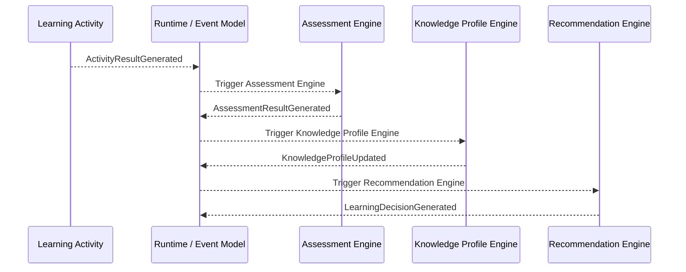
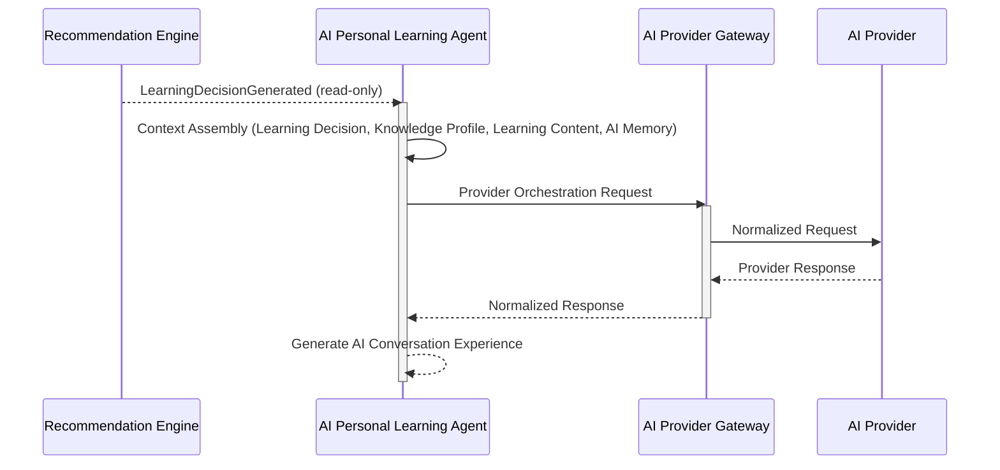

# Engine Contracts

| Version | Status | Owner | Depends On | Used By | Last Updated |
|---|---|---|---|---|---|
| 1.1 | Freeze | Engineering | `30_engine/*`, `40_ai/*`, `20_runtime/20_state_machine.md`, `20_runtime/21_event_model.md`, `61_api_design_principles.md`, `62_api_spec.md`, `63_database_model.md`, `65_event_contracts.md`, `99_architecture_decisions.md` | Engineering, QA, Operations | 2026-07-11 |

---

# 1. Document Information

Dokumen ini merupakan **implementation specification**, bukan dokumen arsitektur. Dokumen ini **tidak** mendesain ulang arsitektur, **tidak** memperkenalkan business entity baru, **tidak** memperkenalkan business rule baru, dan **tidak** memperkenalkan runtime flow baru. Seluruh nama engine, nama event, nama state, dan Architecture Decision (AD) dituliskan sesuai dokumen sumber. Narasi penjelasan dituliskan dalam Bahasa Indonesia, konsisten dengan gaya `60_srs.md` dan `62_api_spec.md`.

Dokumen ini melengkapi (bukan menggantikan) `62_api_spec.md` Bagian 12 (Internal Engine APIs) dan Bagian 13 (AI Provider Gateway APIs) dengan level detail kontrak yang lebih implementable, tanpa mengubah kontrak yang telah ditetapkan di sana.

**Primary References:** `00_foundation/*`, `10_learning_domain/*`, `20_runtime/*`, `30_engine/*`, `40_ai/*`, `50_product/*`, `61_api_design_principles.md`, `62_api_spec.md`, `63_database_model.md`, `65_event_contracts.md`, `99_architecture_decisions.md` — terutama AD-001 s/d AD-010.

> **Catatan penting mengenai contoh JSON:** Arsitektur sumber (`61_api_design_principles.md` Bagian 7, `62_api_spec.md` Bagian 9) secara eksplisit menyatakan bahwa struktur envelope bersifat **konseptual, bukan OpenAPI/skema teknis literal**. Seluruh contoh JSON pada dokumen ini bersifat **ilustratif** — field yang digunakan hanya berasal dari Core Concepts, Response Object, dan Data Object yang telah didefinisikan pada dokumen arsitektur sumber. Tipe data, format literal, dan skema teknis akhir tetap menjadi keputusan tahap implementasi, sesuai Out of Scope `62_api_spec.md` Bagian 2.

---

# 2. Purpose

Dokumen ini mendefinisikan **Engine Contracts**, yaitu kontrak internal antara Runtime, Core Learning Engines, AI Layer components, dan AI Provider Gateway pada Kaifa v2.

Dokumen ini menjelaskan **bagaimana** Runtime memediasi seluruh invocation melalui approved Internal Engine API atau official Event — bukan **apa** yang menjadi business rule Engine. Engine tidak saling memanggil secara langsung.

Dokumen ini **bukan**:

* Dokumen HTTP API (peran tersebut dimiliki `62_api_spec.md`).
* Pengganti Event Model (peran tersebut dimiliki `21_event_model.md`).
* Dokumen Business Rule (peran tersebut dimiliki dokumen Learning Domain terkait).

Dokumen ini mendefinisikan:

* Engine Responsibilities
* Engine Inputs dan Outputs
* Request Contract
* Response Contract
* Error Contract
* Event Contract
* Idempotency Contract
* Retry Contract
* Timeout Contract
* Failure Handling
* Observability Contract

---

# 3. Scope

## In Scope

* Kontrak internal Runtime-mediated untuk Assessment Engine, Knowledge Profile Engine, Recommendation Engine, AI Personal Learning Agent, dan AI Provider Gateway.
* Idempotency, retry, timeout, error, dan observability contract pada level Engine.
* Traceability terhadap dokumen arsitektur, PRD, SRS, dan API Spec.

## Out of Scope

* Database schema.
* REST endpoint definitions (lihat `62_api_spec.md`).
* Teknologi authentication dan implementasi authorization. MVP Basic Learner Authentication telah didefinisikan pada frozen `62_api_spec.md` dan `63_database_model.md`; Advanced Authentication tetap Open Issue. Engine Contracts hanya menerima Learner/actor context yang telah di-resolve oleh Runtime atau application boundary dan tidak mendefinisikan JWT, cookie, session technology, OAuth, MFA, SSO, role, atau permission.
* Deployment dan infrastruktur.
* Implementasi Queue/Message Broker spesifik (Kafka/RabbitMQ/NATS/dsb.), konsisten dengan Out of Scope `21_event_model.md`.
* Bahasa pemrograman dan framework.

---

# 4. Engines Covered

Dokumen ini hanya mencakup lima Engine berikut, sesuai `30_engine/*` dan `40_ai/*`. Tidak ada Engine baru yang diperkenalkan.

1. Assessment Engine (`30_assessment_engine.md`)
2. Knowledge Profile Engine (`31_knowledge_profile_engine.md`)
3. Recommendation Engine (`32_recommendation_engine.md`)
4. AI Personal Learning Agent (`43_ai_personal_learning_agent.md`)
5. AI Provider Gateway (`41_ai_provider_integration.md`)

> Catatan: Bagian 9-MVP mendefinisikan kontrak terbatas (MVP-limited) untuk AI Personal Learning Agent dalam kapasitas AI Conversation Practice. Kontrak Phase 3 penuh tetap pada Bagian 9. Tidak ada Engine baru yang diperkenalkan; AI Provider Gateway (Bagian 10) digunakan oleh keduanya.

---

# 5. Global Contract Rules

Aturan berikut berlaku untuk **seluruh** Engine pada dokumen ini, tanpa pengecualian.

* **Engine tidak pernah memanggil Engine lain secara langsung.** Seluruh komunikasi antar Engine terjadi melalui Event (AD-003) atau melalui Runtime yang memicu Internal Engine API sesuai urutan Canonical Learning Pipeline (AD-005), sebagaimana dijelaskan pada `62_api_spec.md` Bagian 12: *"Internal Engine API dipicu oleh Runtime sesuai State Machine dan Event Model, bukan dipanggil langsung antar Engine."*
* **Engine tidak memiliki business rule.** Business rule tetap dimiliki Learning Domain (AD-002); Engine hanya mengeksekusi.
* **Output ownership bersifat tunggal.** Assessment Engine adalah sole producer/owner Assessment Result, Knowledge Profile Engine adalah sole writer/owner Knowledge Profile, dan Recommendation Engine adalah sole producer/owner Learning Decision. Database, API, frontend, AI Layer, dan engine lain tidak boleh menghitung, menghasilkan, atau menimpa output yang bukan miliknya.
* Core Learning Engines — Assessment Engine, Knowledge Profile Engine, dan Recommendation Engine — bersifat **deterministic** dan **stateless**. (Assessment Engine dan Recommendation Engine secara eksplisit dinyatakan deterministic pada `30_assessment_engine.md` dan `32_recommendation_engine.md`; prinsip yang sama berlaku pada Knowledge Profile Engine sesuai `31_knowledge_profile_engine.md` — Deterministic Processing).
* AI Layer components — AI Personal Learning Agent dan AI Provider Gateway — tidak dianggap sebagai deterministic learning decision engines. Keduanya bersifat **non-authoritative** terhadap learning outcome, tidak boleh menghasilkan Learning Decision, Knowledge Profile, atau Assessment Result, dan hanya boleh menyimpan/menulis data AI Layer seperti AI Memory, Conversation Context, audit log, provider metadata, dan observability data sesuai governance. (`31_knowledge_profile_engine.md` — Stateless Processing; `62_api_spec.md` Bagian 12.1–12.2 — *"Karakteristik: Stateless, deterministic"*).
* **AI tidak pernah menghasilkan** Learning Decision, Knowledge Profile, maupun Assessment Result (AD-006, AD-007; `62_api_spec.md` Bagian 24 — AI API Restrictions).
* **MVP Placement boundary:** Placement starting point suggestion bukan Learning Decision, dan Recommendation Engine tidak boleh dipanggil oleh MVP Placement Test flow.
* **MVP AI Practice assessment boundary:** Activity Result atau approved assessment evidence yang didukung, termasuk canonical target-language transcript, completion data, pronunciation-related metadata, atau activity evidence lain dari AI Conversation Practice boleh dikonsumsi Assessment Engine bersama Activity Result dan Assessment Blueprint, tetapi AI tidak pernah menghasilkan, mengubah, atau memiliki Assessment Result.
* **Translation/transliteration boundary:** translation dan transliteration hanya learner support aids dan tidak pernah menjadi official assessment source.
* **Phase boundary:** Knowledge Profile Engine dan Recommendation Engine tetap Phase 2 untuk full adaptive learning; MVP Placement Test dan MVP AI Conversation Practice tidak mengaktifkan kedua engine tersebut kecuali dipromosikan oleh fase mendatang.
* Setiap request/event wajib membawa **Correlation ID** dan **Trace ID** (`61_api_design_principles.md` Bagian 6; `62_api_spec.md` Bagian 8 dan 23).
* Setiap Event bersifat **immutable** setelah dipublikasikan dan memiliki **tepat satu publisher resmi** (`21_event_model.md` — Event Principles).

---

# 6. Engine Contract — Assessment Engine

## 6.1 Purpose

Assessment Engine adalah komponen runtime yang mengeksekusi Assessment Blueprint terhadap Activity Result untuk menghasilkan Assessment Result sebagai sole producer dan owner, sekaligus implementation layer yang menjalankan aturan evaluasi tanpa menjadi pemilik business rule tersebut. Activity Result tetap merupakan record Runtime-owned yang non-evaluative dan bukan milik Assessment Engine. *(Sumber: `30_assessment_engine.md` — Purpose)*

## 6.2 Responsibilities

* Menerima generic Activity Result.
* Menerima Placement Test Activity Result sebagai specialized assessable Learning Activity result.
* Menerima assessable AI Conversation Practice Activity Result beserta approved assessment evidence yang didukung, termasuk canonical transcript, completion data, pronunciation-related metadata, atau activity evidence lain, serta referensi Assessment Blueprint.
* Menyelesaikan (resolve) Assessment Blueprint yang berlaku.
* Memvalidasi Activity Result dan evidence source yang disetujui.
* Menolak atau mengabaikan translation/transliteration sebagai official assessment source.
* Menjalankan proses evaluasi.
* Menghasilkan Assessment Result.
* Dapat menyertakan Placement starting point suggestion pada Assessment Result output/evaluation metadata.
* Mempublikasikan event runtime.
* Menyediakan Assessment Result bagi engine lain.

Assessment Engine **tidak** menentukan aturan evaluasi maupun target pembelajaran, **tidak** memiliki Activity Result, **tidak** memperbarui Knowledge Profile, **tidak** menghasilkan Learning Decision, dan **tidak** memanggil Recommendation Engine. Placement starting point suggestion yang mungkin muncul pada output bukan Learning Decision. Assessment Engine tetap stateless/deterministic dan idempotent untuk input dan siklus evaluasi yang sama. *(Sumber: `30_assessment_engine.md` — Engine Responsibilities)*

## 6.3 Ownership

| Field | Value |
|---|---|
| Owner | Assessment Engine |
| Depends On | `16_assessment_blueprint.md`, `21_event_model.md`, `20_state_machine.md` |
| Used By | `31_knowledge_profile_engine.md` |

## 6.4 Dependencies

**Consumes**

| Input | Source |
|---|---|
| Activity Result | Runtime, melalui official Learning Activity completion behavior |
| Placement Test Activity Result | Runtime, melalui completion `learning_activity` dengan `purpose = Placement` |
| AI Practice Activity Result + canonical transcript/evidence reference | AI Conversation Practice completion / Runtime |
| Assessment Blueprint | Learning Design |
| Runtime Context | Runtime |

**Produces**

| Output | Consumer |
|---|---|
| Assessment Result | Knowledge Profile Engine in Phase 2; Assessment Result API in MVP |
| Assessment Event | Event Model |
| Placement starting point suggestion metadata | Learner/Application via Assessment Result API |

**Reads:** Assessment Blueprint (Assessment Strategy, Evaluation Criteria, Assessment Method, Mastery Criteria) — read-only, dimiliki Learning Domain (AD-002, AD-004).

**Writes:** Assessment Result (sole writer). Assessment Engine **tidak** menulis Activity Result, Knowledge Profile, atau Learning Decision dan **tidak mengubah domain secara langsung**. Assessment Result hanya dibaca klien melalui official read-only API.

**Publishes Official Events:** `AssessmentStarted`, `AssessmentCompleted`, `AssessmentResultGenerated`.

**Observability Signals:** `AssessmentFailed` (observability-only; bukan Official Runtime Event dan dapat dipersist pada `system_event_log`).

**Consumes Events:** `ActivityResultGenerated`, `AssessmentBlueprintUpdated`.

*(Sumber: `30_assessment_engine.md` — Engine Inputs, Engine Outputs, Published Events, Consumed Events)*

## 6.5 Input Contract

| Element | Description |
|---|---|
| Required Input | `activityResultRef`; `assessmentBlueprintRef` |
| Placement Input | Placement Activity Result dan metadata seperti `placementPurpose` / `purpose = Placement`; bukan domain entity baru |
| AI Practice Input | `canonicalTargetLanguageTranscriptRef` atau evidence reference ekuivalen; `approvedConversationEvidenceRef`; referensi Assessment Blueprint |
| Excluded Input | `excludedAssessmentSources`: translation/transliteration; harus ditolak atau diabaikan sebagai official assessment source |
| Optional Input | Runtime Context tambahan (mis. locale, session metadata) — tidak boleh mengandung business rule baru (`61_api_design_principles.md` Bagian 6) |
| Validation | Input Validation di level entrypoint (format, tipe, kelengkapan) sebelum diteruskan ke Engine Validation (`61_api_design_principles.md` Bagian 9; `62_api_spec.md` Bagian 18) |
| Correlation ID | Wajib menyertai setiap request; auto-generate oleh entrypoint bila tidak disertakan klien (`62_api_spec.md` Bagian 8) |
| Trace ID | Wajib menyertai setiap request; auto-generate oleh entrypoint bila tidak disertakan klien (`62_api_spec.md` Bagian 8) |
| Idempotency Key | Wajib untuk memicu evaluasi ulang terhadap Activity Result yang sama, konsisten dengan sifat deterministic Engine (`62_api_spec.md` Bagian 19) |
| Context | Runtime Context (state pembelajaran saat ini sesuai `20_state_machine.md` — state `Assessing`) |
| Source Documents | `30_assessment_engine.md`, `16_assessment_blueprint.md`, `62_api_spec.md` §12.1 |

**Example payload (illustrative, non-normative):**

```json
{
  "correlationId": "corr-8f1e2c",
  "traceId": "trace-4471ab",
  "idempotencyKey": "assess-activityresult-9c21",
  "input": {
    "activityResultRef": "activity-result-9c21",
    "assessmentBlueprintRef": "blueprint-speaking-002",
    "learnerRef": "learner-3310",
    "canonicalTargetLanguageTranscriptRef": "ai-practice-transcript-3381",
    "approvedConversationEvidenceRef": "ai-practice-evidence-4420",
    "excludedAssessmentSources": ["translation", "transliteration"],
    "placementPurpose": null
  },
  "context": {
    "state": "Assessing"
  }
}
```

## 6.6 Output Contract

**Success Response**

```json
{
  "success": true,
  "data": {
    "assessmentResultId": "assessment-result-77af",
    "activityResultRef": "activity-result-9c21",
    "assessmentBlueprintRef": "blueprint-quiz-002",
    "evaluationOutcome": "PASSED",
    "timestamp": "2026-07-05T04:12:00Z"
  },
  "metadata": {
    "correlationId": "corr-8f1e2c",
    "traceId": "trace-4471ab",
    "processingTimeMs": 182,
    "engineVersion": "assessment-engine-2.0",
    "decisionVersion": "n/a"
  }
}
```

**Placement Test Assessment Result example (illustrative, non-normative):**

```json
{
  "success": true,
  "data": {
    "assessmentResultId": "assessment-result-placement-77af",
    "activityResultRef": "activity-result-placement-9c21",
    "assessmentBlueprintRef": "blueprint-placement-001",
    "placementStartingPointSuggestion": {
      "suggestedModuleRef": "module-a1-002",
      "reasonSummary": "Based on Placement Test Assessment Result"
    },
    "isLearningDecision": false,
    "recommendationEngineInvoked": false
  }
}
```

**AI Conversation Practice Assessment Result example (illustrative, non-normative):**

```json
{
  "success": true,
  "data": {
    "assessmentResultId": "assessment-result-ai-practice-55be",
    "activityResultRef": "activity-result-ai-practice-44aa",
    "assessmentBlueprintRef": "blueprint-speaking-002",
    "evidenceSourceMetadata": {
      "canonicalTargetLanguageTranscriptRef": "ai-practice-transcript-3381",
      "approvedConversationEvidenceRef": "ai-practice-evidence-4420",
      "excludedAssessmentSources": ["translation", "transliteration"]
    },
    "producedByAi": false,
    "officialScoreProducedByAi": false,
    "officialMasteryProducedByAi": false
  }
}
```

*Field `evaluationOutcome` dan struktur detail hasil evaluasi mengikuti Response Object pada `62_api_spec.md` §11.8 ("identitas unik, referensi Activity Result, hasil evaluasi, referensi Assessment Blueprint yang digunakan, timestamp"); representasi literal detail hasil evaluasi merupakan keputusan implementasi.*

**Failure Response**

```json
{
  "success": false,
  "error": {
    "errorCode": "ASSESSMENT_ENGINE_VALIDATION_ERROR",
    "category": "Validation Error",
    "message": "Activity Result tidak valid.",
    "retryable": false
  },
  "metadata": {
    "correlationId": "corr-8f1e2c",
    "traceId": "trace-4471ab",
    "processingTimeMs": 24,
    "engineVersion": "assessment-engine-2.0"
  }
}
```

**Metadata Fields:** Correlation ID, Trace ID, Processing Time, Engine Version. Decision Version tidak berlaku pada Assessment Engine (Decision Version hanya relevan bagi Recommendation Engine — lihat 8.6).

## 6.7 Error Contract

| Error Type | errorCode | message (contoh) | retryable | httpMapping (referensi) |
|---|---|---|---|---|
| Validation Error | `ASSESSMENT_ENGINE_VALIDATION_ERROR` | Activity Result tidak valid. | false | 400/422 |
| Validation Error | `ASSESSMENT_ENGINE_INVALID_PLACEMENT_RESULT` | Placement Activity Result tidak valid. | false | 422 |
| Business Error | `ASSESSMENT_ENGINE_PLACEMENT_BLUEPRINT_MISSING` | Assessment Blueprint untuk Placement tidak tersedia. | false | 422/409 |
| Validation Error | `ASSESSMENT_ENGINE_INVALID_AI_PRACTICE_EVIDENCE` | Approved AI Practice evidence tidak valid. | false | 422 |
| Validation Error | `ASSESSMENT_ENGINE_CANONICAL_TRANSCRIPT_MISSING` | Canonical target-language transcript tidak tersedia. | false | 422 |
| Validation Error | `ASSESSMENT_ENGINE_INVALID_ASSESSMENT_SOURCE` | Translation/transliteration tidak boleh digunakan sebagai official assessment source. | false | 422 |
| Validation Error | `ASSESSMENT_ENGINE_RECOMMENDATION_INVOCATION_FORBIDDEN` | MVP Placement flow tidak boleh memanggil Recommendation Engine. | false | 422 |
| Business Error | `ASSESSMENT_ENGINE_BLUEPRINT_UNRESOLVED` | Assessment Blueprint tidak dapat di-resolve. | false | 422/409 |
| Runtime Error | `ASSESSMENT_ENGINE_RUNTIME_ERROR` | Terjadi kegagalan tak terduga saat eksekusi evaluasi. | true | 500 |
| Dependency Error | `ASSESSMENT_ENGINE_DEPENDENCY_UNAVAILABLE` | Learning Design/Assessment Blueprint repository tidak tersedia. | true | 503 |
| Timeout | `ASSESSMENT_ENGINE_TIMEOUT` | Proses evaluasi melebihi batas waktu. | true | 503/500 |
| Retryable Error | (Runtime Error, Dependency Error, Timeout di atas) | — | true | 500/503 |
| Non-Retryable Error | (Validation Error, Business Error di atas) | — | false | 400/409/422 |

*(Kategori error, kode status, dan prinsip "pesan error tidak membocorkan detail internal" bersumber dari `61_api_design_principles.md` Bagian 8 & 10 dan `62_api_spec.md` Bagian 10. errorCode merupakan penamaan implementasi yang konsisten dengan kategori tersebut, bukan business rule baru.)*

## 6.8 Event Contract

**Consumed Events**

| Event | Required Fields (konseptual) | Optional Fields | Publisher | Ordering |
|---|---|---|---|---|
| `ActivityResultGenerated` | Activity Result reference, Learner reference, timestamp | Runtime Context | Learning Activity | Harus diterima setelah `LearningActivityCompleted` sesuai `21_event_model.md` Runtime Flow |
| `AssessmentBlueprintUpdated` | Assessment Blueprint reference, versi | — | Assessment Blueprint | Tidak mengubah Assessment Result yang sudah dihasilkan (immutable) |

**Published Official Events**

| Event | Required Fields | Optional Fields | Consumers |
|---|---|---|---|
| `AssessmentStarted` | Correlation ID, Activity Result reference | Trace ID | Observability |
| `AssessmentCompleted` | Correlation ID, Activity Result reference, outcome | Trace ID | Runtime (state transition) |
| `AssessmentResultGenerated` | Assessment Result reference, Activity Result reference, Assessment Blueprint reference, timestamp | Evaluation Metadata | Knowledge Profile Engine, Runtime |

**Observability Signals**

| Signal | Required Fields | Optional Fields | Purpose |
|---|---|---|---|
| `AssessmentFailed` | Correlation ID, alasan kegagalan (kategori error) | Trace ID | Logs, traces, metrics, monitoring, failure tracing, dan operations diagnostics; dapat dipersist pada `system_event_log` |

`AssessmentFailed` bukan Official Runtime Event maupun official integration contract, tidak boleh menjadi cross-layer business trigger atau required input downstream Engine, dan tidak memicu canonical learning pipeline transition.

**Idempotency (Event):** Konsumsi ulang `ActivityResultGenerated` yang sama (mis. akibat replay) tidak boleh menghasilkan lebih dari satu `AssessmentResultGenerated` untuk siklus evaluasi yang sama, konsisten dengan `62_api_spec.md` Bagian 19.

**Publisher/Consumer:** Sesuai Event Ownership `21_event_model.md` — Assessment Engine adalah satu-satunya publisher official Assessment Events. `AssessmentResultGenerated` tetap menjadi official event untuk memicu downstream Phase 2 processing melalui Runtime.

*(Sumber: `21_event_model.md`, `30_assessment_engine.md` — Published Events, Consumed Events)*

## 6.9 Idempotency

* **Idempotency Key:** operation identifier stabil per siklus evaluasi (mis. berbasis Activity Result reference), diverifikasi entrypoint sebelum diteruskan ke Engine (`62_api_spec.md` Bagian 19).
* **Duplicate Request:** request dengan Idempotency Key yang sama mengembalikan Assessment Result yang telah dihasilkan sebelumnya, tanpa mengeksekusi ulang evaluasi.
* **Duplicate Event:** konsumsi ganda `ActivityResultGenerated` tidak menghasilkan Assessment Result ganda.
* **Replay Protection:** Engine bersifat deterministic, sehingga replay dengan input identik aman menghasilkan output identik; namun publikasi event ganda dicegah oleh Idempotency Key pada level publisher.
* **Out-of-order Event Handling:** apabila `AssessmentBlueprintUpdated` diterima setelah `ActivityResultGenerated` untuk siklus yang sama, Assessment Engine tetap menggunakan Assessment Blueprint yang di-resolve pada saat evaluasi dimulai (tidak mengubah Assessment Result yang sudah immutable).

## 6.10 Retry Contract

* **Retry Strategy:** retry hanya untuk operasi idempotent (`62_api_spec.md` Bagian 19, 22).
* **Exponential Backoff:** diterapkan pada level infrastruktur/entrypoint saat memanggil Assessment Engine; parameter teknis (jumlah percobaan, backoff) merupakan detail infrastruktur di luar cakupan dokumen ini, konsisten dengan Out of Scope `21_event_model.md`.
* **Dead Letter Queue:** event yang gagal diproses berulang kali setelah retry maksimum diarahkan ke DLQ untuk investigasi Operations (mekanisme teknis DLQ adalah detail infrastruktur, di luar cakupan dokumen ini).
* **Maximum Retry:** ditentukan pada level infrastruktur; dokumen ini tidak menetapkan angka spesifik (Out of Scope).
* **Duplicate Detection:** menggunakan Idempotency Key (lihat 6.9).

## 6.11 Timeout Contract

Setiap pemanggilan Assessment Engine dibatasi timeout untuk mencegah permintaan menggantung. Kegagalan akibat timeout dicatat sebagai System Error dan dipantau melalui Observability. *(Sumber: `62_api_spec.md` Bagian 21)*

## 6.12 Failure Handling

| Condition | Expected Behaviour |
|---|---|
| Dependency unavailable (Learning Design/Assessment Blueprint repository) | Proses evaluasi dihentikan; event kegagalan dipantau monitoring. |
| Database unavailable | Assessment Result tidak dipersist; event kegagalan dipublikasikan. |
| Invalid Input (Activity Result tidak valid) | Input ditolak secara graceful; tidak menghasilkan Assessment Result. |
| Invalid Placement Activity Result / missing Placement Blueprint | Input ditolak; tidak menghasilkan Assessment Result dan tidak memanggil Recommendation Engine. |
| Invalid AI Practice evidence / missing canonical transcript | Input ditolak; translation/transliteration tidak digunakan sebagai fallback assessment source. |
| Event publishing failure | Kegagalan dicatat dan dapat dipantau sistem monitoring. |
| Partial failure | Tidak ada Assessment Result parsial; evaluasi bersifat all-or-nothing per siklus. |
| Rollback strategy | Tidak ada perubahan domain yang perlu di-rollback karena Assessment Engine tidak mengubah domain secara langsung. |
| Graceful degradation | Canonical Learning Pipeline dihentikan sementara pada tahap Assessing hingga dependency pulih; tidak ada AI fallback yang relevan pada Engine ini. |

*(Sumber: `30_assessment_engine.md` — Failure Handling; `60_srs.md` Bagian 13 — Error Handling Matrix #1, #2)*

## 6.13 Observability

| Metric | Description |
|---|---|
| Latency | Waktu total pemrosesan Assessment Engine per request. |
| Processing Time | Durasi eksekusi evaluasi. |
| Success Rate | Proporsi evaluasi yang berhasil menghasilkan Assessment Result. |
| Failure Rate | Proporsi evaluasi yang gagal. |
| Retry Count | Jumlah percobaan ulang per request/event. |
| Timeout Count | Jumlah request yang melampaui batas waktu. |
| Duplicate Event Count | Jumlah `ActivityResultGenerated` duplikat yang terdeteksi. |
| Queue Length | Panjang antrian event masuk yang menunggu diproses. |
| Correlation ID / Trace ID | Wajib pada setiap log dan metric untuk tracing lintas layanan. |
| Audit Fields | Timestamp, Activity Result reference, Assessment Blueprint reference, outcome. |

*(Sumber: `62_api_spec.md` Bagian 23 — Observability)*

## 6.14 Traceability

| Field | Value |
|---|---|
| Source Documents | `30_assessment_engine.md`, `16_assessment_blueprint.md`, `21_event_model.md`, `20_state_machine.md` |
| Architecture Layer | Engine |
| Related PRD FR | FR-008, FR-012B, FR-016 |
| Related SRS | SRS-FR-008, SRS-FR-012B, SRS-FR-016 |
| Related API Endpoints | `62_api_spec.md` §11.8 (Assessment Result, read-only), §11.15 (AI Conversation Practice), §11.16 (Placement Test API Alignment), §12.1 (Internal Engine API) |
| Related Database Model | `63_database_model.md` `activity_result`, `assessment_result`, `ai_practice_assessment_evidence` |
| Related AD | AD-004, AD-005, AD-006, AD-009 |

---

# 7. Engine Contract — Knowledge Profile Engine

## 7.1 Purpose

Knowledge Profile Engine adalah komponen runtime yang membangun dan memperbarui Knowledge Profile berdasarkan Assessment Result, menerjemahkan hasil evaluasi menjadi representasi tingkat penguasaan learner tanpa menjadi pemilik business rule pembelajaran. *(Sumber: `31_knowledge_profile_engine.md` — Purpose)*

## 7.2 Responsibilities

* Menerima Assessment Result.
* Memuat Knowledge Profile learner.
* Menghitung perubahan tingkat penguasaan berdasarkan hasil evaluasi.
* Memperbarui Knowledge Profile.
* Mempublikasikan perubahan Knowledge Profile.
* Menyediakan Knowledge Profile terbaru bagi engine lain.

Knowledge Profile Engine **tidak** menentukan strategi evaluasi maupun rekomendasi pembelajaran. Knowledge Profile Engine adalah sole writer/owner Knowledge Profile dan memperbaruinya secara incremental, bukan full rebuild. Database, API, frontend, AI Layer, dan engine lain tidak boleh menghitung atau menimpa Knowledge Profile. *(Sumber: `31_knowledge_profile_engine.md` — Engine Responsibilities)*

**MVP Boundary:** Knowledge Profile Engine tetap Phase 2 untuk full adaptive learning. MVP Placement Test dan MVP AI Conversation Practice dapat menghasilkan dan menyimpan Assessment Result tanpa memicu Knowledge Profile Engine, kecuali pipeline Phase 2 diaktifkan secara eksplisit pada fase mendatang.

## 7.3 Ownership

| Field | Value |
|---|---|
| Owner | Knowledge Profile Engine |
| Depends On | `30_assessment_engine.md`, `21_event_model.md` |
| Used By | `32_recommendation_engine.md`, `43_ai_personal_learning_agent.md` |

Knowledge Profile Engine adalah **sole owner** Knowledge Profile — generate dan modify (AD-002, AD-007; `60_srs.md` Bagian 14 — Permission Matrix).

## 7.4 Dependencies

**Consumes**

| Input | Source |
|---|---|
| Assessment Result | Assessment Engine |
| Knowledge Profile | Runtime Repository |
| Learning Context | Runtime |

**Produces**

| Output | Consumer |
|---|---|
| Updated Knowledge Profile | Recommendation Engine |
| Knowledge Profile Event | Event Model |

**Reads:** Assessment Result (read-only, dari Assessment Engine).

**Writes:** Knowledge Profile (satu-satunya pemilik tulis), secara **incremental**, bukan rebuild total (`62_api_spec.md` §11.9).

**Publishes Official Events:** `KnowledgeProfileUpdated`.

**Observability Signals:** `KnowledgeProfileUpdateStarted`, `KnowledgeProfileUpdateFailed`.

Observability signals are not part of the official Runtime Event Contract for MVP.
They may be emitted as logs, traces, metrics, or internal engine diagnostics, but must not be used as cross-layer business triggers.

**Consumes Events:** `AssessmentCompleted`, `AssessmentResultGenerated`.

Knowledge Profile Engine **tidak berinteraksi langsung dengan AI**. *(Sumber: `31_knowledge_profile_engine.md` — Integration Points)*

## 7.5 Input Contract

| Element | Description |
|---|---|
| Required Input | Assessment Result yang valid |
| Optional Input | Learning Context tambahan (mis. session metadata) |
| Validation | Assessment Result divalidasi sebelum Knowledge Profile diperbarui (`31_knowledge_profile_engine.md` — Processing Flow: Validate Assessment Result) |
| Correlation ID | Wajib, diteruskan dari siklus evaluasi Assessment Engine |
| Trace ID | Wajib, diteruskan dari siklus evaluasi Assessment Engine |
| Idempotency Key | Wajib, konsisten dengan sifat deterministic dan stateless Engine (`62_api_spec.md` Bagian 19) |
| Context | Learning Context (state `Updating Knowledge Profile` pada `20_state_machine.md`) |
| Source Documents | `31_knowledge_profile_engine.md`, `30_assessment_engine.md`, `62_api_spec.md` §12.2 |

**Example payload (illustrative, non-normative):**

```json
{
  "correlationId": "corr-8f1e2c",
  "traceId": "trace-4471ab",
  "idempotencyKey": "kpe-update-assessmentresult-77af",
  "input": {
    "assessmentResultRef": "assessment-result-77af",
    "learnerRef": "learner-3310"
  },
  "context": {
    "state": "Updating Knowledge Profile"
  }
}
```

## 7.6 Output Contract

**Success Response**

```json
{
  "success": true,
  "data": {
    "knowledgeProfileRef": "knowledge-profile-3310",
    "learnerRef": "learner-3310",
    "updateType": "incremental",
    "basedOnAssessmentResultRef": "assessment-result-77af",
    "timestamp": "2026-07-05T04:12:05Z"
  },
  "metadata": {
    "correlationId": "corr-8f1e2c",
    "traceId": "trace-4471ab",
    "processingTimeMs": 96,
    "engineVersion": "knowledge-profile-engine-2.0",
    "decisionVersion": "n/a"
  }
}
```

**Failure Response**

```json
{
  "success": false,
  "error": {
    "errorCode": "KPE_ASSESSMENT_RESULT_INVALID",
    "category": "Validation Error",
    "message": "Assessment Result tidak valid.",
    "retryable": false
  },
  "metadata": {
    "correlationId": "corr-8f1e2c",
    "traceId": "trace-4471ab",
    "processingTimeMs": 18,
    "engineVersion": "knowledge-profile-engine-2.0"
  }
}
```

## 7.7 Error Contract

| Error Type | errorCode | message (contoh) | retryable | httpMapping (referensi) |
|---|---|---|---|---|
| Validation Error | `KPE_ASSESSMENT_RESULT_INVALID` | Assessment Result tidak valid. | false | 400/422 |
| Business Error | `KPE_PROFILE_NOT_FOUND` | Knowledge Profile tidak ditemukan. | false | 404/409 |
| Runtime Error | `KPE_RUNTIME_ERROR` | Terjadi kegagalan tak terduga saat memperbarui profil. | true | 500 |
| Dependency Error | `KPE_DEPENDENCY_UNAVAILABLE` | Knowledge Profile repository tidak tersedia. | true | 503 |
| Timeout | `KPE_TIMEOUT` | Proses pembaruan melebihi batas waktu. | true | 503/500 |
| Retryable Error | (Runtime Error, Dependency Error, Timeout, dan "Gagal menyimpan perubahan") | — | true | 500/503 |
| Non-Retryable Error | (Validation Error, Business Error) | — | false | 400/404/409/422 |

*(Sumber kondisi kegagalan: `31_knowledge_profile_engine.md` — Failure Handling: "Assessment Result tidak valid", "Knowledge Profile tidak ditemukan", "Gagal memperbarui Knowledge Profile", "Gagal menyimpan perubahan", "Gagal mempublikasikan event"; `60_srs.md` Bagian 13 Error Handling Matrix #3–#5.)*

## 7.8 Event Contract

**Consumed Events**

| Event | Required Fields (konseptual) | Publisher | Ordering |
|---|---|---|---|
| `AssessmentCompleted` | Correlation ID, Activity Result reference, outcome | Assessment Engine | Diterima setelah `AssessmentStarted` |
| `AssessmentResultGenerated` | Assessment Result reference, Activity Result reference, timestamp | Assessment Engine | Memicu Processing Flow: Load → Validate → Update → Persist → Publish |

**Published Official Events**

| Event | Required Fields | Optional Fields | Consumers |
|---|---|---|---|
| `KnowledgeProfileUpdated` | Knowledge Profile reference, Learner reference, Assessment Result reference (basis), timestamp | Profile Metadata | Recommendation Engine, AI Personal Learning Agent (read-only), Runtime |

**Observability Signals**

| Signal | Required Fields | Optional Fields | Purpose |
|---|---|---|---|
| `KnowledgeProfileUpdateStarted` | Correlation ID, Assessment Result reference | Trace ID | Logs, traces, metrics, internal diagnostics |
| `KnowledgeProfileUpdateFailed` | Correlation ID, alasan kegagalan | Trace ID | Logs, traces, metrics, operations diagnostics |

Observability signals are not official Runtime Event Contracts and must not be consumed as business triggers by downstream engines.

**Idempotency (Event):** Konsumsi ulang `AssessmentResultGenerated` yang sama tidak boleh menghasilkan lebih dari satu `KnowledgeProfileUpdated` untuk basis Assessment Result yang sama.

*(Sumber: `21_event_model.md`, `31_knowledge_profile_engine.md` — Published Events, Consumed Events, Runtime Behaviour)*

## 7.9 Idempotency

* **Idempotency Key:** berbasis Assessment Result reference, memastikan satu Assessment Result hanya memicu satu pembaruan Knowledge Profile.
* **Duplicate Request:** request berulang dengan Idempotency Key sama tidak menggandakan pembaruan.
* **Duplicate Event:** konsumsi ganda `AssessmentResultGenerated` tidak menghasilkan `KnowledgeProfileUpdated` ganda.
* **Replay Protection:** pembaruan bersifat incremental dan deterministic; replay dengan basis Assessment Result yang sama harus menghasilkan Knowledge Profile akhir yang konsisten.
* **Out-of-order Event Handling:** apabila `AssessmentResultGenerated` untuk siklus evaluasi lebih baru diterima sebelum siklus lebih lama (kondisi jarang), Engine memproses berdasarkan urutan penerimaan yang valid sesuai State Machine; Engine tidak mendefinisikan aturan pengurutan bisnis baru (Out of Scope Business Rule).

## 7.10 Retry Contract

* **Retry Strategy:** retry hanya pada operasi idempotent, konsisten dengan sifat deterministic dan stateless Knowledge Profile Engine (`62_api_spec.md` Bagian 19, 22).
* **Exponential Backoff:** parameter teknis merupakan detail infrastruktur (Out of Scope).
* **Dead Letter Queue:** event yang gagal diproses berulang diarahkan ke DLQ untuk investigasi (detail teknis di luar cakupan).
* **Maximum Retry:** ditentukan pada level infrastruktur.
* **Duplicate Detection:** menggunakan Idempotency Key berbasis Assessment Result reference.

## 7.11 Timeout Contract

Setiap pemanggilan Knowledge Profile Engine dibatasi timeout; kegagalan timeout dicatat sebagai System Error dan dipantau Observability. *(Sumber: `62_api_spec.md` Bagian 21)*

## 7.12 Failure Handling

| Condition | Expected Behaviour |
|---|---|
| Dependency unavailable | Proses pembaruan dihentikan; event kegagalan dipantau monitoring. |
| Database unavailable | Gagal menyimpan perubahan; kegagalan dicatat sebagai observability signal; state tidak bertransisi. |
| Invalid Input | Assessment Result tidak valid → pembaruan Knowledge Profile dibatalkan. |
| Event publishing failure | Kegagalan dicatat dan dapat dipantau sistem monitoring. |
| Partial failure | Tidak ada pembaruan parsial; update bersifat all-or-nothing per Assessment Result. |
| Rollback strategy | Apabila persist gagal setelah kalkulasi, perubahan tidak dikomit; Knowledge Profile tetap pada versi sebelumnya. |
| Graceful degradation | Canonical Learning Pipeline tertahan pada state `Updating Knowledge Profile` hingga dependency pulih. |

*(Sumber: `31_knowledge_profile_engine.md` — Failure Handling; `60_srs.md` Bagian 13 #3–#5)*

## 7.13 Observability

| Metric | Description |
|---|---|
| Latency | Waktu total pemrosesan pembaruan profil. |
| Processing Time | Durasi kalkulasi + persist. |
| Success Rate | Proporsi pembaruan yang berhasil. |
| Failure Rate | Proporsi pembaruan yang gagal. |
| Retry Count | Jumlah percobaan ulang. |
| Timeout Count | Jumlah request yang melampaui batas waktu. |
| Duplicate Event Count | Jumlah `AssessmentResultGenerated` duplikat yang terdeteksi. |
| Queue Length | Panjang antrian event masuk. |
| Correlation ID / Trace ID | Wajib pada seluruh log dan metric. |
| Audit Fields | Timestamp, Assessment Result reference (basis), Knowledge Profile reference. |

## 7.14 Traceability

| Field | Value |
|---|---|
| Source Documents | `31_knowledge_profile_engine.md`, `30_assessment_engine.md`, `21_event_model.md` |
| Architecture Layer | Engine |
| Related PRD FR | FR-013 |
| Related API Endpoints | `62_api_spec.md` §11.9 (Knowledge Profile, read-only), §12.2 (Internal Engine API) |
| Related AD | AD-002, AD-007 |

---

# 8. Engine Contract — Recommendation Engine

## 8.1 Purpose

Recommendation Engine adalah komponen runtime yang menghasilkan Learning Decision berdasarkan kondisi pembelajaran learner, menganalisis Knowledge Profile, Learning Design, dan konteks pembelajaran tanpa menjadi pemilik business rule domain. *(Sumber: `32_recommendation_engine.md` — Purpose)*

## 8.2 Responsibilities

* Menganalisis Knowledge Profile learner.
* Mempertimbangkan Learning Design yang berlaku.
* Mempertimbangkan konteks pembelajaran saat ini.
* Menghasilkan Learning Decision.
* Mempublikasikan hasil keputusan.
* Menyediakan keputusan bagi aplikasi maupun AI Layer.

Recommendation Engine **tidak** bertanggung jawab terhadap proses evaluasi maupun pembentukan Knowledge Profile. Recommendation Engine adalah sole producer/owner Learning Decision dan menghasilkan tepat satu official Learning Decision untuk siklus keputusan yang berlaku dari input resmi arsitektur. Database, API, frontend, AI Layer, dan engine lain tidak boleh menghasilkan atau menimpa Learning Decision. *(Sumber: `32_recommendation_engine.md` — Engine Responsibilities)*

**MVP Boundary:** Recommendation Engine tetap Phase 2. MVP Placement Test dan MVP AI Conversation Practice tidak mengaktifkan Recommendation Engine. Recommendation Engine adalah sole owner Learning Decision, sedangkan Placement starting point suggestion bukan Learning Decision dan tidak boleh diproduksi melalui Recommendation Engine pada MVP.

## 8.3 Ownership

| Field | Value |
|---|---|
| Owner | Recommendation Engine |
| Depends On | `31_knowledge_profile_engine.md`, `12_learning_design.md` |
| Used By | `40_ai_architecture.md`, `43_ai_personal_learning_agent.md` |

Recommendation Engine adalah **sole owner** Learning Decision — generate (AD-006; `60_srs.md` Bagian 14 — Permission Matrix).

## 8.4 Dependencies

**Consumes**

| Input | Source |
|---|---|
| Knowledge Profile | Knowledge Profile Engine |
| Learning Design | Learning Domain |
| Learning Context | Runtime |
| Program Context | Learning Program |

**Produces**

| Output | Consumer |
|---|---|
| Learning Decision | Application |
| Learning Decision | AI Layer |
| Recommendation Event | Event Model |

**Reads:** Knowledge Profile (read-only, consume), Learning Design.

**Writes:** Learning Decision (satu-satunya pemilik). Engine **tidak mengubah domain secara langsung**.

**Publishes Official Events:** `LearningDecisionGenerated`.

**Observability Signals:** `RecommendationStarted`, `RecommendationCompleted`, `RecommendationFailed`.

Observability signals are not part of the official Runtime Event Contract for MVP.
They may be emitted as logs, traces, metrics, or internal engine diagnostics, but must not be used as cross-layer business triggers.

**Consumes Events:** `KnowledgeProfileUpdated`, `LearningContextChanged`.

## 8.5 Input Contract

| Element | Description |
|---|---|
| Required Input | Knowledge Profile terbaru, Learning Design yang berlaku, Learning Context |
| Optional Input | Program Context (struktur formalnya tidak didefinisikan arsitektur sumber — dicatat sebagai Open Issue, lihat Bagian 15) |
| Validation | Input telah divalidasi oleh layer sebelumnya (`32_recommendation_engine.md` — Engine Inputs) |
| Correlation ID | Wajib |
| Trace ID | Wajib |
| Idempotency Key | Wajib, konsisten dengan ketentuan "tepat satu Learning Decision per siklus evaluasi" (`60_srs.md` Bagian 12 — Business Rule #19) |
| Context | Learning Context (state `Generating Learning Decision` pada `20_state_machine.md`) |
| Source Documents | `32_recommendation_engine.md`, `12_learning_design.md`, `62_api_spec.md` §12.3 |

**Example payload (illustrative, non-normative):**

```json
{
  "correlationId": "corr-8f1e2c",
  "traceId": "trace-4471ab",
  "idempotencyKey": "rec-cycle-knowledgeprofile-3310-v5",
  "input": {
    "knowledgeProfileRef": "knowledge-profile-3310",
    "learningDesignRef": "learning-design-021",
    "learnerRef": "learner-3310"
  },
  "context": {
    "state": "Generating Learning Decision",
    "programContext": "mengikuti dokumen sumber apa adanya (struktur formal belum ditetapkan — lihat Open Issue)"
  }
}
```

## 8.6 Output Contract

**Success Response**

```json
{
  "success": true,
  "data": {
    "learningDecisionRef": "learning-decision-4482",
    "learnerRef": "learner-3310",
    "decisionType": "Next Module",
    "basedOnKnowledgeProfileRef": "knowledge-profile-3310",
    "timestamp": "2026-07-05T04:12:10Z"
  },
  "metadata": {
    "correlationId": "corr-8f1e2c",
    "traceId": "trace-4471ab",
    "processingTimeMs": 140,
    "engineVersion": "recommendation-engine-2.0",
    "decisionVersion": "rec-cycle-v5"
  }
}
```

*`decisionType` wajib salah satu dari 7 jenis resmi: Next Module, Review Module, Repeat Activity, Take Assessment, Continue Learning, Complete Module, Complete Program (`62_api_spec.md` §11.10; `60_srs.md` Bagian 12 #20).*

**Failure Response**

```json
{
  "success": false,
  "error": {
    "errorCode": "REC_LEARNING_DESIGN_NOT_FOUND",
    "category": "Business Error",
    "message": "Learning Design tidak ditemukan.",
    "retryable": false
  },
  "metadata": {
    "correlationId": "corr-8f1e2c",
    "traceId": "trace-4471ab",
    "processingTimeMs": 22,
    "engineVersion": "recommendation-engine-2.0"
  }
}
```

## 8.7 Error Contract

| Error Type | errorCode | message (contoh) | retryable | httpMapping (referensi) |
|---|---|---|---|---|
| Validation Error | `REC_LEARNING_CONTEXT_INVALID` | Learning Context tidak valid. | false | 400/422 |
| Business Error | `REC_LEARNING_DESIGN_NOT_FOUND` | Learning Design tidak ditemukan. | false | 404/409 |
| Runtime Error | `REC_RUNTIME_ERROR` | Terjadi kegagalan tak terduga saat menghasilkan keputusan. | true | 500 |
| Dependency Error | `REC_DEPENDENCY_UNAVAILABLE` | Knowledge Profile Engine/Learning Design repository tidak tersedia. | true | 503 |
| Timeout | `REC_TIMEOUT` | Proses rekomendasi melebihi batas waktu. | true | 503/500 |
| Retryable Error | (Runtime Error, Dependency Error, Timeout) | — | true | 500/503 |
| Non-Retryable Error | (Validation Error, Business Error, "Tidak ada Learning Decision yang dapat dihasilkan") | — | false | 400/404/409/422 |

*(Sumber: `32_recommendation_engine.md` — Failure Handling; `60_srs.md` Bagian 13 Error Handling Matrix #6–#8: "Learning Design tidak ditemukan", "Learning Context tidak valid", "Tidak ada Learning Decision yang dapat dihasilkan".)*

>Business Error pada dokumen ini berarti domain/business precondition tidak terpenuhi, bukan business rule baru yang dimiliki Engine.

## 8.8 Event Contract

**Consumed Events**

| Event | Required Fields (konseptual) | Publisher |
|---|---|---|
| `KnowledgeProfileUpdated` | Knowledge Profile reference, Learner reference, timestamp | Knowledge Profile Engine |
| `LearningContextChanged` | Learning Context reference | Runtime |

**Published Official Events**

| Event | Required Fields | Optional Fields | Consumers |
|---|---|---|---|
| `LearningDecisionGenerated` | Learning Decision reference, decisionType (salah satu dari 7 jenis resmi), Learner reference, timestamp | Recommendation Metadata | Application, AI Layer (read-only), Runtime |

**Observability Signals**

| Signal | Required Fields | Optional Fields | Purpose |
|---|---|---|---|
| `RecommendationStarted` | Correlation ID, Knowledge Profile reference | Trace ID | Logs, traces, metrics, internal diagnostics |
| `RecommendationCompleted` | Correlation ID | — | Logs, traces, metrics, internal diagnostics |
| `RecommendationFailed` | Correlation ID, alasan kegagalan | Trace ID | Logs, traces, metrics, operations diagnostics |

Observability signals are not official Runtime Event Contracts and must not be consumed as business triggers by Application, AI Layer, or downstream engines.

**Idempotency (Event):** Recommendation Engine wajib menghasilkan **tepat satu** Learning Decision per siklus evaluasi (`60_srs.md` Bagian 12 #19); konsumsi ganda `KnowledgeProfileUpdated` untuk siklus yang sama tidak boleh menghasilkan `LearningDecisionGenerated` ganda.

*(Sumber: `21_event_model.md`, `32_recommendation_engine.md` — Published Events, Consumed Events)*

## 8.9 Idempotency

* **Idempotency Key:** berbasis Knowledge Profile reference + siklus evaluasi, memastikan tepat satu Learning Decision dihasilkan.
* **Duplicate Request:** request berulang mengembalikan Learning Decision yang sama untuk siklus yang sama.
* **Duplicate Event:** konsumsi ganda `KnowledgeProfileUpdated` tidak menggandakan Learning Decision.
* **Replay Protection:** deterministic decision — input identik (Knowledge Profile, Learning Design, Learning Context) menghasilkan Learning Decision konsisten (`32_recommendation_engine.md` — Deterministic Decision).
* **Out-of-order Event Handling:** Recommendation Engine memproses berdasarkan Knowledge Profile versi terbaru yang valid; tidak mendefinisikan aturan pengurutan bisnis baru.

## 8.10 Retry Contract

* **Retry Strategy:** retry hanya pada operasi idempotent (`62_api_spec.md` Bagian 19, 22).
* **Exponential Backoff:** detail teknis infrastruktur, Out of Scope.
* **Dead Letter Queue:** event gagal berulang diarahkan ke DLQ (detail teknis Out of Scope).
* **Maximum Retry:** ditentukan pada level infrastruktur.
* **Duplicate Detection:** menggunakan Idempotency Key berbasis siklus evaluasi.

## 8.11 Timeout Contract

Setiap pemanggilan Recommendation Engine dibatasi timeout; kegagalan timeout dicatat sebagai System Error dan dipantau Observability. *(Sumber: `62_api_spec.md` Bagian 21)*

## 8.12 Failure Handling

| Condition | Expected Behaviour |
|---|---|
| Dependency unavailable | Proses dihentikan; event kegagalan dipantau monitoring. |
| Database unavailable | Learning Decision tidak dipersist; kegagalan dicatat sebagai observability signal. |
| Invalid Input | Learning Context tidak valid → Learning Decision tidak dihasilkan; kegagalan dicatat sebagai observability signal. |
| Event publishing failure | Kegagalan dicatat dan dapat dipantau sistem monitoring. |
| Partial failure | Tidak ada Learning Decision parsial; keputusan bersifat all-or-nothing per siklus. |
| Rollback strategy | Apabila persist gagal, tidak ada Learning Decision yang dikomit untuk siklus tersebut. |
| Graceful degradation | Canonical Learning Pipeline tertahan pada state `Generating Learning Decision` hingga dependency pulih. |

*(Sumber: `32_recommendation_engine.md` — Failure Handling; `60_srs.md` Bagian 13 #6–#8)*

## 8.13 Observability

| Metric | Description |
|---|---|
| Latency | Waktu total pemrosesan rekomendasi. |
| Processing Time | Durasi analisis + kalkulasi keputusan. |
| Success Rate | Proporsi siklus yang berhasil menghasilkan Learning Decision. |
| Failure Rate | Proporsi siklus yang gagal. |
| Retry Count | Jumlah percobaan ulang. |
| Timeout Count | Jumlah request yang melampaui batas waktu. |
| Duplicate Event Count | Jumlah `KnowledgeProfileUpdated` duplikat yang terdeteksi. |
| Queue Length | Panjang antrian event masuk. |
| Correlation ID / Trace ID | Wajib pada seluruh log dan metric. |
| Audit Fields | Timestamp, Knowledge Profile reference (basis), decisionType, Learning Decision reference. |

## 8.14 Traceability

| Field | Value |
|---|---|
| Source Documents | `32_recommendation_engine.md`, `31_knowledge_profile_engine.md`, `12_learning_design.md`, `21_event_model.md` |
| Architecture Layer | Engine |
| Related PRD FR | FR-014 |
| Related API Endpoints | `62_api_spec.md` §11.10 (Learning Decision, read-only), §12.3 (Internal Engine API) |
| Related AD | AD-006 |

---

# 9-MVP. Engine Contract — AI Personal Learning Agent (MVP-Limited: AI Conversation Practice)

## 9-MVP.1 Purpose

Bagian ini mendefinisikan **MVP-limited contract** untuk AI Personal Learning Agent dalam kapasitas **AI Conversation Practice** saja. Kontrak ini aktif sejak Phase 1 (MVP) dan terpisah dari Full AI Personal Learning Agent Contract (Bagian 9, Phase 3).

AI Personal Learning Agent pada MVP-limited scope:
* Melayani percakapan dalam konteks Learning Activity type `Practice` yang terhubung ke satu Learning Objective.
* Mendukung text interaction.
* Mendukung mandatory Speech-to-Text (STT) input capability and mandatory Text-to-Speech (TTS) output capability melalui AI Provider Gateway.
* Menghasilkan canonical target-language transcript sebagai official conversation record.
* Mendukung Arabic script dan RTL metadata untuk conversation UI.
* Dapat menyediakan Indonesian translation toggle dan optional transliteration sebagai learner support only.
* Menggunakan Published Learning Content sebagai konteks di mana berlaku, tanpa mengubah Learning Content resmi.
* Menghasilkan conversation response, feedback text, practice guidance, practice signals, dan approved assessment evidence candidates melalui AI Provider Gateway.
* Dapat berpartisipasi dalam evidence packaging untuk assessable AI Conversation Practice, tetapi **tidak** menghasilkan official Assessment Result.
* **Tidak** menghasilkan Learning Decision, **tidak** memperbarui Knowledge Profile, **tidak** menghasilkan atau memiliki Assessment Result.
* **Tidak** menjalankan peran Assessment Engine, Knowledge Profile Engine, atau Recommendation Engine.

## 9-MVP.2 Responsibilities (MVP-limited)

* Menerima konteks AI Conversation Practice: referensi Learning Activity (type Practice), referensi Learning Objective, referensi Published Learning Content (opsional), identitas Learner.
* Menyusun prompt berdasarkan konteks tersebut.
* Memanggil AI Provider Gateway untuk text interaction dan mandatory STT/TTS support.
* Menghasilkan conversation response, feedback text, practice guidance, practice signals, dan evidence candidates.
* Menyimpan sesi sebagai `ai_practice_conversation` dan `ai_practice_message`, termasuk canonical target-language transcript dan learner support metadata.
* Mencatat setiap pemanggilan provider pada `ai_practice_provider_record`.
* Menyediakan approved assessment evidence candidates untuk packaging yang kemudian dikonsumsi Assessment Engine bersama Activity Result dan Assessment Blueprint.
* Menegakkan AI Authority Matrix (`44_ai_governance.md`) — permintaan yang melanggar boundary ditolak.

**Tidak boleh dilakukan:**
* Menghasilkan, memperbarui, atau memiliki Assessment Result (AD-004, AD-006).
* Memperbarui atau menulis `knowledge_profile` (AD-007).
* Menghasilkan Learning Decision (AD-006).
* Bertindak sebagai Assessment Engine, Knowledge Profile Engine, atau Recommendation Engine.
* Mempublikasikan Official Runtime Event.
* Menulis atau mengubah Learning Content resmi (AD-009).
* Menjadikan translation/transliteration sebagai official assessment source.

## 9-MVP.3 Ownership

| Field | Value |
|---|---|
| Owner | AI Layer (MVP-limited AI Conversation Practice) |
| Depends On | `41_ai_provider_integration.md` (AI Provider Gateway), `15_learning_activity.md`, `14_learning_objective.md`, `22_content_model.md`, `44_ai_governance.md` |
| Used By | Learner (via AI Conversation Practice API); Assessment Engine only through approved evidence package |

## 9-MVP.4 Input Contract

| Element | Description |
|---|---|
| Required Input | Referensi Learning Activity (type Practice), referensi Learning Objective, identitas Learner, pesan Learner, target language |
| Optional Input | Referensi Published Learning Content sebagai konteks, riwayat percakapan sesi berjalan, audio input reference atau speech-to-text transcript, text-to-speech request metadata, Indonesian translation toggle, optional transliteration flag |
| Validation | Activity type wajib `Practice`; Learning Activity wajib terhubung ke satu Learning Objective; permintaan diperiksa terhadap AI Authority Matrix; translation/transliteration tidak boleh ditandai sebagai official assessment source |
| Correlation ID | Wajib |
| Trace ID | Wajib |
| Source Documents | `43_ai_personal_learning_agent.md`, `44_ai_governance.md`, `15_learning_activity.md`, `62_api_spec.md` §11.15 |

## 9-MVP.5 Output Contract

| Output | Description |
|---|---|
| Conversation Response | Teks respons percakapan dari AI Practice Partner |
| Feedback Text | Umpan balik latihan terhadap input Learner |
| Practice Guidance | Panduan latihan kontekstual berdasarkan Learning Objective dan Learning Content |
| Canonical Target-Language Transcript | Official conversation record untuk assessable practice; untuk Arabic menggunakan Arabic script dan RTL metadata |
| Voice Metadata | STT/TTS metadata mencakup recording, processing, playback, permission failure, dan retry state; learner tetap dapat memilih text interaction |
| Learner Support | Indonesian translation dan optional transliteration; bukan official assessment source |
| Practice Signals / Evidence Candidates | Candidate signals/evidence untuk approved assessment evidence packaging; bukan Assessment Result |

Output **bukan** Assessment Result, **bukan** Knowledge Profile update, **bukan** Learning Decision. Output AI dapat menjadi evidence candidate, tetapi official Assessment Result hanya dihasilkan Assessment Engine.

## 9-MVP.6 AI Practice Evidence Contract

Approved assessment evidence untuk assessable AI Conversation Practice:

* Bukan Assessment Result dan tidak berisi official score/mastery.
* Berisi canonical target-language transcript dan approved practice signals/evidence.
* Secara eksplisit mengecualikan translation/transliteration dari official assessment source.
* Dikonsumsi Assessment Engine bersama Activity Result dan Assessment Blueprint.
* Tidak menulis `assessment_result`, `knowledge_profile`, atau `learning_decision`.

## 9-MVP.7 Event Contract

**AI tidak mempublikasikan Official Runtime Event secara langsung.** Aktivitas AI Conversation Practice dicatat sebagai:
* Audit record pada `ai_practice_provider_record` (Timestamp, Provider, Prompt Version, Model, Response ID, Token Usage, Error).
* Governance violation record pada `ai_practice_safety_event` apabila terjadi pelanggaran AI Authority Matrix.
* Approved evidence package pada `ai_practice_assessment_evidence` bila conversation diselesaikan sebagai assessable Learning Activity.

Saat assessable conversation diselesaikan, Learning Activity / Runtime mempublikasikan `ActivityResultGenerated`; Runtime memicu Assessment Engine yang sendiri mempublikasikan `AssessmentStarted`, `AssessmentCompleted`, dan `AssessmentResultGenerated`. Tidak ada `KnowledgeProfileUpdated` atau `LearningDecisionGenerated` pada MVP.

## 9-MVP.8 Failure Handling

| Failure | Expected Behaviour |
|---|---|
| AI Provider tidak tersedia | Graceful Degradation (AD-009): Learner diinformasikan AI tidak tersedia; text-only atau non-AI fallback digunakan bila tersedia; tidak memicu Recommendation Engine / Learning Decision. |
| Permission voice ditolak atau recording/processing/playback gagal | State kegagalan dicatat, Learner dapat retry; STT/TTS tetap kapabilitas wajib MVP dan tidak menghasilkan Assessment Result, Knowledge Profile update, atau Learning Decision. |
| Translation/transliteration tidak tersedia | Learner support dinonaktifkan/degraded; official assessment tetap menggunakan canonical target-language transcript dan approved evidence. |
| Governance violation (AI Authority Matrix) | Respons ditolak atau diubah sesuai policy; dicatat pada `ai_practice_safety_event`. |
| Learning Content tidak tersedia | AI melanjutkan tanpa konteks Learning Content; tidak boleh berpura-pura content tersedia atau mengubah Learning Content resmi. |
| Activity type bukan Practice | Request ditolak (400/422). |
| Learning Objective tidak ditemukan | Request ditolak (404/422). |

## 9-MVP.9 Traceability

| Field | Value |
|---|---|
| Source Documents | `43_ai_personal_learning_agent.md`, `44_ai_governance.md`, `15_learning_activity.md`, `41_ai_provider_integration.md` |
| Architecture Layer | AI Layer (MVP-limited) |
| Related PRD FR | FR-012B |
| Related SRS | SRS-FR-012B |
| Related API Endpoints | `62_api_spec.md` §11.15 (AI Conversation Practice) |
| Related Database Model | `63_database_model.md` `ai_practice_conversation`, `ai_practice_message`, `ai_practice_assessment_evidence`, `ai_practice_provider_record` |
| Related AD | AD-006, AD-007, AD-008, AD-009 |

---

# 9. Engine Contract — AI Personal Learning Agent

## 9.1 Purpose

AI Personal Learning Agent adalah komponen pada AI Experience Layer, di atas Engine Layer, yang menghasilkan AI Conversation Experience berdasarkan Learning Decision, Knowledge Profile, Learning Content, AI Memory, Conversation Context, dan Learning Context. *(Sumber: `43_ai_personal_learning_agent.md` — Architecture Position, Responsibilities)*

## 9.2 Responsibilities

* Context Assembly, Capability Selection, Conversation Management, Provider Orchestration, Experience Generation, Personalization, Explanation.

Agent **tidak** bertanggung jawab untuk: menghasilkan Learning Decision, menghitung Assessment Result, memperbarui Knowledge Profile, mengubah Assessment Blueprint, mengubah Learning Content resmi, mengubah business rule, menentukan mastery. *(Sumber: `43_ai_personal_learning_agent.md` — Responsibilities)*

## 9.3 Ownership

| Field | Value |
|---|---|
| Owner | AI Layer (AI Personal Learning Agent) |
| Depends On | `40_ai_architecture.md`, `32_recommendation_engine.md`, `31_knowledge_profile_engine.md` (read-only), `22_content_model.md`, `42_ai_memory.md`, `44_ai_governance.md` |
| Used By | Learner (via AI Conversation Experience) |

Agent **tidak boleh mengambil alih** tanggung jawab Domain, Runtime, maupun Engine.

## 9.4 Dependencies

**Consumes (read-only, kecuali dinyatakan lain)**

| Context | Owner | Access | Purpose |
|---|---|---|---|
| Learning Decision | Recommendation Engine | Read | Mengetahui langkah belajar berikutnya |
| Knowledge Profile | Knowledge Profile Engine | Read | Memahami kondisi penguasaan learner |
| Learning Content | Content Model | Read | Memberikan penjelasan berdasarkan konten resmi |
| AI Memory | AI Memory | Read/Write | Personalisasi percakapan |
| Conversation Context | AI Memory/Session | Read/Write | Menjaga kesinambungan percakapan |
| Learning Context | Runtime | Read | Mengetahui konteks aktivitas/sesi belajar |
| Assessment Result | Assessment Engine | Read | Menjelaskan hasil evaluasi kepada learner |

**Produces**

| Output | Consumer |
|---|---|
| AI Conversation Experience | Learner |

**Reads:** Learning Decision, Knowledge Profile, Learning Content, Assessment Result — seluruhnya read-only, tidak boleh dimodifikasi langsung oleh Agent.

**Writes:** AI Memory, Conversation Context (bukan Knowledge Profile — AD-007).

**Publishes Events:** Tidak didefinisikan sebagai Engine Event resmi pada `21_event_model.md` (AI Layer tidak memiliki Event Group pada Event Ownership); observability AI Layer dilakukan melalui audit log sesuai `62_api_spec.md` Bagian 23 (Timestamp, Provider, Prompt Version, Model, Context Source, Response ID, Token Usage, Error).

**Consumes Events:** `LearningDecisionGenerated`, `KnowledgeProfileUpdated` (sebagai pemicu context refresh, bersifat read-only consumption).

## 9.5 Input Contract

| Element | Description |
|---|---|
| Required Input | Learning Decision aktif (precondition, `60_srs.md` UC-04) |
| Optional Input | Knowledge Profile, Learning Content, AI Memory, Conversation Context, Assessment Result — dikonsumsi sesuai AI Context Hierarchy |
| Validation | Permintaan diperiksa terhadap AI Authority Matrix (`44_ai_governance.md`) sebelum diproses |
| Correlation ID | Wajib |
| Trace ID | Wajib |
| Idempotency Key | Direkomendasikan untuk mencegah duplikasi audit log pada retry percakapan; tidak mengubah data resmi apa pun sehingga risiko non-idempotency terbatas pada AI Memory/Conversation Context |
| Context | AI Context Hierarchy: Learning Decision → Knowledge Profile → Learning Content → Conversation Context → AI Memory (`60_srs.md` UC-04) |
| Source Documents | `43_ai_personal_learning_agent.md`, `44_ai_governance.md`, `42_ai_memory.md`, `62_api_spec.md` §11.12 |

**Example payload (illustrative, non-normative):**

```json
{
  "correlationId": "corr-8f1e2c",
  "traceId": "trace-4471ab",
  "input": {
    "learnerRef": "learner-3310",
    "learningDecisionRef": "learning-decision-4482",
    "message": "Tolong jelaskan kenapa saya diarahkan ke Next Module."
  },
  "context": {
    "aiContextHierarchy": [
      "Learning Decision",
      "Knowledge Profile",
      "Learning Content",
      "Conversation Context",
      "AI Memory"
    ]
  }
}
```

## 9.6 Output Contract

**Success Response**

```json
{
  "success": true,
  "data": {
    "aiConversationExperienceId": "ai-conv-9021",
    "learnerRef": "learner-3310",
    "responseText": "Penjelasan naratif berbasis Learning Decision dan Knowledge Profile.",
    "usedLearningDecisionRef": "learning-decision-4482"
  },
  "metadata": {
    "correlationId": "corr-8f1e2c",
    "traceId": "trace-4471ab",
    "processingTimeMs": 610,
    "engineVersion": "ai-personal-learning-agent-2.0",
    "decisionVersion": "n/a"
  }
}
```

**Failure Response**

```json
{
  "success": false,
  "error": {
    "errorCode": "AGENT_GOVERNANCE_VIOLATION",
    "category": "AI Provider Error",
    "message": "Permintaan melanggar AI Authority Matrix.",
    "retryable": false
  },
  "metadata": {
    "correlationId": "corr-8f1e2c",
    "traceId": "trace-4471ab",
    "processingTimeMs": 40,
    "engineVersion": "ai-personal-learning-agent-2.0"
  }
}
```

*AI Conversation Experience tidak boleh mengubah Learning Decision, Knowledge Profile, Assessment Result, atau Learning Content resmi (`62_api_spec.md` §11.12).*

## 9.7 Error Contract

| Error Type | errorCode | message (contoh) | retryable | httpMapping (referensi) |
|---|---|---|---|---|
| Validation Error | `AGENT_INPUT_INVALID` | Format permintaan percakapan tidak valid. | false | 400/422 |
| Business Error | `AGENT_GOVERNANCE_VIOLATION` | Permintaan melanggar AI Authority Matrix. | false | 403 |
| Runtime Error | `AGENT_RUNTIME_ERROR` | Terjadi kegagalan tak terduga saat menyusun konteks/percakapan. | true | 500 |
| Dependency Error | `AGENT_CONTEXT_UNAVAILABLE` | Learning Decision/Knowledge Profile/Learning Content/AI Memory tidak tersedia. | true | 503/404 |
| Timeout | `AGENT_TIMEOUT` | Proses percakapan melebihi batas waktu. | true | 503 |
| Retryable Error | (Runtime Error, Dependency Error, Timeout) | — | true | 500/503 |
| Non-Retryable Error | (Validation Error, Business Error/Governance Violation) | — | false | 400/403/422 |

*(Sumber: `43_ai_personal_learning_agent.md` — Failure Handling; `62_api_spec.md` §11.12 Possible Errors: 400, 403 (Governance Violation), 422, 503.)*

## 9.8 Event Contract

**Consumed Events**

| Event | Publisher | Purpose |
|---|---|---|
| `LearningDecisionGenerated` | Recommendation Engine | Mengetahui langkah belajar berikutnya untuk konteks percakapan |
| `KnowledgeProfileUpdated` | Knowledge Profile Engine | Memperbarui pemahaman kondisi penguasaan learner (read-only) |

**Published Events:** AI Personal Learning Agent tidak mempublikasikan Domain Event maupun Engine Event resmi pada `21_event_model.md` (Event Ownership hanya mencakup Learning Program s/d Recommendation Events). Aktivitas Agent dicatat sebagai **audit log**, bukan Event Model, sesuai `62_api_spec.md` Bagian 23 — Audit Logging.

**Ordering:** Agent hanya mengonsumsi event setelah `LearningDecisionGenerated` tersedia (precondition UC-04).

**Idempotency:** Konsumsi ganda `LearningDecisionGenerated`/`KnowledgeProfileUpdated` tidak boleh menghasilkan efek samping pada data resmi; Agent bersifat read-only terhadap kedua context tersebut.

## 9.9 Idempotency

* **Idempotency Key:** direkomendasikan pada level audit log untuk mencegah duplikasi entri log akibat retry jaringan; tidak berlaku pada modifikasi data resmi karena Agent tidak mengubahnya.
* **Duplicate Request:** permintaan percakapan berulang menghasilkan AI Conversation Experience baru (percakapan bersifat interaktif, bukan operasi tunggal deterministic seperti Assessment/Recommendation Engine); namun tidak boleh menggandakan pembaruan AI Memory.
* **Duplicate Event:** konsumsi ganda `LearningDecisionGenerated` tidak menghasilkan efek pada data resmi.
* **Replay Protection:** audit log wajib mencatat Response ID unik untuk setiap interaksi (`62_api_spec.md` Bagian 23).
* **Out-of-order Event Handling:** apabila `KnowledgeProfileUpdated` diterima setelah sesi percakapan dimulai, Agent memperbarui konteks pada interaksi berikutnya tanpa mengubah riwayat percakapan sebelumnya.

## 9.10 Retry Contract

* **Retry Strategy:** retry pada pemanggilan AI Provider Gateway sebagai bagian dari Fallback Strategy (AD-009), bukan pada level Learning Decision/Knowledge Profile.
* **Exponential Backoff:** parameter teknis di luar cakupan dokumen ini.
* **Dead Letter Queue:** tidak relevan untuk percakapan real-time; kegagalan dicatat pada audit log.
* **Maximum Retry:** ditentukan pada level AI Provider Gateway Fallback Strategy.
* **Duplicate Detection:** Response ID unik per interaksi.

## 9.11 Timeout Contract

Setiap pemanggilan Agent (termasuk pemanggilan ke AI Provider Gateway) dibatasi timeout. Timeout terhadap AI Provider Gateway memicu Fallback Strategy (AD-009); ini tidak menghentikan Canonical Learning Pipeline inti. *(Sumber: `62_api_spec.md` Bagian 21)*

## 9.12 Failure Handling

| Failure | Expected Behaviour |
|---|---|
| AI Provider unavailable | Gunakan fallback provider atau tampilkan respons aman. |
| Learning Decision unavailable | Jangan membuat keputusan sendiri; menunggu sistem menyelesaikan rekomendasi. |
| Knowledge Profile unavailable | Berikan respons umum tanpa mengklaim kondisi learner. |
| Learning Content unavailable | Hindari menjawab seolah-olah content tersedia. |
| AI Memory unavailable | Lanjutkan percakapan tanpa personalisasi berbasis memory. |
| Governance violation | Tolak atau ubah respons sesuai policy. |

*(Sumber: `43_ai_personal_learning_agent.md` — Failure Handling; `60_srs.md` Bagian 13 #11–#15)*

## 9.13 Observability

Conversation request, context retrieval, provider call, response latency, error rate, fallback usage, memory update, governance decision, user feedback. Audit fields minimum: Timestamp, Provider, Prompt Version, Model, Context Source, Response ID, Token Usage, Error. Observability tidak boleh mengekspos data sensitif secara tidak perlu. *(Sumber: `43_ai_personal_learning_agent.md` — Observability; `62_api_spec.md` Bagian 23 — Audit Logging)*

## 9.14 Traceability

| Field | Value |
|---|---|
| Source Documents | `43_ai_personal_learning_agent.md`, `44_ai_governance.md`, `42_ai_memory.md`, `40_ai_architecture.md` |
| Architecture Layer | AI Layer |
| Related PRD FR | FR-018, FR-019, FR-023, FR-024, FR-025 |
| Related API Endpoints | `62_api_spec.md` §11.12 (AI Conversation), §11.13 (AI Memory, read-only) |
| Related AD | AD-006, AD-007, AD-008, AD-009 |

---

# 10. Engine Contract — AI Provider Gateway

## 10.1 Purpose

AI Provider Gateway adalah abstraction layer antara Kaifa dan penyedia AI, bertanggung jawab memilih provider, melakukan routing, normalisasi request/response, retry, fallback, dan observability, tanpa memiliki business rule pembelajaran. *(Sumber: `41_ai_provider_integration.md` — AI Provider Gateway)*

## 10.2 Responsibilities

Memilih provider, melakukan routing request, normalisasi request, normalisasi response, retry, fallback, observability.

## 10.3 Ownership

| Field | Value |
|---|---|
| Owner | AI Layer (AI Provider Gateway) |
| Depends On | `40_ai_architecture.md` |
| Used By | AI Personal Learning Agent; governed by AI Governance.|

AI Layer **hanya mengetahui** AI Provider Gateway; Gateway bertanggung jawab memilih provider yang sesuai (AD-008).

## 10.4 Dependencies

**Consumes**

| Input | Source |
|---|---|
| Prompt/Request AI | AI Personal Learning Agent |
| Capability requirement | AI Personal Learning Agent |

**Produces**

| Output | Consumer |
|---|---|
| Normalized Response/Completion | AI Personal Learning Agent |
| Provider Status | Observability |

**Reads:** Tidak membaca data domain bisnis (Knowledge Profile, Learning Decision, dsb.) secara langsung — hanya menerima payload yang telah disusun Agent.

**Writes:** Tidak menulis data domain apa pun.

**Publishes Events:** Tidak didefinisikan sebagai Engine Event resmi pada `21_event_model.md`; status dilaporkan melalui Provider Status API dan metrics.

**Consumes Events:** Tidak mengonsumsi Domain/Engine Event; dipanggil langsung oleh Agent melalui Provider Orchestration.

## 10.5 Input Contract

| Element | Description |
|---|---|
| Required Input | Capability yang dibutuhkan (Chat Completion, Reasoning, Text Generation, Translation, Speech to Text, Text to Speech, limited pronunciation feedback as practice support only, OCR, Vision Understanding, Embedding, Content Moderation), payload prompt yang telah disusun Agent |
| Optional Input | Provider preference/policy organisasi |
| Validation | Data Minimization — hanya data yang diperlukan yang dikirim ke provider (`41_ai_provider_integration.md` — Security Principles) |
| Correlation ID | Wajib |
| Trace ID | Wajib |
| Idempotency Key | Direkomendasikan untuk mencegah duplikasi pemanggilan provider akibat retry |
| Context | Provider Selection Strategy berdasarkan capability, kualitas model, latency, biaya, availability, kebijakan organisasi |
| Source Documents | `41_ai_provider_integration.md`, `62_api_spec.md` §13 |

**MVP Capability Boundary:** Speech to Text dan Text to Speech adalah mandatory MVP capabilities untuk AI Conversation Practice. Limited pronunciation feedback, bila tersedia dari provider, hanya practice support signal dan bukan standalone pronunciation certification. Gateway tidak memperkenalkan real-time voice call, voice biometrics, standalone pronunciation certification, full localization platform, dictionary engine, dialect detection, atau real-time interpretation.

**Example payload (illustrative, non-normative):**

```json
{
  "correlationId": "corr-8f1e2c",
  "traceId": "trace-4471ab",
  "input": {
    "capability": "Chat Completion",
    "prompt": "disusun berdasarkan AI Context Hierarchy",
    "promptVersion": "v3"
  },
  "context": {
    "providerSelectionCriteria": ["capability", "latency", "cost", "availability"]
  }
}
```

## 10.6 Output Contract

**Success Response**

```json
{
  "success": true,
  "data": {
    "completionId": "completion-5521",
    "provider": "provider-a",
    "capability": "Chat Completion",
    "normalizedResponse": "hasil completion yang telah dinormalisasi"
  },
  "metadata": {
    "correlationId": "corr-8f1e2c",
    "traceId": "trace-4471ab",
    "processingTimeMs": 480,
    "engineVersion": "ai-provider-gateway-2.0",
    "decisionVersion": "n/a"
  }
}
```

**Failure Response**

```json
{
  "success": false,
  "error": {
    "errorCode": "GATEWAY_PROVIDER_UNAVAILABLE",
    "category": "AI Provider Error",
    "message": "Provider utama tidak tersedia; fallback diaktifkan.",
    "retryable": true
  },
  "metadata": {
    "correlationId": "corr-8f1e2c",
    "traceId": "trace-4471ab",
    "processingTimeMs": 210,
    "engineVersion": "ai-provider-gateway-2.0"
  }
}
```

## 10.7 Error Contract

| Error Type | errorCode | message (contoh) | retryable | httpMapping (referensi) |
|---|---|---|---|---|
| Validation Error | `GATEWAY_REQUEST_INVALID` | Request ke provider tidak valid setelah normalisasi. | false | 400/422 |
| Business Error | `GATEWAY_CAPABILITY_UNSUPPORTED` | Capability yang diminta tidak tersedia pada provider manapun. | false | 422 |
| Runtime Error | `GATEWAY_RUNTIME_ERROR` | Terjadi kegagalan tak terduga pada adapter provider. | true | 500 |
| Dependency Error | `GATEWAY_PROVIDER_UNAVAILABLE` | Provider utama tidak tersedia. | true | 503 |
| Timeout | `GATEWAY_TIMEOUT` | Pemanggilan provider melebihi batas waktu. | true | 503 |
| Retryable Error | (Dependency Error, Timeout, Runtime Error) | — | true | 500/503 |
| Non-Retryable Error | (Validation Error, Business Error/Capability Unsupported) | — | false | 400/422 |

*(Sumber: `41_ai_provider_integration.md` — Fallback Strategy; `62_api_spec.md` §11.12 Possible Errors 503 — AI Provider tidak tersedia, Graceful Degradation aktif; `62_api_spec.md` §10 — AI Provider Error category.)*

## 10.8 Event Contract

AI Provider Gateway **tidak** mempublikasikan maupun mengonsumsi Domain/Engine Event pada `21_event_model.md`. Status dan kegagalan dilaporkan melalui **Provider Status API** dan **Health Check API** (`62_api_spec.md` Bagian 13), serta melalui metrics Observability.

| Interaction | Description | Publisher/Consumer |
|---|---|---|
| Health Check | Memeriksa ketersediaan Gateway dan provider terhubung | Gateway → Observability |
| Provider Status | Melaporkan status masing-masing provider (tersedia/fallback/gagal) | Gateway → Observability |

## 10.9 Idempotency

* **Idempotency Key:** direkomendasikan per pemanggilan provider untuk mencegah pemanggilan ganda akibat retry jaringan.
* **Duplicate Request:** request idempotency-key sama tidak memicu pemanggilan provider berulang bila hasil sebelumnya masih valid.
* **Duplicate Event:** tidak relevan (Gateway tidak berbasis event model).
* **Replay Protection:** Response ID unik per completion untuk audit (`62_api_spec.md` Bagian 23).
* **Out-of-order Event Handling:** tidak relevan; Gateway bersifat request/response sinkron atau near-sinkron per capability.

## 10.10 Retry Contract

* **Retry Strategy:** Fallback Strategy — (1) gunakan provider cadangan apabila capability tersedia; (2) jika tidak tersedia, berikan respons aman kepada aplikasi; (3) fungsi pembelajaran utama tetap berjalan menggunakan engine non-AI (`41_ai_provider_integration.md` — Fallback Strategy).
* **Exponential Backoff:** parameter teknis di luar cakupan dokumen ini (Out of Scope infrastruktur).
* **Dead Letter Queue:** tidak relevan pada pola request/response sinkron Gateway; kegagalan permanen dicatat pada Observability.
* **Maximum Retry:** ditentukan pada level konfigurasi Gateway (Out of Scope detail teknis).
* **Duplicate Detection:** Response ID dan Idempotency Key per pemanggilan.

## 10.11 Timeout Contract

Pemanggilan AI Provider Gateway dibatasi timeout; kegagalan timeout memicu Fallback Strategy (AD-009). Pada MVP AI Conversation Practice, kegagalan provider harus degrade ke text-only atau non-AI fallback bila tersedia dan tidak boleh memicu Recommendation Engine / Learning Decision. Pada Phase 2/3 adaptive flow, Learning Decision dari Recommendation Engine dapat tetap ditampilkan bila sudah tersedia sebagai output resmi. *(Sumber: `62_api_spec.md` Bagian 21; `60_srs.md` UC-05)*

## 10.12 Failure Handling

| Condition | Expected Behaviour |
|---|---|
| Dependency unavailable (provider utama) | Fallback Strategy diaktifkan; Gateway mencoba provider cadangan. |
| Database unavailable | Tidak berlaku langsung pada Gateway (Gateway tidak memiliki data store domain); status provider tetap dilaporkan melalui Provider Status. |
| Invalid Input | Request ditolak sebelum diteruskan ke provider (Validation Error). |
| Voice capability unavailable | MVP AI Practice degrade ke text-only; canonical target-language transcript tetap official conversation record. |
| Translation/transliteration unavailable | Learner support dinonaktifkan/degraded; tidak memengaruhi official assessment source. |
| Event publishing failure | Tidak berlaku (Gateway tidak berbasis Event Model); kegagalan pelaporan status dicatat pada Observability. |
| Partial failure | Salah satu provider gagal namun capability tersedia pada provider lain → fallback otomatis tanpa memengaruhi provider lain (Provider Isolation). |
| Rollback strategy | Tidak relevan; Gateway tidak mengubah data domain. |
| Graceful degradation | Jika seluruh provider gagal, sistem menampilkan indikasi fallback non-AI yang jelas. Untuk MVP AI Conversation Practice, fallback tidak memicu Recommendation Engine / Learning Decision; Learning Activity dan Assessment Engine flow tetap berjalan sesuai capability non-AI yang tersedia. Knowledge Profile Update tetap Phase 2. |

## 10.13 Observability

| Metric | Description |
|---|---|
| Request Count | Jumlah request ke provider. |
| Success Rate | Proporsi request yang berhasil. |
| Error Rate | Proporsi request yang gagal. |
| Latency | Waktu respons provider. |
| Cost per Request | Biaya per pemanggilan provider. |
| Token Usage | Jumlah token yang digunakan. |
| Provider Availability | Status ketersediaan tiap provider. |
| Correlation ID / Trace ID | Wajib pada seluruh log dan metric. |
| Audit Fields | Timestamp, Provider, Prompt Version, Model, Context Source, Response ID, Token Usage, Error. |

*(Sumber: `41_ai_provider_integration.md` — Observability; `62_api_spec.md` Bagian 23)*

## 10.14 Traceability

| Field | Value |
|---|---|
| Source Documents | `41_ai_provider_integration.md`, `40_ai_architecture.md` |
| Architecture Layer | AI Layer |
| Related PRD FR | FR-021, FR-022 |
| Related API Endpoints | `62_api_spec.md` Bagian 13 (Conversation, Prompt, Completion, Health Check, Provider Status) |
| Related AD | AD-008, AD-009 |

---

# 11. Engine Interaction Matrix

Hanya interaksi yang telah disetujui arsitektur (`21_event_model.md`, `20_state_machine.md`, `62_api_spec.md` Bagian 12–13) yang dicantumkan. Tidak ada interaksi Engine-ke-Engine langsung.

Catatan MVP: baris Knowledge Profile Engine dan Recommendation Engine menunjukkan pipeline penuh Phase 2-capable. MVP Placement Test dan MVP AI Conversation Practice berhenti pada Activity Result → Assessment Engine → Assessment Result, kecuali Phase 2 adaptive learning diaktifkan secara eksplisit di fase mendatang.

| Producer | Consumer | Contract | Event | Sync/Async |
|---|---|---|---|---|
| Runtime (Activity Result dari official Learning Activity completion) | Assessment Engine | Internal Engine API §12.1 | `ActivityResultGenerated` | Async (event-driven) |
| Assessment Blueprint | Assessment Engine | Read-only reference (AD-004) | `AssessmentBlueprintUpdated` | Async |
| Runtime (Assessment Result dari Assessment Engine) | Knowledge Profile Engine | Internal Engine API §12.2 | `AssessmentResultGenerated` | Async (event-driven) |
| Runtime (Knowledge Profile dari Knowledge Profile Engine) | Recommendation Engine | Internal Engine API §12.3 | `KnowledgeProfileUpdated` | Async (event-driven) |
| Recommendation Engine | Application | Public API §11.10 (read-only) | `LearningDecisionGenerated` | Async → tersedia via read-only GET |
| Recommendation Engine | AI Personal Learning Agent | Read-only consumption (AD-006, AD-009) | `LearningDecisionGenerated` | Async (consumed as context) |
| Knowledge Profile Engine | AI Personal Learning Agent | Read-only consumption (AD-007) | `KnowledgeProfileUpdated` | Async (consumed as context) |
| Assessment Engine | AI Personal Learning Agent | Read-only consumption (Assessment Result, untuk penjelasan) | — | Sync (query saat context assembly) |
| AI Personal Learning Agent | AI Provider Gateway | Provider Orchestration; AI Provider Gateway API §13 | — (bukan Event Model, request/response) | Sync/Near-sync |
| AI Provider Gateway | AI Provider | Provider Adapter (AD-008) | — | Sync/Near-sync |
| Runtime (State Machine) | Assessment Engine / Knowledge Profile Engine / Recommendation Engine | Internal Engine API, dipicu sesuai `20_state_machine.md` | Sesuai state ownership | Async (event-driven) |

*(Interaksi ini konsisten dengan `62_api_spec.md` Bagian 12: "Internal Engine API dipicu oleh Runtime sesuai State Machine dan Event Model, bukan dipanggil langsung antar Engine.")*

---

# 12. Engine Sequence Diagrams

## 12.1 Assessment Pipeline

Diagram berikut menunjukkan pipeline penuh. Untuk MVP Placement Test dan MVP AI Conversation Practice, bagian Knowledge Profile Engine dan Recommendation Engine tetap Phase 2 dan tidak diaktifkan oleh flow MVP.



## 12.2 AI Flow



*Kedua diagram bersifat konseptual, konsisten dengan Runtime Flow `21_event_model.md` dan Architecture Position `43_ai_personal_learning_agent.md`. Diagram tidak memperkenalkan langkah, entitas, atau event baru.*

---

# 13. Contract Rules

* Engine **tidak pernah** memanggil Engine lain secara langsung.
* Engine berkomunikasi **hanya** melalui Events atau Approved Internal Contracts (Internal Engine API yang dipicu Runtime).
* **Tidak ada business rule** di dalam Engine.
* Core Learning Engines — Assessment Engine, Knowledge Profile Engine, dan Recommendation Engine — bersifat **deterministic** dan **stateless**.
* AI Layer components — AI Personal Learning Agent dan AI Provider Gateway — bersifat **non-authoritative** terhadap learning outcome dan tidak boleh menghasilkan Learning Decision, Knowledge Profile, atau Assessment Result.
* AI **tidak pernah** menghasilkan Learning Decision, Knowledge Profile, atau Assessment Result.

*(Konsisten dengan AD-002, AD-003, AD-005, AD-006, AD-007; `62_api_spec.md` Bagian 12 dan 24.)*

---

# 14. Out of Scope

Konsisten dengan instruksi generasi dokumen ini, hal-hal berikut **tidak** dibahas:

* Database schema.
* REST endpoint definitions (didefinisikan pada `62_api_spec.md`).
* Teknologi authentication dan implementasi authorization. MVP Basic Learner Authentication telah didefinisikan pada frozen `62_api_spec.md` dan `63_database_model.md`; Advanced Authentication tetap Open Issue. Engine Contracts hanya menerima Learner/actor context yang telah di-resolve oleh Runtime atau application boundary dan tidak mendefinisikan JWT, cookie, session technology, OAuth, MFA, SSO, role, atau permission.
* Deployment dan infrastruktur.
* Implementasi Queue/Message Broker (Kafka/RabbitMQ/dsb.).
* Bahasa pemrograman dan framework.

---

# 15. Open Issues

| # | Issue | Dampak pada Dokumen Ini | Related AD/Source |
|---|---|---|---|
| 1 | Struktur formal **Program Context** (input Recommendation Engine) belum didefinisikan arsitektur. | Input Contract Recommendation Engine (Bagian 8.5) mengikuti dokumen sumber apa adanya tanpa skema rinci. | `62_api_spec.md` §12.3; AD-002 |
| 2 | Mekanisme teknologi konkret **Authentication** (JWT/session/cookie) untuk MVP Basic Learner Authentication belum ditetapkan. | Header identitas pemanggil pada seluruh contoh payload bersifat konseptual, bukan skema final. | `62_api_spec.md` Bagian 6.2 |
| 3 | Mekanisme otorisasi akses Educator terhadap data Learner tertentu (Open Issue #6 pada `60_srs.md`) belum diformalkan. | Tidak memengaruhi Engine Contract secara langsung karena Engine hanya berinteraksi dengan Runtime, namun relevan bagi konsumen hilir (Public API). | `60_srs.md` Bagian 25 #6 |
| 4 | Batas peran AI pada Assessment Strategy "AI Assisted" di luar bounded FR-012B (Open Issue #8 pada `60_srs.md`) belum ditetapkan. | Tidak menambah tanggung jawab AI Personal Learning Agent maupun AI Provider Gateway pada dokumen ini; AI tetap tidak menghasilkan Assessment Result (AD-006). | `60_srs.md` Bagian 25 #8 |
| 5 | Parameter teknis retry (jumlah percobaan, backoff, DLQ) belum ditetapkan sebagai keputusan arsitektur maupun implementasi. | Retry Contract pada seluruh Engine (Bagian 6.10, 7.10, 8.10, 9.10, 10.10) mencatat hal ini sebagai detail infrastruktur, konsisten dengan Out of Scope `21_event_model.md`. | `21_event_model.md` — Out of Scope; `62_api_spec.md` Bagian 22 |
| 6 | Skema JSON literal (tipe data, format field) untuk seluruh Input/Output Contract belum ditetapkan sebagai OpenAPI/skema teknis resmi. | Seluruh contoh JSON pada dokumen ini bersifat ilustratif dan non-normatif. | `61_api_design_principles.md` Bagian 7; `62_api_spec.md` Bagian 9 |

---

# 16. Cross-Document Traceability Matrix

| Engine | Source Architecture Document(s) | Architecture Layer | Related PRD FR | Related SRS | Related API / DB Spec Section | Related AD |
|---|---|---|---|---|---|---|
| Assessment Engine | `30_assessment_engine.md`, `16_assessment_blueprint.md` | Engine | FR-008, FR-012B, FR-016 | SRS-FR-008, SRS-FR-012B, SRS-FR-016 | `62_api_spec.md` §11.8, §11.15, §11.16, §12.1; `63_database_model.md` `activity_result`, `assessment_result`, `ai_practice_assessment_evidence` | AD-004, AD-005, AD-006, AD-009 |
| Knowledge Profile Engine | `31_knowledge_profile_engine.md` | Engine | FR-013 | SRS-FR-013 | `62_api_spec.md` §11.9, §12.2; `63_database_model.md` `knowledge_profile`, `knowledge_profile_snapshot` | AD-002, AD-007 |
| Recommendation Engine | `32_recommendation_engine.md` | Engine | FR-014 | SRS-FR-014 | `62_api_spec.md` §11.10, §12.3; `63_database_model.md` `learning_decision` | AD-006 |
| AI Personal Learning Agent (MVP-limited Practice) | `43_ai_personal_learning_agent.md`, `44_ai_governance.md`, `41_ai_provider_integration.md` | AI Layer | FR-012B | SRS-FR-012B | `62_api_spec.md` §11.15; `63_database_model.md` `ai_practice_conversation`, `ai_practice_message`, `ai_practice_assessment_evidence`, `ai_practice_provider_record` | AD-006, AD-007, AD-008, AD-009 |
| AI Personal Learning Agent (Phase 3) | `43_ai_personal_learning_agent.md`, `44_ai_governance.md` | AI Layer | FR-018, FR-019, FR-023, FR-024, FR-025 | SRS-FR-018, SRS-FR-019, SRS-FR-023, SRS-FR-024, SRS-FR-025 | `62_api_spec.md` §11.12, §11.13 | AD-006, AD-007, AD-008, AD-009 |
| AI Provider Gateway | `41_ai_provider_integration.md`, `40_ai_architecture.md` | AI Layer | FR-021, FR-022 | SRS-FR-021, SRS-FR-022 | `62_api_spec.md` §13 | AD-008, AD-009 |
| Event Model (cross-cutting) | `21_event_model.md` | Runtime | FR-011 | SRS-FR-011 | — | AD-003 |
| State Machine (cross-cutting) | `20_state_machine.md` | Runtime | FR-010 | SRS-FR-010 | — | AD-003 |
| Canonical Learning Pipeline (cross-cutting) | `99_architecture_decisions.md` (AD-005) | Cross-layer | FR-015 | SRS-FR-015 | — | AD-005 |

---

# 17. Architecture Compliance Checklist

| # | Item | Status |
|---|---|---|
| 1 | Tidak ada Engine baru diperkenalkan (hanya 5 Engine sesuai `30_engine/*` dan `40_ai/*`; Bagian 9-MVP adalah kontrak terbatas pada Engine yang sudah ada). | PASS |
| 2 | Tidak ada business entity baru diperkenalkan. | PASS |
| 3 | Tidak ada business rule baru diperkenalkan. | PASS |
| 4 | Tidak ada Event baru di luar `21_event_model.md`. | PASS |
| 5 | Engine tidak pernah memanggil Engine lain secara langsung (AD-003). | PASS |
| 6 | AI tidak menghasilkan Learning Decision/Knowledge Profile/Assessment Result (AD-006, AD-007). | PASS |
| 7 | Ownership setiap output konsisten dengan Document Ownership masing-masing sumber. | PASS |
| 8 | Tidak ada kontradiksi dengan `62_api_spec.md`. | PASS |
| 9 | Tidak ada kontradiksi dengan `52_prd.md`. | PASS |
| 10 | Seluruh AD-001 s/d AD-010 dirujuk secara eksplisit pada bagian yang relevan. | PASS |
| 11 | MVP-limited AI Conversation Practice (Bagian 9-MVP) tidak menghasilkan Learning Decision, Knowledge Profile, atau Assessment Result. | PASS |
| 12 | MVP-limited AI Conversation Practice tidak mempublikasikan Official Runtime Event; seluruh interaksi dicatat sebagai audit/observability record. | PASS |
| 13 | Placement Test tidak memanggil Recommendation Engine pada MVP. | PASS |
| 14 | Placement starting point suggestion bukan Learning Decision. | PASS |
| 15 | AI Practice evidence bukan Assessment Result dan tidak berisi official score/mastery. | PASS |
| 16 | Translation/transliteration bukan official assessment source. | PASS |
| 17 | AI tidak menulis Assessment Result, Knowledge Profile, atau Learning Decision. | PASS |
| 18 | Knowledge Profile Engine dan Recommendation Engine tetap Phase 2 untuk full adaptive learning. | PASS |

---

# 18. Engineering Readiness Checklist

| # | Item | Status |
|---|---|---|
| 1 | Setiap Engine memiliki Input Contract, Output Contract, Error Contract, Event Contract. | PASS |
| 2 | Setiap Engine memiliki Idempotency, Retry, Timeout Contract. | PASS |
| 3 | Setiap Engine memiliki Failure Handling matrix. | PASS |
| 4 | Setiap Engine memiliki Observability metrics. | PASS |
| 5 | Contoh JSON tersedia untuk setiap Input/Output Contract (bersifat ilustratif, non-normatif). | PASS |
| 6 | Engine Interaction Matrix hanya berisi interaksi yang disetujui arsitektur. | PASS |
| 7 | Sequence Diagram tersedia untuk Assessment Pipeline dan AI Flow. | PASS |
| 8 | Tidak ada duplikasi definisi antar bagian dokumen. | PASS |
| 9 | Tidak ada circular dependency pada Engine Interaction Matrix. | PASS |
| 10 | Assessment Engine Input/Output/Error Contract mencakup Placement Test dan assessable AI Conversation Practice evidence. | PASS |
| 11 | Speech-to-Text input dan Text-to-Speech output adalah mandatory MVP capabilities untuk AI Conversation Practice; Learner tetap dapat memilih text interaction; voice permission, recording, processing, playback, dan retry/fallback states didukung. STT/TTS tidak memperkenalkan real-time voice call, voice biometrics, atau standalone pronunciation certification; limited pronunciation feedback tetap practice support only. | PASS |

---

# 19. Documentation Consistency Checklist

| # | Item | Status |
|---|---|---|
| 1 | Tidak ada kontradiksi dengan `62_api_spec.md`. | PASS |
| 2 | Tidak ada kontradiksi dengan `52_prd.md`. | PASS |
| 3 | Tidak ada kontradiksi dengan `60_srs.md`. | PASS |
| 4 | Seluruh Open Issue baru yang relevan (skema JSON, retry parameter teknis) dicatat, bukan diselesaikan secara sepihak. | PASS |
| 5 | Kontrak selaras dengan `63_database_model.md` untuk `activity_result`, `assessment_result`, dan `ai_practice_assessment_evidence`. | PASS |
| 6 | MVP Placement dan AI Practice boundaries selaras dengan `52_prd.md`, `60_srs.md`, dan `62_api_spec.md`. | PASS |

---

# 20. Review Result

* Architecture Compliance: **PASS**
* Engineering Readiness: **PASS**
* Documentation Consistency: **PASS**

---

# 21. Engineering Freeze Declaration

Dokumen ini dibekukan sebagai official implementation contract untuk Runtime-mediated engine invocation pada Kaifa v2. Engine tidak saling memanggil secara langsung; Runtime, approved Internal Engine API, dan official Event memediasi eksekusi. Assessment Engine adalah sole producer/owner Assessment Result, Knowledge Profile Engine adalah sole writer/owner Knowledge Profile, dan Recommendation Engine adalah sole producer/owner Learning Decision. Activity Result tetap Runtime-owned dan non-evaluative, sedangkan Runtime tetap mengorkestrasi engine execution dan memiliki state transition.

AI Layer tidak menghasilkan atau mengubah Assessment Result, Knowledge Profile, maupun Learning Decision, dan tidak mempublikasikan Official Runtime Event secara langsung. Placement Test tetap specialized assessable Learning Activity tanpa engine atau domain entity baru; Placement starting-point suggestion bukan Learning Decision dan MVP Placement Test tidak memanggil Recommendation Engine. AI Conversation Practice evidence tetap terpisah dari official scoring yang hanya dimiliki Assessment Engine. Speech-to-Text input dan Text-to-Speech output tetap mandatory MVP capabilities sementara text interaction tetap tersedia; translation dan transliteration tetap learner support dan bukan official assessment source. Knowledge Profile Engine dan Recommendation Engine tetap Phase 2 untuk full adaptive learning. Perubahan berikutnya memerlukan controlled review terhadap frozen architecture, API Specification, Database Model, Event Contracts, PRD, dan SRS.
