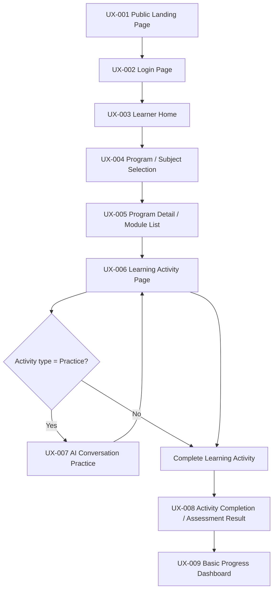
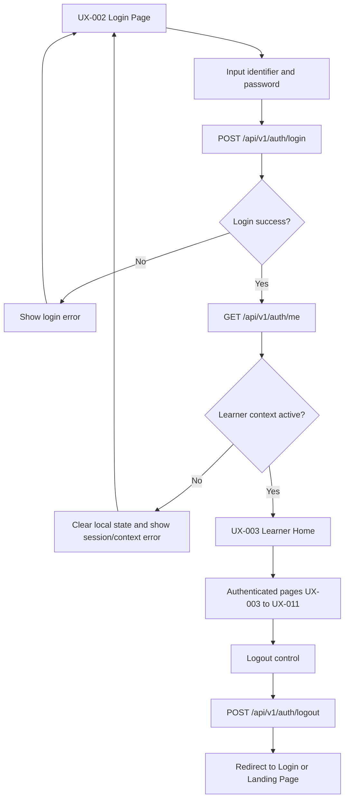
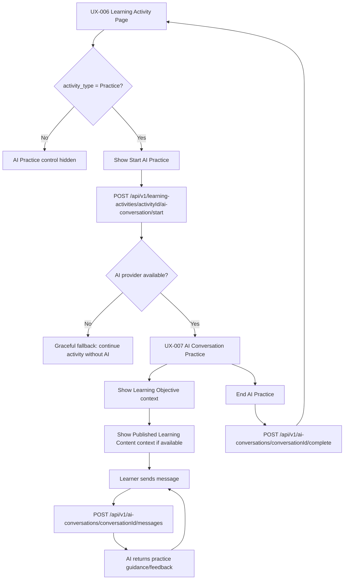

# User Flow — Kaifa v2 MVP

| Field | Value |
| ----- | ----- |
| Version | 1.0 |
| Status | Freeze |
| Owner | Product & UI/UX |
| Depends On | `70_ui_ux_spec.md`, `52_prd.md`, `60_srs.md`, `62_api_spec.md`, `80_feature_breakdown.md` |
| Used By | Product, UI/UX, Frontend, Backend, QA |
| Last Updated | 2026-07-05 |

Dokumen ini mendefinisikan user flow MVP Kaifa v2 berdasarkan UI/UX Specification yang telah disetujui dan dokumentasi MVP yang telah dibekukan. Seluruh istilah arsitektur resmi seperti Learning Program, Learning Activity, Assessment Result, Knowledge Profile, Learning Decision, Learner context, dan Runtime Event dipertahankan dalam Bahasa Inggris.

Dokumen ini tidak mendesain ulang arsitektur, tidak menambah business entity, tidak menambah business rule, dan tidak memperluas scope MVP.

---

# 1. Purpose

Dokumen ini menjelaskan alur end-to-end pengguna MVP dan jalur interaksi antar layar UX-001 sampai UX-010. Tujuannya adalah memberi acuan implementasi bagi Frontend, Backend, Product, UI/UX, dan QA mengenai entry point, exit behavior, API yang digunakan, data yang dibaca/ditulis, serta fallback yang aman.

Dokumen ini mengikuti `70_ui_ux_spec.md` sebagai sumber utama untuk screen, navigasi, state UI, dan batasan MVP. Dokumen ini tidak mendefinisikan ulang Domain, Engine, Runtime, AI Layer, Authentication, atau Event Model.

---

# 2. Flow Principles

* Landing Page bersifat public dan dapat diakses tanpa Learner context.
* Semua learner flow setelah login wajib memiliki Learner context aktif dari session yang valid.
* Isolasi data Learner wajib: Learner A tidak boleh melihat, mengakses, atau memodifikasi data Learner B.
* Learning Activity tetap menjadi pusat pengalaman belajar MVP.
* Assessment Result hanya diproduksi oleh Assessment Engine berdasarkan Activity Result dan Assessment Blueprint.
* AI Conversation Practice adalah assessable MVP Practice experience; AI feedback tetap bukan official assessment dan Assessment Engine saja menghasilkan Assessment Result.
* Dashboard hanya menampilkan basic learning progress.
* Error/fallback state wajib menjaga keamanan data Learner dan tidak menampilkan data sebelum context valid.
* UI interaction tidak mempublikasikan Official Runtime Event.
* MVP UI tidak menampilkan Knowledge Profile, Learning Decision, atau adaptive recommendation.

---

# 3. Primary MVP Flow

Happy path MVP dimulai dari Landing Page public, berlanjut ke login, pemilihan program, aktivitas belajar, AI Conversation Practice untuk Learning Activity type `Practice`, penyelesaian aktivitas, tampilan Assessment Result, dan Dashboard progress dasar.



Flow ini memiliki dua jalur valid pada Learning Activity Page:

* Learner menyelesaikan Learning Activity langsung tanpa AI Practice.
* Learner membuka AI Conversation Practice terlebih dahulu, kembali ke Learning Activity Page, lalu menyelesaikan Learning Activity secara eksplisit.

AI Conversation Practice tidak menggantikan completion action dan tidak menghasilkan official learning outcome.

---

# 4. Public Entry Flow

## Entry Point

User membuka UX-001 Public Landing Page tanpa login.

## Steps

1. User mengakses Landing Page.
2. UI memuat informasi produk dari `GET /api/v1/public/landing-page`.
3. UI memuat program highlights dari `GET /api/v1/public/program-highlights`.
4. User membaca informasi produk dan program highlights.
5. User memilih tombol Login/Masuk.
6. UI mengarahkan user ke UX-002 Login Page.

## Exit Point

User berada di UX-002 Login Page. Belum ada Learner context aktif sampai login berhasil.

## APIs Used

* `GET /api/v1/public/landing-page`
* `GET /api/v1/public/program-highlights`

## Data Used

* `landing_page_config`
* Published Learning Program highlights, tanpa data Learner.

## Out of Scope

* Public signup.
* Enrollment dari Landing Page.
* Program detail public.
* Personalisasi Landing Page berdasarkan Learner.
* Runtime Event untuk interaksi Landing Page.

## Error/Fallback

* Jika dynamic content gagal dimuat, UI menampilkan static fallback minimum tentang produk.
* Jika program highlights kosong, UI tetap menampilkan informasi produk dan tombol Login.
* Tidak ada data Learner yang diakses atau ditampilkan pada flow ini.

---

# 5. Basic Learner Authentication Flow

Flow ini membangun Learner context aktif untuk seluruh halaman terautentikasi. Minimal dua learner account dapat digunakan pada MVP, dan setiap account harus tetap terisolasi datanya.



## Steps

1. User membuka UX-002 Login Page.
2. User memasukkan identifier dan password.
3. UI memanggil `POST /api/v1/auth/login`.
4. Jika login gagal, UI menampilkan pesan kredensial tidak tepat tanpa membocorkan detail internal.
5. Jika login berhasil, UI memanggil `GET /api/v1/auth/me` untuk memastikan Learner context aktif.
6. Jika Learner context valid, UI mengarahkan ke UX-003 Learner Home.
7. Logout tersedia di semua halaman terautentikasi dan memanggil `POST /api/v1/auth/logout`.
8. Setelah logout, UI menghapus state lokal dan redirect ke Login Page atau Landing Page.

## Entry Behavior

* User belum login, baru logout, atau diarahkan karena session expired.

## Exit Behavior

* Login berhasil: UX-003 Learner Home.
* Login gagal: tetap di UX-002 dengan error message.
* Logout berhasil: UX-001 atau UX-002 tanpa data Learner tersisa di UI.

## APIs Used

* `POST /api/v1/auth/login`
* `GET /api/v1/auth/me`
* `POST /api/v1/auth/logout`

## Data Records

* `learner_auth_account`
* `auth_session`
* `learner`

## Data Safety Rules

* Learner A tidak boleh mengakses data Learner B.
* Semua API terautentikasi menggunakan Learner context dari session aktif.
* Jika `GET /api/v1/auth/me` gagal atau tidak mengembalikan Learner aktif, UI wajib redirect ke Login Page.

## Out of Scope

* Public signup.
* Password reset.
* OAuth / Social Login.
* SSO.
* MFA.
* Email verification.
* Role management.
* Educator, parent, organization identity, atau advanced identity features.

---

# 6. Program / Subject Selection Flow

Flow ini memungkinkan Learner memilih Learning Program yang Published. Subject dapat dipresentasikan sebagai representasi UI dari program atau offering yang tersedia, tetapi tidak memperkenalkan entity baru.

## Entry Behavior

Learner berada di UX-003 Learner Home dengan Learner context aktif.

## Steps

1. UI memverifikasi Learner context melalui `GET /api/v1/auth/me` bila diperlukan.
2. UI memuat daftar Published Learning Program melalui `GET /api/v1/learning-programs`.
3. UI menampilkan program/subject representation sebagai Program Card atau Subject Card.
4. Learner memilih satu program.
5. UI mengarahkan Learner ke UX-005 Program Detail / Module List.

## Exit Behavior

Learner berada di UX-005 untuk program yang dipilih.

## APIs Used

* `GET /api/v1/auth/me`
* `GET /api/v1/learning-programs`

## Data Records

* `learner`
* `learning_program`

## Example

* Learner A dapat memilih Arabic Learning.
* Learner B dapat memilih English Learning.
* Ini adalah dukungan multi-learner dan multi-program/subject, bukan adaptive personalized path.

## Rules

* Program/subject selection berbasis daftar Published Learning Program yang tersedia.
* UI tidak menampilkan adaptive recommendation.
* UI tidak menggunakan Knowledge Profile atau Learning Decision untuk mengurutkan atau mempersonalisasi pilihan MVP.

## Empty/Error Behavior

* Tidak ada program: tampilkan pesan bahwa belum ada program pembelajaran yang tersedia.
* Gagal memuat program: tampilkan retry state dan opsi kembali ke Learner Home.
* Unauthorized/session expired: redirect ke Login Page.

---

# 7. Module and Learning Activity Flow

Flow ini membawa Learner dari program detail ke Learning Activity Page. Learning Activity adalah titik utama eksekusi pembelajaran MVP.

```mermaid
flowchart TD
    A[UX-005 Program Detail / Module List] --> B[Select Learning Module]
    B --> C[Load Published Learning Activities]
    C --> D{Activities available?}
    D -- No --> E[No activity available empty state]
    D -- Yes --> F[Select Learning Activity]
    F --> G[UX-006 Learning Activity Page]
    G --> H[Load Learning Objective]
    G --> I[Load Published Learning Content if available]
    H --> J[Learner follows activity instructions]
    I --> J
    J --> K[Complete Activity]
    K --> L[POST /api/v1/learning-activities/{activityId}/complete]
    L --> M[Activity Result recorded]
    M --> N[Assessment flow starts per engine behavior]
```

## Entry Behavior

Learner berada di UX-005 setelah memilih Learning Program.

## Steps

1. UI memuat detail Learning Program melalui `GET /api/v1/learning-programs/{programId}`.
2. UI memuat Program Structure melalui `GET /api/v1/learning-programs/{programId}/program-structure` bila diperlukan.
3. UI memuat Published Learning Module melalui `GET /api/v1/learning-modules`.
4. Learner memilih Learning Module.
5. UI memuat daftar Published Learning Activity melalui `GET /api/v1/learning-activities`.
6. Learner memilih Learning Activity.
7. UI membuka UX-006 Learning Activity Page.
8. UI memuat detail activity melalui `GET /api/v1/learning-activities/{activityId}`.
9. UI menampilkan Learning Objective dan Published Learning Content terkait bila tersedia.
10. Learner menyelesaikan activity melalui tombol Complete Activity.
11. UI memanggil `POST /api/v1/learning-activities/{activityId}/complete`.
12. Sistem mencatat Activity Result dan memulai assessment flow sesuai API/engine behavior yang telah ada.

## Exit Behavior

Learner diarahkan ke UX-008 Activity Completion / Assessment Result ketika Assessment Result tersedia, atau melihat loading state jika hasil masih diproses.

## APIs Used

* `GET /api/v1/learning-programs/{programId}`
* `GET /api/v1/learning-programs/{programId}/program-structure`
* `GET /api/v1/learning-modules`
* `GET /api/v1/learning-activities`
* `GET /api/v1/learning-activities/{activityId}`
* `POST /api/v1/learning-activities/{activityId}/complete`

## Data Records

* `learning_program`
* `program_structure`
* `learning_module`
* `learning_activity`
* `learning_objective`
* `content_item`
* `learning_state`
* `activity_result`

## Rules

* Hanya Published content yang digunakan pada Learner-facing flow.
* UI tidak memperkenalkan state transition baru di luar documented State Machine behavior.
* Completion action menghasilkan Activity Result; Assessment Result tetap tanggung jawab Assessment Engine.

## Empty/Error Behavior

* Tidak ada module: tampilkan No module available.
* Tidak ada activity: tampilkan No activity available.
* Learning Content kosong: tampilkan instruksi activity; Learner tetap dapat menyelesaikan activity bila completion criteria terpenuhi.
* Resource not found: tampilkan fallback dan tombol kembali.

---

# 8. AI Conversation Practice Flow

Placement flow is UX-002 → UX-003 → UX-004 → UX-005 → UX-011 → UX-008. UX-011 reuses Learning Activity, Activity Result, Assessment Result, and Assessment Engine with `purpose = Placement`; it adds no domain resource. UX-007 provides microphone permission, Voice Recording, Voice Processing, Transcript Ready, Replay, Retry, text fallback, and assessable submission states.


AI Conversation Practice adalah MVP-limited Practice activity experience. Flow ini hanya tersedia dari UX-006 ketika `activity_type = Practice`.



## Entry Behavior

Learner berada di UX-006 pada Learning Activity type `Practice` dan memilih Start AI Practice.

## Steps

1. UI menampilkan tombol AI Practice hanya jika `activity_type = Practice`.
2. Learner memulai sesi AI Practice.
3. UI memanggil `POST /api/v1/learning-activities/{activityId}/ai-conversation/start`.
4. UI menampilkan Learning Objective context.
5. UI dapat menampilkan related Published Learning Content context bila tersedia.
6. Learner mengirim pesan.
7. UI memanggil `POST /api/v1/ai-conversations/{conversationId}/messages`.
8. AI mengembalikan practice guidance/feedback.
9. Learner dapat mengirim pesan lanjutan selama sesi aktif.
10. Learner mengakhiri sesi AI Practice.
11. UI memanggil `POST /api/v1/ai-conversations/{conversationId}/complete`.
12. Learner kembali ke UX-006 Learning Activity Page.
13. Learner tetap harus menyelesaikan Learning Activity secara eksplisit.

## Exit Behavior

Learner kembali ke UX-006. Learning Activity belum selesai sampai Learner memilih Complete Activity.

## APIs Used

* `POST /api/v1/learning-activities/{activityId}/ai-conversation/start`
* `POST /api/v1/ai-conversations/{conversationId}/messages`
* `POST /api/v1/ai-conversations/{conversationId}/complete`
* `GET /api/v1/ai-conversations/{conversationId}`

## Data Records

* `ai_practice_conversation`
* `ai_practice_message`
* `ai_practice_provider_record`
* `ai_practice_safety_event`
* `learning_activity`
* `learning_objective`
* `content_item`

## Mandatory Constraints

* AI Practice hanya tersedia untuk Learning Activity type `Practice`.
* AI menggunakan Learning Objective dan dapat menggunakan Published Learning Content sebagai context.
* AI output adalah practice guidance/feedback saja.
* AI Practice tidak menghasilkan Assessment Result.
* AI Practice tidak memperbarui Knowledge Profile.
* AI Practice tidak menghasilkan Learning Decision.
* AI Practice tidak mempublikasikan Official Runtime Event.
* AI records hanya audit/observability/provider records.
* Jika AI Provider unavailable, UI menampilkan graceful fallback dan Learning Activity tetap dapat diselesaikan tanpa AI.

## Out of Scope

* Full AI Learning Companion.
* AI Memory.
* AI scoring.
* AI-generated official assessment.
* AI-driven recommendation.

---

# 9. Activity Completion and Assessment Result Flow

Flow ini menjelaskan penyelesaian Learning Activity dan tampilan Assessment Result resmi.

## Entry Behavior

Learner berada di UX-006 Learning Activity Page dan memilih Complete Activity.

## Steps

1. Learner memilih tombol Complete Activity.
2. UI memanggil `POST /api/v1/learning-activities/{activityId}/complete`.
3. Sistem mencatat Activity Result.
4. Activity Result menjadi input untuk Assessment Engine.
5. Assessment Engine mengevaluasi Activity Result menggunakan Assessment Blueprint.
6. Assessment Engine menghasilkan Assessment Result.
7. UI memuat Assessment Result melalui `GET /api/v1/assessment-results/{resultId}` atau daftar result yang relevan bila result ID diperoleh dari flow.
8. UI menampilkan UX-008 Activity Completion / Assessment Result.
9. Learner dapat kembali ke Module List atau membuka Dashboard.

## Exit Behavior

* Lihat Dashboard: UX-009 Basic Progress Dashboard.
* Lanjutkan/Kembali: UX-005 Program Detail / Module List.

## APIs Used

* `POST /api/v1/learning-activities/{activityId}/complete`
* `GET /api/v1/assessment-results/{resultId}`
* `GET /api/v1/assessment-results` bila diperlukan untuk daftar milik Learner.

## Data Used

* `learning_activity`
* `activity_result`
* `assessment_blueprint`
* `assessment_result`
* `learning_state`

## Rules

* Assessment Result hanya diproduksi oleh Assessment Engine.
* UI menampilkan Assessment Result read-only.
* UI tidak mengizinkan Learner mengubah Assessment Result.
* UI tidak menampilkan Knowledge Profile update dalam MVP.
* UI tidak menampilkan Learning Decision dalam MVP.
* UI tidak menampilkan adaptive recommendation dalam MVP.

## Out of Scope

* Manual correction dari UI Learner.
* Knowledge Profile visualization.
* Learning Decision explanation.
* Adaptive next-step recommendation.
* Full adaptive Learning Path.

## Error/Fallback

* Assessment Result belum tersedia: tampilkan loading state.
* Assessment failed: tampilkan pesan hasil evaluasi tidak dapat diproses dan opsi kembali aman.
* Resource not found: tampilkan not found fallback.
* Session expired: redirect ke Login Page.

---

# 10. Basic Progress Dashboard Flow

Dashboard MVP menampilkan progress belajar dasar, bukan personalized learning system.

## Entry Behavior

Learner membuka UX-009 dari UX-003 Learner Home atau UX-008 Assessment Result page.

## Steps

1. UI memverifikasi Learner context melalui `GET /api/v1/auth/me`.
2. UI memuat Assessment Result milik Learner melalui `GET /api/v1/assessment-results`.
3. UI membaca current learning state dari `learning_state` melalui API/projection yang sesuai.
4. UI menampilkan completed activities, Activity Result, Assessment Result, dan current learning state.
5. Learner dapat kembali ke Learner Home, Program Selection, atau Module List sesuai konteks navigasi.

## Exit Behavior

* Kembali ke Learner Home: UX-003.
* Pilih program/module terkait: UX-004 atau UX-005.
* Logout: redirect ke UX-001 atau UX-002 setelah `POST /api/v1/auth/logout`.

## APIs Used

* `GET /api/v1/auth/me`
* `GET /api/v1/assessment-results`

## Data Records

* `learner`
* `learning_state`
* `activity_result`
* `assessment_result`

## Mandatory Constraints

* Dashboard tidak menampilkan Knowledge Profile.
* Dashboard tidak menampilkan Learning Decision.
* Dashboard tidak menampilkan adaptive recommendation.
* Dashboard tidak mengklaim mastery berbasis Knowledge Profile.
* Dashboard tidak menghasilkan Runtime Event untuk UI interaction.

---

# 11. Error and Fallback Flows

| Flow | Trigger | UI Behavior | Safe Destination | Data Safety Rule |
| ---- | ------- | ----------- | ---------------- | ---------------- |
| Session expired | API menunjukkan session tidak valid/expired | Hapus state lokal, tampilkan pesan session expired, redirect | UX-002 Login Page | Tidak tampilkan data Learner setelah session invalid. |
| Learner context missing | `GET /api/v1/auth/me` gagal mengembalikan Learner aktif | Hapus state lokal dan minta login ulang | UX-002 Login Page | Jangan gunakan cached Learner data sebagai pengganti context valid. |
| Unauthorized access / data isolation failure | Learner mencoba resource di luar Learner context aktif | Tampilkan pesan tidak berwenang tanpa detail resource | UX-003 Learner Home atau UX-002 bila session invalid | Jangan tampilkan identifier/data milik Learner lain. |
| No program available | Tidak ada Published Learning Program | Tampilkan empty state program | UX-003 Learner Home | Tidak membuat Enrollment atau rekomendasi fallback. |
| No module available | Program tidak memiliki Published Learning Module | Tampilkan empty state module | UX-004 Program / Subject Selection | Tidak membuat module virtual. |
| No activity available | Module tidak memiliki Published Learning Activity | Tampilkan empty state activity | UX-005 Program Detail / Module List | Tidak membuat activity baru dari UI. |
| AI provider unavailable | AI Provider gagal atau timeout | Tampilkan fallback banner; disable/hide AI Practice; activity tetap bisa diselesaikan | UX-006 Learning Activity Page | Jangan ubah Activity Result, Assessment Result, Knowledge Profile, atau Learning Decision. |
| Assessment processing failed | Assessment Engine gagal memproses Activity Result | Tampilkan pesan assessment failed dan retry/kembali jika tersedia | UX-006 atau UX-005 sesuai konteks | Jangan tampilkan hasil parsial sebagai Assessment Result. |
| Network error | Request gagal karena koneksi | Tampilkan network banner dan retry | Halaman saat ini atau halaman aman terdekat | Jangan mengirim ulang completion tanpa idempotency/API behavior yang aman. |
| Resource not found | API mengembalikan 404 | Tampilkan not found fallback | UX-003, UX-004, atau UX-005 sesuai resource | Jangan menebak resource alternatif. |
| Server error | API mengembalikan 500 | Tampilkan pesan sistem umum dan retry | Halaman saat ini atau halaman aman terdekat | Jangan tampilkan stack trace, provider detail, query, atau internal ID mentah. |

---

# 12. Alternate Flows

## 12.1 Learner skips AI Practice and completes activity directly

1. Learner membuka UX-006.
2. Jika activity type `Practice`, tombol AI Practice tersedia tetapi tidak wajib digunakan.
3. Learner memilih Complete Activity.
4. Flow berlanjut ke Activity Completion and Assessment Result Flow.

## 12.2 Learner starts AI Practice but exits before completing activity

1. Learner memulai UX-007 AI Conversation Practice.
2. Learner mengakhiri sesi atau kembali ke UX-006.
3. AI Practice session dicatat sebagai audit/observability/provider record.
4. Learning Activity belum selesai sampai Learner memilih Complete Activity.

## 12.3 Learner logs out from authenticated page

1. Learner memilih Logout dari UX-003 sampai UX-009.
2. UI memanggil `POST /api/v1/auth/logout`.
3. UI menghapus state lokal.
4. User diarahkan ke UX-001 atau UX-002.

## 12.4 Learner returns from Assessment Result to Module List instead of Dashboard

1. Learner melihat UX-008.
2. Learner memilih Lanjutkan/Kembali.
3. UI mengarahkan ke UX-005 Program Detail / Module List.
4. Tidak ada Learning Decision atau adaptive next-step yang ditampilkan.

## 12.5 Learner switches program/subject manually

1. Learner membuka UX-004 dari Learner Home atau navigation.
2. Learner memilih program/subject representation lain.
3. UI membuka UX-005 untuk program yang dipilih.
4. Perpindahan ini adalah pilihan manual Learner, bukan adaptive personalized path.

## 12.6 Learner sees empty program/module/activity state

1. UI memuat resource Published yang relevan.
2. Jika daftar kosong, UI menampilkan empty state spesifik.
3. Learner dapat kembali ke halaman aman sebelumnya.
4. UI tidak membuat entity baru, Enrollment, recommendation, atau fallback learning path.

---

# 13. Flow-to-Screen Mapping

| Flow | Screens involved | Main API endpoints | Data records | Notes |
| ---- | ---------------- | ------------------ | ------------ | ----- |
| Public Entry Flow | UX-001, UX-002 | `GET /api/v1/public/landing-page`, `GET /api/v1/public/program-highlights` | `landing_page_config`, `learning_program` highlights | Public; no Learner data; no Enrollment. |
| Login Flow | UX-002, UX-003 | `POST /api/v1/auth/login`, `GET /api/v1/auth/me`, `POST /api/v1/auth/logout` | `learner_auth_account`, `auth_session`, `learner` | Builds active Learner context; two learner accounts minimum. |
| Program Selection Flow | UX-003, UX-004, UX-005 | `GET /api/v1/auth/me`, `GET /api/v1/learning-programs`, `GET /api/v1/learning-programs/{programId}` | `learner`, `learning_program` | Published programs only; manual choice, not adaptive. |
| Module/Activity Flow | UX-005, UX-006 | `GET /api/v1/learning-programs/{programId}/program-structure`, `GET /api/v1/learning-modules`, `GET /api/v1/learning-activities`, `GET /api/v1/learning-activities/{activityId}`, `POST /api/v1/learning-activities/{activityId}/complete` | `program_structure`, `learning_module`, `learning_activity`, `learning_objective`, `content_item`, `learning_state`, `activity_result` | Learning Activity is the center of MVP learning experience. |
| AI Conversation Practice Flow | UX-006, UX-007 | `POST /api/v1/learning-activities/{activityId}/ai-conversation/start`, `POST /api/v1/ai-conversations/{conversationId}/messages`, `POST /api/v1/ai-conversations/{conversationId}/complete`, `GET /api/v1/ai-conversations/{conversationId}` | `ai_practice_conversation`, `ai_practice_message`, `ai_practice_provider_record`, `ai_practice_safety_event` | Practice guidance only; no official learning output. |
| Assessment Result Flow | UX-006, UX-008, UX-005, UX-009 | `POST /api/v1/learning-activities/{activityId}/complete`, `GET /api/v1/assessment-results/{resultId}`, `GET /api/v1/assessment-results` | `activity_result`, `assessment_result`, `assessment_blueprint`, `learning_state` | Assessment Result read-only; produced by Assessment Engine only. |
| Dashboard Flow | UX-003, UX-008, UX-009 | `GET /api/v1/auth/me`, `GET /api/v1/assessment-results` | `learner`, `learning_state`, `activity_result`, `assessment_result` | Basic progress only; no Knowledge Profile or Learning Decision. |
| Error/Fallback Flow | UX-002, UX-003, UX-004, UX-005, UX-006, UX-007, UX-008, UX-009, UX-010 | `GET /api/v1/auth/me`, relevant failing endpoint | `auth_session`, current requested record, relevant safe fallback state | Preserves data safety and does not publish UI Runtime Events. |

---

# 14. Flow-to-Feature Traceability

| Flow | Feature Breakdown ID | SRS ID | UI Screen IDs | MVP/Future status |
| ---- | -------------------- | ------ | ------------- | ----------------- |
| Public Entry Flow | FB-MVP-013 | SRS-FR-012A | UX-001 | MVP |
| Login Flow | FB-MVP-015 | SRS-FR-012C | UX-002, UX-003 | MVP limited auth |
| Program Selection Flow | FB-MVP-001 | SRS-FR-001 | UX-003, UX-004 | MVP |
| Module Flow | FB-MVP-002, FB-MVP-003 | SRS-FR-002, SRS-FR-003 | UX-005 | MVP |
| Learning Activity Flow | FB-MVP-006, FB-MVP-009 | SRS-FR-006, SRS-FR-009 | UX-006 | MVP |
| AI Practice Flow | FB-MVP-014 | SRS-FR-012B | UX-007 | MVP limited Practice support |
| Assessment Result Flow | FB-MVP-008 | SRS-FR-008 | UX-008 | MVP |
| Dashboard Flow | FB-MVP-012 | SRS-FR-012 | UX-009 | MVP limited dashboard |
| Error/Fallback Flow | Cross-cutting | SRS-FR-012B, SRS-FR-012C | UX-010 | MVP support state |

---

# 15. Out of Scope Flows

* **Public Signup Flow** — tidak ada registrasi mandiri Learner pada MVP.
* **Forgot Password Flow** — tidak ada reset password atau recovery email pada MVP.
* **OAuth / Social Login Flow** — tidak ada Google login, OAuth, SSO, MFA, atau advanced identity feature.
* **Full adaptive Learning Path Flow** — adaptive personalized learning path tetap Phase 2; Placement Test MVP menggunakan specialized Learning Activity flow.
* **Adaptive Learning Path Flow** — adaptive personalized learning path tidak tersedia dalam MVP.
* **Knowledge Profile Visualization Flow** — MVP UI tidak menampilkan Knowledge Profile atau mastery visualization.
* **Learning Decision Explanation Flow** — MVP UI tidak menampilkan Learning Decision atau penjelasan AI atas Learning Decision.
* **Enrollment Flow** — Enrollment workflow formal tidak diperkenalkan dalam MVP UI.
* **Educator Flow** — tidak ada Educator account, dashboard, class management, atau learner monitoring UI pada MVP.
* **Parent Flow** — tidak ada Parent account atau Parent dashboard pada MVP.
* **Payment Flow** — tidak ada payment/subscription flow pada MVP.
* **Notification Flow** — tidak ada notification center atau push notification pada MVP.
* **Achievement / Certificate Flow** — tidak ada achievement atau certificate flow pada MVP.

---

# 16. Open Issues

* Advanced Authentication.
* Public Signup.
* Enrollment Workflow.
* Adaptive Learning Path.
* Knowledge Profile Visualization.
* Learning Decision Explanation.
* Educator Experience.
* Parent Experience.
* Notifications.
* Achievements / Certificates.

---

# 17. References

* `docs/70_ui_ux/70_ui_ux_spec.md`
* `docs/50_product/52_prd.md`
* `docs/60_engineering/60_srs.md`
* `docs/60_engineering/62_api_spec.md`
* `docs/60_engineering/63_database_model.md`
* `docs/60_engineering/65_event_contracts.md`
* `docs/80_implementation/80_feature_breakdown.md`
* `docs/99_architecture_decisions.md`
