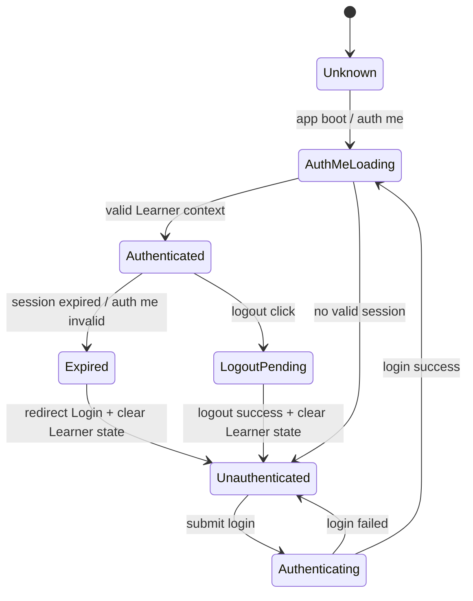
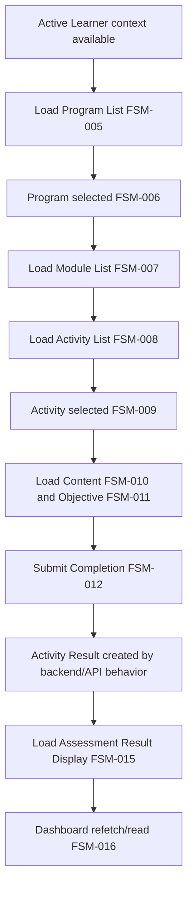
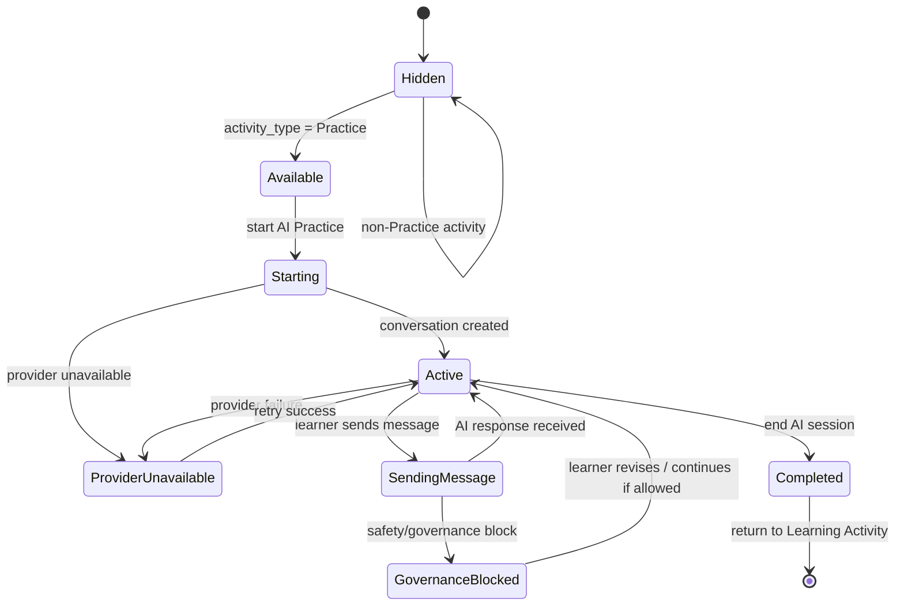

# Frontend State Model — Kaifa v2 MVP

| Field | Value |
| --- | --- |
| Version | 1.0 |
| Status | Freeze |
| Owner | Product & UI/UX |
| Depends On | `70_ui_ux_spec.md`, `71_user_flow.md`, `72_screen_inventory.md`, `73_component_spec.md`, `52_prd.md`, `60_srs.md`, `62_api_spec.md`, `80_feature_breakdown.md` |
| Used By | Product, UI/UX, Frontend, Backend, QA |
| Last Updated | 2026-07-05 |

# 1. Purpose

Dokumen ini mendefinisikan frontend-owned UI state untuk Kaifa v2 MVP, termasuk auth/session state, active Learner context, navigation state, selected learning resources, loading/error states, AI Practice UI state, assessment result display state, dan dashboard state.

Frontend state dalam dokumen ini adalah presentation/application state. Frontend state bukan Domain state, Runtime state, Engine state, AI Memory, Knowledge Profile, atau Learning Decision. Dokumen ini tidak mengubah architecture, API contract, database model, event model, atau business rules yang sudah dibekukan.

# 2. State Ownership Principles

* Frontend state adalah presentation/application state saja.
* Backend/API tetap menjadi source of truth untuk Learner, session, learning resources, Activity Result, Assessment Result, dan `learning_state`.
* Frontend dapat melakukan cache/display state, tetapi sensitive context harus direvalidasi menggunakan `GET /api/v1/auth/me`.
* Frontend harus menghapus Learner-scoped state saat logout, session expired, atau Learner context mismatch.
* Frontend tidak boleh menginferensi atau menghitung official learning outcomes.
* Frontend tidak boleh mem-publish Official Runtime Events.
* Frontend tidak boleh membuat fallback business rules.
* AI Practice state terpisah dari Assessment Result state.
* Dashboard state hanya menampilkan basic progress.
* Frontend harus mencegah stale data leakage antar Learner accounts.

# 3. Frontend State Domains

| State Domain ID | State Domain Name | Purpose | Owned By Frontend? | Source of Truth | Used In Screens | Notes |
| --- | --- | --- | --- | --- | --- | --- |
| FSM-001 | Auth Session State | Melacak status session untuk akses learner. | Yes, display/control state only | Backend auth/session API | UX-002 to UX-009 | Sensitive context harus direvalidasi. |
| FSM-002 | Active Learner Context State | Menyimpan Learner context aktif untuk UI. | Yes, minimal display state | `GET /api/v1/auth/me` | UX-002 to UX-009 | Wajib menjaga data isolation. |
| FSM-003 | Navigation / Route State | Mengelola route aktif, safe back, dan safe destination. | Yes | Router + auth/resource validation | UX-001 to UX-011 | Tidak menggunakan Learning Decision. |
| FSM-004 | Public Landing State | Menampilkan landing content publik. | Yes | Public content API | UX-001 | Tidak membaca Learner data. |
| FSM-005 | Program List State | Menampilkan Published Learning Programs. | Yes | Learning program API | UX-003, UX-004 | Manual selection only. |
| FSM-006 | Selected Program State | Menampilkan program detail dan structure yang dipilih. | Yes | Learning program API | UX-005 | Reset saat learner/program berubah. |
| FSM-007 | Module List State | Menampilkan Published Learning Modules. | Yes | Learning module API | UX-005 | No adaptive sequencing. |
| FSM-008 | Activity List State | Menampilkan Published Learning Activities. | Yes | Learning activity API | UX-005 | AI label hanya untuk `Practice`. |
| FSM-009 | Selected Activity State | Menampilkan activity aktif. | Yes | Learning activity API | UX-006, UX-007, UX-008 | Tidak mendefinisikan state transition bisnis. |
| FSM-010 | Learning Content Display State | Menampilkan Published Learning Content. | Yes | Learning content API | UX-006, UX-007 | Tidak generate content dengan AI. |
| FSM-011 | Learning Objective Context State | Menampilkan Learning Objective terkait activity. | Yes | Activity/API response | UX-006, UX-007, UX-008 | UI tidak mengubah objective. |
| FSM-012 | Activity Completion UI State | Mengelola submit completion dari UI. | Yes | Completion API response | UX-006 | Activity Result dibuat oleh backend/API behavior. |
| FSM-013 | AI Practice Availability State | Menentukan visibilitas dan kesiapan AI Practice. | Yes | Activity type + AI availability API behavior | UX-006, UX-007 | Hidden untuk non-Practice. |
| FSM-014 | AI Conversation UI State | Mengelola conversation UI untuk Practice. | Yes | AI Practice APIs | UX-007 | Practice-only, bukan assessment. |
| FSM-015 | Assessment Result Display State | Menampilkan Assessment Result read-only. | Yes | Assessment Result API | UX-008, UX-009 | Result dibuat Assessment Engine. |
| FSM-016 | Dashboard Progress Display State | Menampilkan basic progress learner. | Yes | Auth/progress/result APIs | UX-003, UX-009 | Tidak menampilkan Knowledge Profile atau Learning Decision. |
| FSM-017 | Loading State | Melacak request loading per screen/component. | Yes | Frontend async lifecycle | UX-001 to UX-011 | Jangan tampilkan stale Learner data saat validasi. |
| FSM-018 | Empty State | Menampilkan kondisi data kosong. | Yes | API response + UI rules | UX-001 to UX-011 | Tidak membuat synthetic content. |
| FSM-019 | Error / Fallback State | Menampilkan error aman dan fallback. | Yes | API/router/provider error categories | UX-001 to UX-011 | Tidak membocorkan internal details. |
| FSM-020 | Accessibility / Focus State | Mengelola focus dan announcement. | Yes | Frontend interaction lifecycle | UX-001 to UX-011 | Tidak menyimpan sensitive Learner data. |
| FSM-021 | Placement Test UI State | Manages Placement Test as specialized Learning Activity. | Yes | Learning Activity and Assessment Result APIs | UX-011, UX-008 | Frontend state only; never Runtime state. |

# 4. State Domain Detail Specifications

## FSM-001 — Auth Session State

* Purpose: Melacak status session untuk menentukan akses ke authenticated learner screens.
* Used In Screens: UX-002, UX-003, UX-004, UX-005, UX-006, UX-007, UX-008, UX-009.
* Related Components: CMP-002, CMP-003, CMP-023, CMP-024.
* Source of Truth: Backend auth/session API.
* Frontend Stored Values: session status, request status, safe redirect destination; tidak menyimpan password.
* Initial State: `unknown` saat app boot.
* Valid State Values: `unknown`, `unauthenticated`, `authenticating`, `authenticated`, `expired`, `logoutPending`.
* Triggers / Transitions: app boot memicu `GET /api/v1/auth/me`; login submit memicu `authenticating`; login success dan valid `auth/me` menjadi `authenticated`; session timeout menjadi `expired`; logout submit menjadi `logoutPending` lalu `unauthenticated`.
* Clear / Reset Conditions: logout, session expired, auth/me invalid, Learner context mismatch, hard reload dengan invalid session.
* API Dependencies: `POST /api/v1/auth/login`, `GET /api/v1/auth/me`, `POST /api/v1/auth/logout`.
* Data Dependencies: `learner_auth_account`, `auth_session`, `learner`.
* Security / Data Isolation Rules: Clear semua Learner-scoped state pada logout/session expiry; jangan persist stale session data antar Learner.
* Boundary Notes: Auth state tidak membuat role management, OAuth, SSO, MFA, password reset, atau public signup.
* QA Checklist: Validasi dua learner accounts, session expiry redirect ke Login, logout menghapus data UI, Learner A data tidak terlihat setelah Learner B login.

## FSM-002 — Active Learner Context State

* Purpose: Menyimpan active Learner context minimal untuk identitas UI dan scoping data.
* Used In Screens: UX-002, UX-003, UX-004, UX-005, UX-006, UX-007, UX-008, UX-009.
* Related Components: CMP-002, CMP-005, CMP-007, CMP-008, CMP-016, CMP-017, CMP-018, CMP-019, CMP-024.
* Source of Truth: `GET /api/v1/auth/me`.
* Frontend Stored Values: Learner id, display name, context validation status.
* Initial State: `missing` sebelum auth/me selesai.
* Valid State Values: `missing`, `loading`, `available`, `invalid`.
* Triggers / Transitions: auth/me request, login success, route guard entry, session expiry, logout, context mismatch.
* Clear / Reset Conditions: logout, session expired, Learner switch, invalid auth/me response.
* API Dependencies: `GET /api/v1/auth/me`.
* Data Dependencies: `learner`, `auth_session`.
* Security / Data Isolation Rules: Learner A data harus dibersihkan sebelum menampilkan Learner B data.
* Boundary Notes: Frontend hanya menyimpan identitas minimal yang dibutuhkan untuk UI.
* QA Checklist: Uji route guard tanpa context, validasi nama learner aktif, dan pastikan tidak ada stale identity setelah logout/login ulang.

## FSM-003 — Navigation / Route State

* Purpose: Melacak current route, previous safe route, dan safe destination untuk navigasi UI.
* Used In Screens: UX-001 to UX-011.
* Related Components: CMP-001, CMP-002, CMP-023, CMP-025, CMP-024.
* Source of Truth: Router frontend ditambah hasil validasi auth/resource dari API.
* Frontend Stored Values: current route, route params, previous safe route, intended destination, fallback destination.
* Initial State: current route dari browser location.
* Valid State Values: public route, authenticated route pending validation, authenticated route ready, fallback route.
* Triggers / Transitions: route change, login redirect, logout redirect, back action, continue action, resource not found, unauthorized response.
* Clear / Reset Conditions: logout, session expired, resource mismatch, hard reload.
* API Dependencies: Route-specific APIs dan `GET /api/v1/auth/me` untuk authenticated routes.
* Data Dependencies: Route params untuk `programId`, `activityId`, `resultId`.
* Security / Data Isolation Rules: Jangan route ke unauthorized resource; unauthorized tidak boleh ditampilkan sebagai empty state.
* Boundary Notes: Tidak menggunakan Learning Decision untuk menyarankan next step.
* QA Checklist: Back/continue aman dari activity, redirect session expired ke Login, unauthorized route menuju safe destination.

## FSM-004 — Public Landing State

* Purpose: Menampilkan Landing Page publik dan program highlights.
* Used In Screens: UX-001.
* Related Components: CMP-001, CMP-004, CMP-020, CMP-021.
* Source of Truth: Public content API.
* Frontend Stored Values: landing page config, public program highlights, request status.
* Initial State: `idle`.
* Valid State Values: `idle`, `loading`, `ready`, `emptyHighlights`, `errorFallback`.
* Triggers / Transitions: page load, public API success, public API empty, public API failure.
* Clear / Reset Conditions: page leave, refresh, public content refetch.
* API Dependencies: `GET /api/v1/public/landing-page`, `GET /api/v1/public/program-highlights`.
* Data Dependencies: `landing_page_config`, Published program highlights.
* Security / Data Isolation Rules: Tidak membaca atau menyimpan Learner data.
* Boundary Notes: Tidak membuat Enrollment, signup, personalization, atau Runtime Events.
* QA Checklist: Landing bisa dibuka tanpa auth, Login CTA tersedia, tidak ada learner identity atau private data.

## FSM-005 — Program List State

* Purpose: Menampilkan daftar Published Learning Programs untuk Learner.
* Used In Screens: UX-003, UX-004.
* Related Components: CMP-005, CMP-006, CMP-017, CMP-020, CMP-021, CMP-022.
* Source of Truth: Learning program API.
* Frontend Stored Values: program list, selected candidate id, request status.
* Initial State: `idle` setelah Learner context tersedia.
* Valid State Values: `idle`, `loading`, `ready`, `empty`, `error`.
* Triggers / Transitions: Learner Home load, Program Selection load, retry, logout, session expiry.
* Clear / Reset Conditions: logout, session expired, Learner switch, program list refetch.
* API Dependencies: `GET /api/v1/learning-programs`.
* Data Dependencies: `learning_program`.
* Security / Data Isolation Rules: Display data harus sesuai active Learner context dan published availability.
* Boundary Notes: Manual selection only; tidak ada Knowledge Profile ranking, Learning Decision, atau adaptive recommendation.
* QA Checklist: Empty program state aman, program choice manual, tidak ada recommendation wording.

## FSM-006 — Selected Program State

* Purpose: Menyimpan program yang dipilih untuk menampilkan Program Detail / Module List.
* Used In Screens: UX-005.
* Related Components: CMP-007, CMP-008, CMP-020, CMP-021, CMP-022, CMP-025.
* Source of Truth: Learning program detail dan program structure APIs.
* Frontend Stored Values: selected program id, title, description, structure summary, request status.
* Initial State: no selected program atau route param pending validation.
* Valid State Values: `idle`, `loading`, `ready`, `notFound`, `unauthorized`, `error`.
* Triggers / Transitions: program card selection, direct route load, program switch, retry.
* Clear / Reset Conditions: Learner changes, logout, session expiry, program unavailable, program switch.
* API Dependencies: `GET /api/v1/learning-programs/{programId}`, `GET /api/v1/learning-programs/{programId}/program-structure`.
* Data Dependencies: `learning_program`, `program_structure`.
* Security / Data Isolation Rules: Program detail harus tervalidasi untuk context yang diizinkan.
* Boundary Notes: Tidak menghasilkan adaptive sequencing atau Learning Decision-based next step.
* QA Checklist: Invalid `programId` menampilkan fallback aman, switching program reset module/activity state.

## FSM-007 — Module List State

* Purpose: Menampilkan Published Learning Modules untuk selected program.
* Used In Screens: UX-005.
* Related Components: CMP-007, CMP-020, CMP-021, CMP-022.
* Source of Truth: Learning module API.
* Frontend Stored Values: module list, basic completion display if available, request status.
* Initial State: `idle` sampai selected program valid.
* Valid State Values: `idle`, `loading`, `ready`, `empty`, `error`.
* Triggers / Transitions: selected program ready, module refetch, retry, program switch.
* Clear / Reset Conditions: program switch, Learner switch, logout, session expiry.
* API Dependencies: `GET /api/v1/learning-modules`.
* Data Dependencies: `learning_module`, optional `learning_state` for display status.
* Security / Data Isolation Rules: Module list tidak boleh menampilkan data dari program/resource yang tidak dapat diakses.
* Boundary Notes: No adaptive sequencing.
* QA Checklist: No module available state, no adaptive labels, module card navigation valid.

## FSM-008 — Activity List State

* Purpose: Menampilkan Published Learning Activities untuk module/program yang dipilih.
* Used In Screens: UX-005.
* Related Components: CMP-008, CMP-020, CMP-021, CMP-022.
* Source of Truth: Learning activity API.
* Frontend Stored Values: activity list, `activity_type`, availability label, request status.
* Initial State: `idle` sampai module/program context valid.
* Valid State Values: `idle`, `loading`, `ready`, `empty`, `error`.
* Triggers / Transitions: module selection, program detail load, retry, program switch.
* Clear / Reset Conditions: program switch, module switch, Learner switch, logout, session expiry.
* API Dependencies: `GET /api/v1/learning-activities`.
* Data Dependencies: `learning_activity`, optional `learning_state`.
* Security / Data Isolation Rules: Activity list harus terikat pada accessible program/module context.
* Boundary Notes: AI availability label hanya untuk `activity_type = Practice`.
* QA Checklist: AI Practice label tidak tampil untuk non-Practice, empty activity state aman.

## FSM-009 — Selected Activity State

* Purpose: Menyimpan activity aktif untuk Learning Activity Page, AI Practice, dan result context.
* Used In Screens: UX-006, UX-007, UX-008.
* Related Components: CMP-008, CMP-009, CMP-010, CMP-011, CMP-015, CMP-016, CMP-025.
* Source of Truth: Learning activity API.
* Frontend Stored Values: activity id, title, type, status display, linked objective/content references.
* Initial State: route param pending validation.
* Valid State Values: `idle`, `loading`, `ready`, `notFound`, `unauthorized`, `error`.
* Triggers / Transitions: activity card selection, direct activity route, AI Practice route/panel open, completion success.
* Clear / Reset Conditions: activity switch, program/module switch, Learner switch, logout, session expiry.
* API Dependencies: `GET /api/v1/learning-activities/{activityId}`.
* Data Dependencies: `learning_activity`, `learning_objective`, `content_item`, `learning_state`.
* Security / Data Isolation Rules: Activity harus diverifikasi milik accessible context.
* Boundary Notes: Frontend tidak mendefinisikan business rules atau State Machine transitions.
* QA Checklist: Direct route unauthorized aman, activity switch membersihkan AI/content state terkait.

## FSM-010 — Learning Content Display State

* Purpose: Menampilkan Published Learning Content untuk selected activity.
* Used In Screens: UX-006, optionally UX-007 as context.
* Related Components: CMP-009, CMP-012, CMP-020, CMP-021, CMP-022.
* Source of Truth: Learning content API.
* Frontend Stored Values: content item metadata/body for display, content loading/empty state.
* Initial State: `idle` sampai selected activity ready.
* Valid State Values: `idle`, `loading`, `ready`, `empty`, `error`.
* Triggers / Transitions: activity loaded, content refetch, retry, activity switch.
* Clear / Reset Conditions: activity switch, Learner switch, logout, session expiry.
* API Dependencies: `GET /api/v1/learning-contents`.
* Data Dependencies: `content_item`, `learning_activity`.
* Security / Data Isolation Rules: Content yang ditampilkan harus Published dan accessible untuk activity context.
* Boundary Notes: Empty content menggunakan instruction fallback, bukan AI-generated content.
* QA Checklist: Empty content tidak memblok completion jika API behavior memungkinkan, tidak ada Knowledge Profile personalization.

## FSM-011 — Learning Objective Context State

* Purpose: Menampilkan Learning Objective yang terhubung dengan selected Learning Activity.
* Used In Screens: UX-006, UX-007, UX-008.
* Related Components: CMP-010, CMP-012, CMP-016.
* Source of Truth: Selected Learning Activity/API response.
* Frontend Stored Values: objective id, title, description, display status.
* Initial State: `idle` sampai selected activity/objective loaded.
* Valid State Values: `idle`, `loading`, `ready`, `missing`, `error`.
* Triggers / Transitions: activity load success, objective context available, activity switch.
* Clear / Reset Conditions: activity switch, Learner switch, logout, session expiry.
* API Dependencies: `GET /api/v1/learning-activities/{activityId}` and related content/activity responses.
* Data Dependencies: `learning_objective`, `learning_activity`.
* Security / Data Isolation Rules: Objective context harus sesuai activity yang valid.
* Boundary Notes: UI tidak boleh mengubah Learning Objective.
* QA Checklist: AI Practice selalu menunjukkan objective context; missing objective ditangani sebagai fallback aman.

## FSM-012 — Activity Completion UI State

* Purpose: Mengelola state tombol/submit completion di Learning Activity Page.
* Used In Screens: UX-006.
* Related Components: CMP-015, CMP-022, CMP-023.
* Source of Truth: Completion API response.
* Frontend Stored Values: submit status, validation message, resulting activity result reference if returned.
* Initial State: `idle`.
* Valid State Values: `idle`, `submitting`, `validationError`, `completed`, `failed`.
* Triggers / Transitions: Complete Activity click, API success, API validation error, API/network failure.
* Clear / Reset Conditions: activity switch, completion success route transition, Learner switch, logout, retry.
* API Dependencies: `POST /api/v1/learning-activities/{activityId}/complete`.
* Data Dependencies: `learning_activity`, `learning_state`, `activity_result`.
* Security / Data Isolation Rules: Completion submit harus memakai active Learner context.
* Boundary Notes: Completion menghasilkan Activity Result melalui backend/API behavior; frontend tidak membuat Assessment Result langsung.
* QA Checklist: Double-submit dicegah, failure bisa retry, Assessment Result tidak dibuat di frontend.

## FSM-013 — AI Practice Availability State

* Purpose: Menentukan apakah AI Practice entry terlihat, aktif, disabled, atau unavailable.
* Used In Screens: UX-006, UX-007.
* Related Components: CMP-011, CMP-014, CMP-022.
* Source of Truth: `activity_type`, selected activity context, dan AI provider/API availability response.
* Frontend Stored Values: visibility, availability status, fallback reason category.
* Initial State: `hidden` sampai selected activity ready.
* Valid State Values: `hidden`, `available`, `starting`, `unavailable`, `disabled`.
* Triggers / Transitions: selected activity loaded, non-Practice detected, Practice detected, start request, provider unavailable, governance/config disabled.
* Clear / Reset Conditions: activity switch, AI session complete, Learner switch, logout, session expiry.
* API Dependencies: `POST /api/v1/learning-activities/{activityId}/ai-conversation/start`.
* Data Dependencies: `learning_activity`, `learning_objective`, `content_item`, AI availability/fallback status.
* Security / Data Isolation Rules: AI Practice entry harus terkait active Learner, activity, dan objective.
* Boundary Notes: Hidden untuk non-Practice; unavailable tetap mengizinkan Learning Activity completion tanpa AI.
* QA Checklist: Non-Practice tidak menampilkan entry; provider unavailable menampilkan fallback; tidak ada official outcome dari availability state.

## FSM-014 — AI Conversation UI State

* Purpose: Mengelola UI conversation untuk AI Conversation Practice.
* Used In Screens: UX-007.
* Related Components: CMP-010, CMP-012, CMP-013, CMP-014, CMP-023, CMP-026, CMP-027, CMP-028.
* Source of Truth: AI Practice APIs dan provider response yang telah diproses backend.
* Frontend Stored Values: conversation id, message list display, input draft, send status, governance/provider fallback category.
* Initial State: `notStarted`.
* Valid State Values: `notStarted`, `starting`, `active`, `microphone-permission-requested`, `permission-denied`, `Voice Recording`, `Voice Processing`, `Transcript Ready`, `awaiting-ai-response`, `Replay`, `Retry`, `completing`, `Assessment Pending`, `Assessment Ready`, `governanceBlocked`, `providerUnavailable`, `completed`, `failed`. These are frontend states, never Runtime states.
* Triggers / Transitions: start session, load conversation, send message, AI response received, governance block, provider failure, complete session, exit panel/page.
* Clear / Reset Conditions: AI session ended, activity switch, Learner switch, logout, session expiry.
* API Dependencies: `POST /api/v1/learning-activities/{activityId}/ai-conversation/start`, `GET /api/v1/ai-conversations/{conversationId}`, `POST /api/v1/ai-conversations/{conversationId}/messages`, `POST /api/v1/ai-conversations/{conversationId}/complete`.
* Data Dependencies: `ai_practice_conversation`, `ai_practice_message`, `ai_practice_provider_record`, `ai_practice_safety_event`, `learning_activity`, `learning_objective`, `content_item`.
* Security / Data Isolation Rules: Conversation state harus milik active Learner/activity/objective; tidak boleh menampilkan conversation learner lain.
* Boundary Notes: AI output adalah practice guidance/feedback saja; AI state terpisah dari Assessment Result state; tidak update Knowledge Profile, tidak generate Learning Decision, dan tidak publish Official Runtime Event.
* QA Checklist: AI messages tidak tampil sebagai score/result; governance/provider fallback aman; activity tetap harus diselesaikan eksplisit.

## FSM-015 — Assessment Result Display State

* Purpose: Menampilkan Assessment Result read-only setelah completion atau di Dashboard.
* Used In Screens: UX-008, UX-009.
* Related Components: CMP-016, CMP-019, CMP-021, CMP-022, CMP-025.
* Source of Truth: Assessment Result API; Assessment Result diproduksi oleh Assessment Engine.
* Frontend Stored Values: result id, result summary, display status, fetch error category.
* Initial State: `idle`.
* Valid State Values: `idle`, `loading`, `pending`, `ready`, `failed`, `notFound`.
* Triggers / Transitions: completion success route, direct result route, dashboard result list load, retry.
* Clear / Reset Conditions: result page leave if not cached, Learner switch, logout, session expiry.
* API Dependencies: `GET /api/v1/assessment-results/{resultId}`, `GET /api/v1/assessment-results`.
* Data Dependencies: `activity_result`, `assessment_result`, `assessment_blueprint`, `learning_state`.
* Security / Data Isolation Rules: Result harus scoped ke active Learner; unauthorized result tidak boleh muncul sebagai empty state.
* Boundary Notes: Read-only; tidak menampilkan Knowledge Profile update, Learning Decision, atau adaptive recommendation.
* QA Checklist: No edit controls, failed/not found state aman, result learner lain tidak dapat dilihat.

## FSM-016 — Dashboard Progress Display State

* Purpose: Menampilkan basic progress learner pada Learner Home dan Dashboard.
* Used In Screens: UX-003, UX-009.
* Related Components: CMP-017, CMP-018, CMP-019, CMP-021, CMP-022.
* Source of Truth: Auth/progress/result APIs dan backend `learning_state`.
* Frontend Stored Values: current `learning_state` display, completed activity count, Activity Result list, Assessment Result list, fetch status.
* Initial State: `idle` setelah Learner context available.
* Valid State Values: `idle`, `loading`, `ready`, `empty`, `error`.
* Triggers / Transitions: dashboard load, return from result page, retry, auth/me refresh.
* Clear / Reset Conditions: Learner switch, logout, session expiry, hard reload with invalid session.
* API Dependencies: `GET /api/v1/auth/me`, `GET /api/v1/assessment-results`.
* Data Dependencies: `learner`, `learning_state`, `activity_result`, `assessment_result`.
* Security / Data Isolation Rules: Semua progress data harus terfilter active Learner.
* Boundary Notes: Basic progress only; tidak menampilkan Knowledge Profile, Learning Decision, mastery berbasis Knowledge Profile, atau adaptive recommendation.
* QA Checklist: Dashboard learner A/B terisolasi, no adaptive recommendation text, no Knowledge Profile/Learning Decision.

## FSM-017 — Loading State

* Purpose: Melacak async request state per screen/component.
* Used In Screens: UX-001 to UX-011.
* Related Components: CMP-021 and all data-loading components.
* Source of Truth: Frontend async lifecycle.
* Frontend Stored Values: loading key, request owner, pending status, optional retry token.
* Initial State: no pending request.
* Valid State Values: `idle`, `loading`, `refreshing`, `submitting`.
* Triggers / Transitions: API call start, response, failure, retry, route change.
* Clear / Reset Conditions: request completed, route leave, logout, session expiry, context mismatch.
* API Dependencies: All screen/component APIs.
* Data Dependencies: None directly; tied to current request owner.
* Security / Data Isolation Rules: Jangan tampilkan stale Learner data ketika session validation pending atau invalid.
* Boundary Notes: Loading state tidak mengubah business state.
* QA Checklist: Skeleton/spinner tidak memperlihatkan data lama setelah logout atau Learner switch.

## FSM-018 — Empty State

* Purpose: Menampilkan kondisi data kosong secara aman.
* Used In Screens: UX-001 to UX-011.
* Related Components: CMP-020, CMP-023.
* Source of Truth: API response kosong dan UI-specific empty categories.
* Frontend Stored Values: empty category, display message, safe action.
* Initial State: none.
* Valid State Values: `noProgram`, `noModule`, `noActivity`, `noContent`, `noResult`, `noCompletedActivity`, `emptyHighlights`.
* Triggers / Transitions: successful API response dengan list kosong atau missing optional display data.
* Clear / Reset Conditions: refetch success with data, route leave, Learner switch, logout.
* API Dependencies: Public, learning program, module, activity, content, result APIs.
* Data Dependencies: Response collections for program/module/activity/content/result.
* Security / Data Isolation Rules: Unauthorized atau mismatched resource tidak boleh diperlakukan sebagai empty state.
* Boundary Notes: Tidak membuat synthetic content, fallback learning path, atau fake recommendations.
* QA Checklist: Empty messages jelas, tidak ada data leakage, no fake adaptive guidance.

## FSM-019 — Error / Fallback State

* Purpose: Mengelola kategori error dan fallback UI yang aman.
* Used In Screens: UX-001 to UX-011.
* Related Components: CMP-014, CMP-022, CMP-023.
* Source of Truth: API/router/provider error categories setelah dipetakan menjadi safe UI category.
* Frontend Stored Values: error category, safe message, retry allowed flag, safe destination.
* Initial State: none.
* Valid State Values: `sessionExpired`, `learnerContextMissing`, `unauthorized`, `networkError`, `serverError`, `resourceNotFound`, `aiUnavailable`, `governanceBlocked`, `assessmentFailed`.
* Triggers / Transitions: API failure, auth/me invalid, provider unavailable, route guard failure, assessment fetch failure.
* Clear / Reset Conditions: retry success, route change to safe destination, logout, session refresh.
* API Dependencies: All APIs used by screens/components.
* Data Dependencies: None directly; stores safe error category only.
* Security / Data Isolation Rules: Tidak menampilkan stack trace, provider detail, database query, raw IDs, secrets, atau data Learner lain.
* Boundary Notes: Tidak membuat fallback business rules dan tidak publish Runtime Events untuk fallback interactions.
* QA Checklist: Error messages aman, unauthorized redirect benar, AI unavailable tidak memblok activity completion.

## FSM-020 — Accessibility / Focus State

* Purpose: Mengelola focus target, form error focus, modal/panel open/close, dan async announcements.
* Used In Screens: UX-001 to UX-011.
* Related Components: CMP-003, CMP-012, CMP-014, CMP-021, CMP-022, CMP-023, CMP-025.
* Source of Truth: Frontend interaction lifecycle dan accessibility helpers.
* Frontend Stored Values: current focus target id, last announced message category, panel/modal open status.
* Initial State: default browser focus atau first meaningful heading setelah route load.
* Valid State Values: route focus ready, form error focus, panel open, panel closed, async announcement pending, async announcement complete.
* Triggers / Transitions: route navigation, login error, AI panel open/close, async loading/error success, fallback banner shown.
* Clear / Reset Conditions: route leave, panel close, form resubmit, hard reload.
* API Dependencies: None directly.
* Data Dependencies: None; no sensitive Learner data stored.
* Security / Data Isolation Rules: Tidak menyimpan sensitive Learner data di focus/announcement state.
* Boundary Notes: Mendukung keyboard navigation dan screen reader announcements tanpa mengubah business state.
* QA Checklist: Focus terlihat, errors announced, AI messages distinguishable by role, keyboard navigation berfungsi.

## FSM-021 — Placement Test UI State

* Purpose: Manage Placement Test as the UX-011 presentation of a specialized Learning Activity with `purpose = Placement`.
* Valid State Values: `available`, `starting`, `in-progress`, `submitting`, `assessment-pending`, `assessment-ready`, `failed`, `retry`.
* Related Components: CMP-029, CMP-028.
* Source of Truth: Learning Activity, Activity Result, and Assessment Result APIs.
* Boundary: These are frontend states, never Runtime states; Assessment Engine alone produces the result.
* QA Checklist: Placement route, ownership, pending, ready, failure, retry, and reset.

# 5. State Lifecycle by Screen

| Screen ID | State Domains Used | Initial Load | Success State | Failure / Fallback State | Clear Conditions |
| --- | --- | --- | --- | --- | --- |
| UX-001 | FSM-003, FSM-004, FSM-017, FSM-018, FSM-019, FSM-020 | Load public config/highlights. | Landing content ready or highlights shown. | Public content errorFallback or emptyHighlights. | Page leave or reload. |
| UX-002 | FSM-001, FSM-002, FSM-003, FSM-017, FSM-019, FSM-020 | Auth state unknown/unauthenticated. | Login success, auth/me available, route to UX-003. | Invalid credentials, network error, session invalid. | Login success, page leave, retry. |
| UX-003 | FSM-001, FSM-002, FSM-003, FSM-005, FSM-016, FSM-017, FSM-018, FSM-019, FSM-020 | Validate auth/me, load programs/progress summary. | Learner identity and entry points ready. | Session expired, no programs, network/server error. | Logout, session expired, Learner switch. |
| UX-004 | FSM-001, FSM-002, FSM-003, FSM-005, FSM-017, FSM-018, FSM-019, FSM-020 | Validate Learner, fetch Published programs. | Program/subject cards ready. | No program, unauthorized, network error. | Program selected, logout, session expired. |
| UX-005 | FSM-001, FSM-002, FSM-003, FSM-006, FSM-007, FSM-008, FSM-017, FSM-018, FSM-019, FSM-020 | Validate program route and load structure/modules/activities. | Module and activity list ready. | Program not found, no module, no activity, unauthorized. | Program switch, route leave, logout. |
| UX-006 | FSM-001, FSM-002, FSM-003, FSM-009, FSM-010, FSM-011, FSM-012, FSM-013, FSM-017, FSM-018, FSM-019, FSM-020 | Validate activity, load content/objective, derive AI availability. | Activity/content ready; completion control available. | No content, AI unavailable, activity not found, completion failed. | Activity switch, completion success, logout. |
| UX-007 | FSM-001, FSM-002, FSM-003, FSM-009, FSM-010, FSM-011, FSM-013, FSM-014, FSM-017, FSM-019, FSM-020 | Open/start AI Practice for Practice activity. | Conversation active or completed, return to activity. | Provider unavailable, governance blocked, conversation failed. | AI session ended, activity switch, logout. |
| UX-008 | FSM-001, FSM-002, FSM-003, FSM-009, FSM-011, FSM-015, FSM-017, FSM-019, FSM-020 | Load Assessment Result by result id or completion response. | Read-only result ready. | Pending, failed, not found, unauthorized. | Navigate to dashboard/module/activity, logout. |
| UX-009 | FSM-001, FSM-002, FSM-003, FSM-015, FSM-016, FSM-017, FSM-018, FSM-019, FSM-020 | Validate Learner and load progress/result lists. | Basic progress ready. | No completed activity/result, network/server error. | Logout, session expired, Learner switch. |
| UX-010 | FSM-003, FSM-017, FSM-018, FSM-019, FSM-020 | Error category received from route/API/component. | Safe message and recovery action shown. | Safe fallback remains until route/retry. | Retry success, safe destination navigation, logout. |

# 6. State Lifecycle by Component

| Component ID | State Domains Used | Important State Values | Reset Conditions | Notes |
| --- | --- | --- | --- | --- |
| CMP-001 | FSM-003, FSM-004, FSM-020 | public route, landing ready | Page leave | No Learner data. |
| CMP-002 | FSM-001, FSM-002, FSM-003, FSM-020 | authenticated, learner available | Logout/session expiry | Shows active Learner only. |
| CMP-003 | FSM-001, FSM-002, FSM-017, FSM-019, FSM-020 | authenticating, authenticated, invalid error | Submit success, retry, page leave | No signup/reset/social auth. |
| CMP-004 | FSM-004, FSM-017, FSM-018 | ready, emptyHighlights | Page leave/refetch | Public Published highlights only. |
| CMP-005 | FSM-005, FSM-003 | ready, empty, selected candidate | Program selected/refetch | Manual program choice only. |
| CMP-006 | FSM-005, FSM-003 | subject representation ready | Program/subject selection change | UI representation, not entity. |
| CMP-007 | FSM-006, FSM-007, FSM-017, FSM-018 | module ready, noModule | Program switch | No adaptive sequencing. |
| CMP-008 | FSM-008, FSM-009, FSM-013 | activity ready, Practice label | Module/activity switch | AI label only for Practice. |
| CMP-009 | FSM-010, FSM-017, FSM-018 | content loading, ready, noContent | Activity switch | No AI-generated content. |
| CMP-010 | FSM-011 | objective ready, missing | Activity switch | Linked to selected activity. |
| CMP-011 | FSM-013, FSM-014, FSM-017, FSM-019 | hidden, available, starting, unavailable | Activity switch/session complete | Starts AI Practice only for Practice. |
| CMP-012 | FSM-014, FSM-011, FSM-010, FSM-017, FSM-019, FSM-020 | active, sendingMessage, governanceBlocked, providerUnavailable | Session ended/activity switch | Practice guidance only. |
| CMP-013 | FSM-014, FSM-020 | learner message, AI response, safety message | Conversation clear/session end | Message display is not Assessment Result. |
| CMP-014 | FSM-013, FSM-014, FSM-019, FSM-020 | aiUnavailable, providerUnavailable | AI retry/activity switch | Does not block completion. |
| CMP-015 | FSM-012, FSM-017, FSM-019 | idle, submitting, completed, failed | Activity switch/completion route | Triggers completion API only. |
| CMP-016 | FSM-015, FSM-011, FSM-017, FSM-019 | loading, pending, ready, failed, notFound | Route leave/Learner switch | Read-only Assessment Result. |
| CMP-017 | FSM-016, FSM-002, FSM-017, FSM-018 | progress ready, empty | Dashboard refetch/logout | Basic progress only. |
| CMP-018 | FSM-016, FSM-017, FSM-018 | activity result list ready, empty | Dashboard refetch/logout | Read-only learner-scoped list. |
| CMP-019 | FSM-015, FSM-016, FSM-017, FSM-018 | assessment result list ready, empty | Dashboard refetch/logout | No Learning Decision. |
| CMP-020 | FSM-018, FSM-003 | noProgram, noModule, noActivity, noResult | Refetch success/route change | No synthetic fallback data. |
| CMP-021 | FSM-017, FSM-020 | loading, refreshing, submitting | Request settled/route leave | Avoid stale Learner data. |
| CMP-022 | FSM-019, FSM-020 | safe error category, retry allowed | Retry success/safe navigation | No internal detail leakage. |
| CMP-023 | FSM-003, FSM-019, FSM-020 | safe destination ready | Route change | Must not route unauthorized resources. |
| CMP-024 | FSM-001, FSM-002, FSM-003, FSM-017 | logoutPending, unauthenticated | Logout success/session expiry | Clears local Learner state. |
| CMP-025 | FSM-003, FSM-020 | previous safe route, route focus | Route change | No adaptive next step. |

# 7. Auth and Learner Context State Lifecycle

Auth lifecycle dimulai saat app boot dengan session `unknown`. Frontend memanggil `GET /api/v1/auth/me` untuk memvalidasi active session. Jika tidak valid, user berada pada state `unauthenticated` dan diarahkan ke Login untuk authenticated routes. Saat login submit, state menjadi `authenticating`; setelah `POST /api/v1/auth/login` berhasil, frontend tetap harus memverifikasi active Learner context dengan `GET /api/v1/auth/me` sebelum menampilkan Learner Home.

Saat session expired atau logout, semua Learner-scoped state harus dibersihkan. Jika Learner A logout lalu Learner B login, cache program/progress/result/conversation milik Learner A tidak boleh tetap terlihat.

# 8. Learning Flow State Lifecycle

Learning flow dimulai setelah active Learner context valid. Frontend memuat program list, menyimpan selected program untuk UI, memuat module/activity list, lalu memuat selected activity beserta Learning Objective dan Published Learning Content. Completion submit memanggil completion API. Activity Result dibuat melalui backend/API behavior, Assessment Result ditampilkan melalui Assessment Result API, dan Dashboard diperbarui dengan refetch/read.

# 9. AI Practice State Lifecycle

AI Practice entry hidden untuk non-Practice activity. Untuk `activity_type = Practice`, entry dapat terlihat jika provider/API tersedia. Learner dapat memulai AI Practice, mengirim pesan, menerima practice guidance/feedback, mengalami governance blocked atau provider unavailable fallback, lalu mengakhiri session dan kembali ke Learning Activity Page. Learner tetap harus menyelesaikan Learning Activity secara eksplisit.

AI Practice state terpisah dari Assessment Result state. Normal Practice ends the session and returns to the Learning Activity without completing it. Assessable Practice completes the conversation, submits an Activity Result or approved evidence to Assessment Engine, waits for Assessment Result, then opens UX-008.

# 10. Assessment Result Display State Lifecycle

Setelah activity completion submit, frontend dapat menampilkan result loading atau pending state. Assessment Result yang siap diambil dari `GET /api/v1/assessment-results/{resultId}` atau result list API. Jika result gagal diproses, tidak ditemukan, atau tidak authorized, UI menampilkan fallback aman. Dashboard hanya membaca result state yang tersedia untuk active Learner.

Assessment Result diproduksi hanya oleh Assessment Engine. Frontend state hanya menampilkan Assessment Result secara read-only dan tidak membuat, mengubah, atau menilai result.

# 11. Error and Fallback State Model

| Error Type | Trigger | State Domain | UI Behavior | Safe Destination | Data Safety Rule |
| --- | --- | --- | --- | --- | --- |
| Session expired | `auth/me` invalid, 401, timeout | FSM-001, FSM-019 | Tampilkan pesan session expired dan redirect. | Login | Clear semua Learner-scoped state. |
| Learner context missing | Authenticated route tanpa Learner context | FSM-002, FSM-019 | Tahan render private data, minta login ulang. | Login | Jangan tampilkan cached Learner data. |
| Unauthorized access | Resource bukan milik/akses Learner | FSM-003, FSM-019 | Tampilkan unauthorized fallback. | Learner Home atau Program Selection | Jangan treat sebagai empty state. |
| No program | Program API sukses dengan list kosong | FSM-005, FSM-018 | Empty state no program. | Learner Home | Tidak membuat program sintetis. |
| No module | Module API sukses dengan list kosong | FSM-007, FSM-018 | Empty state no module. | Program Selection atau Program Detail | Tidak membuat sequencing fallback. |
| No activity | Activity API sukses dengan list kosong | FSM-008, FSM-018 | Empty state no activity. | Program Detail / Module List | Tidak membuat activity sintetis. |
| No content | Content kosong untuk activity | FSM-010, FSM-018 | Instruction fallback dan safe completion behavior sesuai API. | Learning Activity Page | Tidak generate content dengan AI. |
| AI unavailable | Provider/API start/message gagal | FSM-013, FSM-014, FSM-019 | Fallback banner; learner bisa lanjut activity tanpa AI. | Learning Activity Page | Tidak membuat result, profile, atau decision. |
| Governance blocked | AI safety/governance block | FSM-014, FSM-019 | Tampilkan safe guidance untuk mengubah input atau kembali. | AI Practice atau Learning Activity | Jangan tampilkan provider/internal detail. |
| Assessment failed | Assessment Result gagal/pending terlalu lama | FSM-015, FSM-019 | Read-only failure/pending message dan retry. | Activity Result page atau Dashboard | UI tidak membuat Assessment Result fallback. |
| Network error | Request timeout/offline | FSM-017, FSM-019 | Retry banner/status. | Tetap di screen atau safe previous route | Jangan tampilkan stale private data jika auth invalid. |
| Server error | 5xx/API failure | FSM-019 | Safe error message dan retry/back. | Previous safe route atau Home | Tidak tampilkan stack trace/query/raw IDs. |
| Resource not found | 404 program/activity/result | FSM-003, FSM-019 | Not found fallback. | Program Selection, Module List, atau Dashboard | Jangan bocorkan resource existence milik learner lain. |

# 12. State Reset Rules

| Event / Trigger | State Domains to Clear | State Domains to Preserve | Reason |
| --- | --- | --- | --- |
| Logout | FSM-001 to FSM-016 learner-scoped values, FSM-017, FSM-018, FSM-019 | Public route defaults, FSM-020 non-sensitive focus defaults | Mencegah stale Learner data setelah session berakhir. |
| Session expired | FSM-001 to FSM-016 learner-scoped values, FSM-017, FSM-018 | Safe destination category, public landing state if loaded | Private data tidak boleh terlihat tanpa valid session. |
| Learner context mismatch | FSM-002, FSM-005 to FSM-016, FSM-017, FSM-018, FSM-019 | Current public route info | Menghindari data leakage antar Learner. |
| Learner switch | FSM-002, FSM-005 to FSM-016, FSM-017, FSM-018, FSM-019 | FSM-003 after safe redirect | Data Learner lama harus hilang sebelum Learner baru terlihat. |
| Program switch | FSM-006, FSM-007, FSM-008, FSM-009, FSM-010, FSM-011, FSM-012, FSM-013, FSM-014 | FSM-001, FSM-002, FSM-005 | Module/activity/content/AI context harus sesuai program baru. |
| Activity switch | FSM-009, FSM-010, FSM-011, FSM-012, FSM-013, FSM-014 | FSM-001, FSM-002, FSM-006, FSM-007, FSM-008 | Activity-specific state tidak boleh terbawa. |
| AI Practice session ended | FSM-014 transient values, AI input draft | FSM-009, FSM-010, FSM-011, FSM-012, FSM-013 | Learner kembali ke activity dan completion tetap eksplisit. |
| Assessment Result viewed | FSM-015 loading/error transient values | FSM-015 read-only result cache if still active, FSM-016 until refetch | Result display tetap read-only; dashboard dapat refetch. |
| Network retry | FSM-017 request status, relevant FSM-019 error | Existing validated context if still authorized | Retry tidak boleh menghapus context valid yang aman. |
| Hard reload / app boot | In-memory learner-scoped state until `auth/me` validates | Public landing cache if non-sensitive | Session harus divalidasi ulang sebelum private render. |

# 13. Data Isolation Rules

* Learner-scoped state harus dikey oleh active Learner context.
* Cached data dari Learner A harus dibersihkan sebelum menampilkan data Learner B.
* Assessment Result dan Activity Result harus difilter berdasarkan active Learner.
* AI Conversation state harus milik active Learner, activity, dan objective yang valid.
* Unauthorized atau mismatched resource tidak boleh ditampilkan sebagai empty state.
* Session invalidation harus menghapus semua Learner-scoped state.
* Loading state pada authenticated screens tidak boleh menampilkan stale data saat `auth/me` masih pending atau invalid.
* Error/fallback UI tidak boleh membocorkan existence resource, raw internal ID, provider detail, database query, secrets, atau data Learner lain.

# 14. AI / Engine / Event Boundary Matrix

| State Domain ID | Can Trigger API Call? | Can Produce Official Runtime Event? | Can Produce Assessment Result? | Can Update Knowledge Profile? | Can Generate Learning Decision? | Notes |
| --- | --- | --- | --- | --- | --- | --- |
| FSM-001 | Yes | No | No | No | No | Auth APIs only. |
| FSM-002 | Yes | No | No | No | No | Reads active Learner context. |
| FSM-003 | No | No | No | No | No | Router state only; route APIs handled by domains. |
| FSM-004 | Yes | No | No | No | No | Public landing APIs only. |
| FSM-005 | Yes | No | No | No | No | Reads Published programs. |
| FSM-006 | Yes | No | No | No | No | Reads selected program detail/structure. |
| FSM-007 | Yes | No | No | No | No | Reads modules. |
| FSM-008 | Yes | No | No | No | No | Reads activities. |
| FSM-009 | Yes | No | No | No | No | Reads selected activity. |
| FSM-010 | Yes | No | No | No | No | Reads Published content. |
| FSM-011 | Yes | No | No | No | No | Objective context comes from activity/API response. |
| FSM-012 | Yes | No | No | No | No | Can trigger completion API; does not publish event or produce Assessment Result. |
| FSM-013 | Yes | No | No | No | No | Can trigger AI start; practice availability only. |
| FSM-014 | Yes | No | No | No | No | Can trigger AI Practice APIs; AI creates no official outcome, while assessable completion is evaluated by Assessment Engine. |
| FSM-015 | Yes | No | No | No | No | Displays Assessment Result produced by Assessment Engine. |
| FSM-016 | Yes | No | No | No | No | Reads basic progress/result data only. |
| FSM-017 | No | No | No | No | No | Async request status only. |
| FSM-018 | No | No | No | No | No | Empty display categories only. |
| FSM-019 | No | No | No | No | No | Safe fallback display only. |
| FSM-020 | No | No | No | No | No | Accessibility/focus state only. |

# 15. QA Checklist

| State Domain ID | QA Focus | Critical Checks | Out-of-Scope Checks |
| --- | --- | --- | --- |
| FSM-001 | Session cleanup | Logout/session expired clear learner-scoped state; no stale data after logout. | No OAuth, SSO, MFA, password reset. |
| FSM-002 | Learner A/B isolation | Learner A data never visible after Learner B login; auth/me required. | No role management or educator context. |
| FSM-003 | Safe navigation | Unauthorized/resource not found routes go to safe destination. | No Learning Decision next-step route. |
| FSM-004 | Public landing state | No auth required; no Learner data access. | No Enrollment or signup. |
| FSM-005 | Program list | Published programs only; manual selection. | No adaptive recommendation. |
| FSM-006 | Selected program | Program switch resets downstream state. | No adaptive path. |
| FSM-007 | Module list | No module empty state safe; no adaptive sequencing. | No adaptive placement gating. |
| FSM-008 | Activity list | AI label only for Practice. | No AI entry for non-Practice. |
| FSM-009 | Selected activity | Activity belongs to accessible context; switch clears content/AI state. | No frontend State Machine rules. |
| FSM-010 | Content display | Empty content does not generate AI content. | No Knowledge Profile personalization. |
| FSM-011 | Objective context | Objective shown for activity and AI Practice. | UI cannot modify objective. |
| FSM-012 | Activity completion | Double submit guarded; failure retry; Activity Result via backend/API. | Frontend cannot create Assessment Result. |
| FSM-013 | AI availability | Hidden for non-Practice; unavailable fallback does not block completion. | No official outcome from AI availability. |
| FSM-014 | AI conversation | AI state does not become Assessment Result; provider/governance fallback safe. | No Knowledge Profile update, Learning Decision, Official Runtime Event. |
| FSM-015 | Assessment display | Read-only; result scoped to active Learner; failed/notFound safe. | No UI editing, no adaptive next step. |
| FSM-016 | Dashboard progress | Basic progress only; learner-scoped result lists. | No Knowledge Profile, Learning Decision, adaptive recommendation. |
| FSM-017 | Loading | Stale data hidden during session validation. | Loading does not change business state. |
| FSM-018 | Empty | Empty states clear and safe. | No synthetic content/path/recommendation. |
| FSM-019 | Error/fallback | No stack trace/provider/db/raw ID/secrets; safe redirects. | No fallback business rules. |
| FSM-020 | Accessibility/focus | Keyboard focus, screen reader error announcements, AI role labels. | No sensitive data in focus state. |

# 16. Out of Scope Frontend State

| Out-of-Scope State | Reason | Future / Phase / Open Issue Status |
| --- | --- | --- |
| Signup state | Public signup tidak termasuk MVP. | Open Issue: Public Signup |
| Password reset state | Password reset tidak termasuk Basic Learner Authentication MVP. | Open Issue: Advanced Authentication |
| OAuth/SSO/MFA state | Advanced authentication tidak termasuk MVP. | Open Issue: Advanced Authentication |
| Enrollment state | Enrollment tidak termasuk MVP scope. | Open Issue: Enrollment Workflow |
| Full adaptive placement/recommendation state | Tidak masuk MVP. | Phase 2 |
| Adaptive recommendation state | Adaptive personalized learning path tidak masuk MVP UI. | Open Issue: Adaptive Learning Path |
| Knowledge Profile state | Knowledge Profile tidak ditampilkan di MVP UI. | Open Issue: Knowledge Profile Visualization |
| Learning Decision explanation state | Learning Decision tidak ditampilkan di MVP UI. | Open Issue: Learning Decision Explanation |
| Educator dashboard state | Educator experience tidak termasuk MVP. | Open Issue: Educator Experience |
| Parent dashboard state | Parent experience tidak termasuk MVP. | Open Issue: Parent Experience |
| Payment state | Payment/subscription tidak termasuk MVP. | Future scope |
| Notification state | Notifications tidak termasuk MVP. | Open Issue: Notifications |
| Achievement/certificate state | Achievements/certificates tidak termasuk MVP. | Open Issue: Achievements / Certificates |
| Advanced analytics state | Advanced analytics tidak termasuk MVP. | Future scope |
| AI Memory state | AI Practice MVP tidak memiliki AI Memory state resmi. | Future scope / governance review |

# 17. References

* `docs/70_ui_ux/70_ui_ux_spec.md`
* `docs/70_ui_ux/71_user_flow.md`
* `docs/70_ui_ux/72_screen_inventory.md`
* `docs/70_ui_ux/73_component_spec.md`
* `docs/50_product/52_prd.md`
* `docs/60_engineering/60_srs.md`
* `docs/60_engineering/62_api_spec.md`
* `docs/60_engineering/63_database_model.md`
* `docs/60_engineering/65_event_contracts.md`
* `docs/80_implementation/80_feature_breakdown.md`
* `docs/99_architecture_decisions.md`
