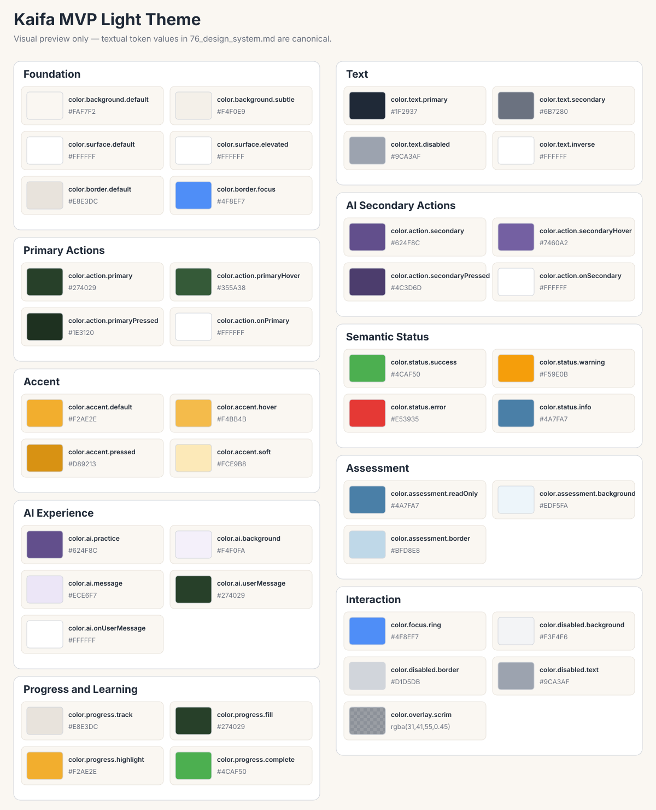

# Design System — Kaifa v2 MVP

| Field        | Value                                                                                                                                                                                                                  |
| ------------ | ---------------------------------------------------------------------------------------------------------------------------------------------------------------------------------------------------------------------- |
| Version      | 1.0                                                                                                                                                                                                                    |
| Status       | Freeze                                                                                                                                                                                                                 |
| Owner        | Product & UI/UX                                                                                                                                                                                                        |
| Depends On   | `70_ui_ux_spec.md`, `71_user_flow.md`, `72_screen_inventory.md`, `73_component_spec.md`, `74_frontend_state_model.md`, `75_interaction_spec.md`, `52_prd.md`, `60_srs.md`, `62_api_spec.md`, `80_feature_breakdown.md` |
| Used By      | Product, UI/UX, Frontend, Backend, QA                                                                                                                                                                                  |
| Last Updated | 2026-07-14                                                                                                                                                                                                             |

# 1. Purpose

Dokumen ini mendefinisikan guidance Design System untuk Kaifa v2 MVP, mencakup design tokens, typography, spacing, layout, component visual rules, accessibility visual states, responsive behavior, UI consistency, dan QA visual checks.

Dokumen ini tidak mendefinisikan domain business rules, backend behavior, runtime behavior, engine behavior, AI behavior, atau official event publication. Design System bersifat visual/presentation guidance dan harus tetap mengikuti batas MVP yang sudah disetujui.

# 2. Design System Principles

- Design system bersifat presentation-level only.
- Design tokens tidak boleh meng-encode business rules.
- Visual treatment harus menjaga MVP boundaries.
- Authenticated screens harus jelas menunjukkan active Learner context jika dibutuhkan.
- Visual design harus mendukung data isolation dan menghindari stale private data setelah logout/session expiry.
- UI states harus visually distinct: default, hover, focus, active, disabled, loading, empty, error, success.
- Accessibility harus dibangun melalui color, typography, focus, spacing, dan interaction affordances.
- Visual hierarchy harus mendukung Learning Activity sebagai pusat MVP learning experience.
- AI Practice harus diberi label visual sebagai practice guidance/feedback only.
- Assessment Result harus terlihat read-only.
- Dashboard harus terlihat sebagai basic progress only.
- Tidak ada visual pattern yang boleh mengimplikasikan a new Placement Test resource atau adaptive recommendation, Knowledge Profile, Learning Decision, Enrollment, public signup, atau advanced authentication dalam MVP.

# 3. Design Token Inventory

| Token Category            | Token Name                      | Purpose                                              | Example Value / Guidance                    | Usage Notes                                             |
| ------------------------- | ------------------------------- | ---------------------------------------------------- | ------------------------------------------- | ------------------------------------------------------- |
| Color Tokens              | `color.background.default`      | Main application background                          | `#FAF7F2`                                   | Canonical value and usage are owned by Section 4.1.     |
| Color Tokens              | `color.background.subtle`       | Secondary sections, empty states, grouped containers | `#F4F0E9`                                   | Canonical value and usage are owned by Section 4.1.     |
| Color Tokens              | `color.surface.default`         | Cards, forms, panels                                 | `#FFFFFF`                                   | Canonical value and usage are owned by Section 4.1.     |
| Color Tokens              | `color.surface.elevated`        | Modal dialogs, popovers                              | `#FFFFFF`                                   | Canonical value and usage are owned by Section 4.1.     |
| Color Tokens              | `color.border.default`          | Standard borders and dividers                        | `#E8E3DC`                                   | Canonical value and usage are owned by Section 4.1.     |
| Color Tokens              | `color.border.focus`            | Keyboard focus outline                               | `#4F8EF7`                                   | Canonical value and usage are owned by Section 4.1.     |
| Color Tokens              | `color.text.primary`            | Primary text                                         | `#1F2937`                                   | Canonical value and usage are owned by Section 4.1.     |
| Color Tokens              | `color.text.secondary`          | Secondary/supporting text                            | `#6B7280`                                   | Canonical value and usage are owned by Section 4.1.     |
| Color Tokens              | `color.text.disabled`           | Disabled text                                        | `#9CA3AF`                                   | Canonical value and usage are owned by Section 4.1.     |
| Color Tokens              | `color.text.inverse`            | Text on dark surfaces                                | `#FFFFFF`                                   | Canonical value and usage are owned by Section 4.1.     |
| Color Tokens              | `color.action.primary`          | Primary buttons, primary CTA                         | `#274029`                                   | Canonical value and usage are owned by Section 4.1.     |
| Color Tokens              | `color.action.primaryHover`     | Hover state                                          | `#355A38`                                   | Canonical value and usage are owned by Section 4.1.     |
| Color Tokens              | `color.action.primaryPressed`   | Pressed state                                        | `#1E3120`                                   | Canonical value and usage are owned by Section 4.1.     |
| Color Tokens              | `color.action.onPrimary`        | Text/icons on primary buttons                        | `#FFFFFF`                                   | Canonical value and usage are owned by Section 4.1.     |
| Color Tokens              | `color.action.secondary`        | AI-related secondary buttons and actions             | `#624F8C`                                   | Canonical value and usage are owned by Section 4.1.     |
| Color Tokens              | `color.action.secondaryHover`   | Hover state                                          | `#7460A2`                                   | Canonical value and usage are owned by Section 4.1.     |
| Color Tokens              | `color.action.secondaryPressed` | Pressed state                                        | `#4C3D6D`                                   | Canonical value and usage are owned by Section 4.1.     |
| Color Tokens              | `color.action.onSecondary`      | Text/icons on secondary buttons                      | `#FFFFFF`                                   | Canonical value and usage are owned by Section 4.1.     |
| Color Tokens              | `color.accent.default`          | Highlights, motivation cues, and active indicators   | `#F2AE2E`                                   | Canonical value and usage are owned by Section 4.1.     |
| Color Tokens              | `color.accent.hover`            | Hover state                                          | `#F4BB4B`                                   | Canonical value and usage are owned by Section 4.1.     |
| Color Tokens              | `color.accent.pressed`          | Pressed state                                        | `#D89213`                                   | Canonical value and usage are owned by Section 4.1.     |
| Color Tokens              | `color.accent.soft`             | Soft highlight background                            | `#FCE9B8`                                   | Canonical value and usage are owned by Section 4.1.     |
| Color Tokens              | `color.status.success`          | Success messages and completed operations            | `#4CAF50`                                   | Canonical value and usage are owned by Section 4.1.     |
| Color Tokens              | `color.status.warning`          | Warning messages                                     | `#F59E0B`                                   | Canonical value and usage are owned by Section 4.1.     |
| Color Tokens              | `color.status.error`            | Errors and destructive actions                       | `#E53935`                                   | Canonical value and usage are owned by Section 4.1.     |
| Color Tokens              | `color.status.info`             | Informational messages                               | `#4A7FA7`                                   | Canonical value and usage are owned by Section 4.1.     |
| Color Tokens              | `color.ai.practice`             | AI Conversation Practice identity                    | `#624F8C`                                   | Canonical value and usage are owned by Section 4.1.     |
| Color Tokens              | `color.ai.background`           | AI chat background                                   | `#F4F0FA`                                   | Canonical value and usage are owned by Section 4.1.     |
| Color Tokens              | `color.ai.message`              | AI message bubble                                    | `#ECE6F7`                                   | Canonical value and usage are owned by Section 4.1.     |
| Color Tokens              | `color.ai.userMessage`          | Learner message bubble                               | `#274029`                                   | Canonical value and usage are owned by Section 4.1.     |
| Color Tokens              | `color.ai.onUserMessage`        | Text on learner message bubble                       | `#FFFFFF`                                   | Canonical value and usage are owned by Section 4.1.     |
| Color Tokens              | `color.assessment.readOnly`     | Read-only Assessment Result                          | `#4A7FA7`                                   | Canonical value and usage are owned by Section 4.1.     |
| Color Tokens              | `color.assessment.background`   | Assessment Result container                          | `#EDF5FA`                                   | Canonical value and usage are owned by Section 4.1.     |
| Color Tokens              | `color.assessment.border`       | Assessment cards                                     | `#BFD8E8`                                   | Canonical value and usage are owned by Section 4.1.     |
| Color Tokens              | `color.progress.track`          | Progress bar background                              | `#E8E3DC`                                   | Canonical value and usage are owned by Section 4.1.     |
| Color Tokens              | `color.progress.fill`           | Progress value                                       | `#274029`                                   | Canonical value and usage are owned by Section 4.1.     |
| Color Tokens              | `color.progress.highlight`      | Current lesson indicator                             | `#F2AE2E`                                   | Canonical value and usage are owned by Section 4.1.     |
| Color Tokens              | `color.progress.complete`       | Completed activities                                 | `#4CAF50`                                   | Canonical value and usage are owned by Section 4.1.     |
| Color Tokens              | `color.focus.ring`              | Keyboard focus indicator                             | `#4F8EF7`                                   | Canonical value and usage are owned by Section 4.1.     |
| Color Tokens              | `color.disabled.background`     | Disabled controls                                    | `#F3F4F6`                                   | Canonical value and usage are owned by Section 4.1.     |
| Color Tokens              | `color.disabled.border`         | Disabled borders                                     | `#D1D5DB`                                   | Canonical value and usage are owned by Section 4.1.     |
| Color Tokens              | `color.disabled.text`           | Disabled text                                        | `#9CA3AF`                                   | Canonical value and usage are owned by Section 4.1.     |
| Color Tokens              | `color.overlay.scrim`           | Modal overlay                                        | `rgba(31,41,55,0.45)`                       | Canonical value and usage are owned by Section 4.1.     |
| Typography Tokens         | `font.family.base`              | Base UI font.                                        | System sans-serif or product-approved font. | Indonesian-first readability.                           |
| Typography Tokens         | `font.family.mono`              | Code/technical identifiers.                          | System monospace.                           | Only for endpoints/IDs if shown in internal tools/docs. |
| Typography Tokens         | `font.size.xs`                  | Extra small text.                                    | 12px guidance.                              | Avoid for critical learner text.                        |
| Typography Tokens         | `font.size.sm`                  | Small text.                                          | 14px guidance.                              | Helper, labels.                                         |
| Typography Tokens         | `font.size.md`                  | Body text.                                           | 16px guidance.                              | Default learner-facing text.                            |
| Typography Tokens         | `font.size.lg`                  | Section heading/body emphasis.                       | 18px guidance.                              | Cards/summary headings.                                 |
| Typography Tokens         | `font.size.xl`                  | Page subsection heading.                             | 20px guidance.                              | Screen headings below H1.                               |
| Typography Tokens         | `font.size.2xl`                 | Page H1.                                             | 24-32px guidance.                           | Avoid excessive marketing scale in app screens.         |
| Typography Tokens         | `font.weight.regular`           | Normal reading text.                                 | 400.                                        | Body copy.                                              |
| Typography Tokens         | `font.weight.medium`            | UI emphasis.                                         | 500.                                        | Labels, navigation.                                     |
| Typography Tokens         | `font.weight.semibold`          | Heading/card title emphasis.                         | 600.                                        | Cards and summaries.                                    |
| Typography Tokens         | `font.weight.bold`              | Strong heading only.                                 | 700.                                        | Use sparingly.                                          |
| Typography Tokens         | `lineHeight.tight`              | Compact headings.                                    | 1.2-1.3.                                    | Headings only.                                          |
| Typography Tokens         | `lineHeight.normal`             | Default body line height.                            | 1.45-1.6.                                   | Learning content.                                       |
| Typography Tokens         | `lineHeight.relaxed`            | Long reading content.                                | 1.6-1.8.                                    | Dense content if needed.                                |
| Spacing Tokens            | `space.0`                       | No spacing.                                          | 0.                                          | Reset/edge cases.                                       |
| Spacing Tokens            | `space.1`                       | Tiny gap.                                            | 4px.                                        | Icon/text gap.                                          |
| Spacing Tokens            | `space.2`                       | Small gap.                                           | 8px.                                        | Form field internals.                                   |
| Spacing Tokens            | `space.3`                       | Medium-small gap.                                    | 12px.                                       | Stacked labels/messages.                                |
| Spacing Tokens            | `space.4`                       | Base gap.                                            | 16px.                                       | Cards, forms.                                           |
| Spacing Tokens            | `space.6`                       | Section gap.                                         | 24px.                                       | Between UI groups.                                      |
| Spacing Tokens            | `space.8`                       | Large section gap.                                   | 32px.                                       | Page sections.                                          |
| Spacing Tokens            | `space.12`                      | Major layout gap.                                    | 48px.                                       | Landing/home sections.                                  |
| Spacing Tokens            | `space.16`                      | Extra large page spacing.                            | 64px.                                       | Public page hero/section rhythm.                        |
| Radius Tokens             | `radius.sm`                     | Small control rounding.                              | 4px.                                        | Inputs, badges.                                         |
| Radius Tokens             | `radius.md`                     | Standard card rounding.                              | 8px max guidance.                           | Cards and panels.                                       |
| Radius Tokens             | `radius.full`                   | Circular affordance.                                 | 999px.                                      | Small indicators only.                                  |
| Border Tokens             | `border.width.default`          | Standard border width.                               | 1px.                                        | Cards/inputs.                                           |
| Border Tokens             | `border.style.default`          | Standard border style.                               | Solid.                                      | Consistent UI outlines.                                 |
| Shadow / Elevation Tokens | `shadow.none`                   | Flat UI.                                             | None.                                       | Default app surfaces.                                   |
| Shadow / Elevation Tokens | `shadow.sm`                     | Mild elevation.                                      | Subtle shadow.                              | Dropdown/panel only.                                    |
| Shadow / Elevation Tokens | `shadow.md`                     | Modal/panel elevation.                               | Moderate shadow.                            | AI modal if used.                                       |
| Layout Tokens             | `layout.page.maxWidth`          | Max content width.                                   | 1120-1280px guidance.                       | App pages; avoid overly wide reading text.              |
| Layout Tokens             | `layout.reading.maxWidth`       | Reading content width.                               | 680-760px guidance.                         | Learning content viewer.                                |
| Layout Tokens             | `layout.sidebar.width`          | Optional side/nav width.                             | 240-320px guidance.                         | Only if implementation uses sidebar.                    |
| Motion Tokens             | `motion.duration.fast`          | Fast UI feedback.                                    | 100-150ms.                                  | Hover/focus transitions.                                |
| Motion Tokens             | `motion.duration.normal`        | Normal transition.                                   | 180-250ms.                                  | Panel open/close.                                       |
| Motion Tokens             | `motion.easing.standard`        | Standard easing.                                     | Ease-out guidance.                          | Avoid distracting motion.                               |
| Z-index / Layer Tokens    | `layer.base`                    | Page content.                                        | 0.                                          | Default.                                                |
| Z-index / Layer Tokens    | `layer.header`                  | Header.                                              | Above base.                                 | Persistent navigation.                                  |
| Z-index / Layer Tokens    | `layer.overlay`                 | Overlay/panel.                                       | Above header if modal.                      | AI modal/panel.                                         |
| Z-index / Layer Tokens    | `layer.toastOrBanner`           | Status banners.                                      | Above content.                              | Non-blocking fallback only.                             |
| Icon Tokens               | `icon.size.sm`                  | Small icons.                                         | 16px.                                       | Inline labels.                                          |
| Icon Tokens               | `icon.size.md`                  | Standard icons.                                      | 20px.                                       | Buttons and cards.                                      |
| Icon Tokens               | `icon.stroke.default`           | Icon stroke.                                         | 1.5-2px.                                    | Maintain legibility.                                    |
| State Tokens              | `state.opacity.disabled`        | Disabled visual.                                     | 40-60% guidance.                            | Must pair with disabled attribute.                      |
| State Tokens              | `state.overlay.loading`         | Loading overlay.                                     | Subtle overlay/skeleton.                    | Do not obscure required safe nav.                       |
| State Tokens              | `state.focus.outlineWidth`      | Focus ring width.                                    | 2-3px.                                      | WCAG 2.1 AA visible-focus support.                      |

# 4. Color System

## 4.1 MVP Light Theme Color Tokens



This SVG is a supplemental visual preview. Token names and textual values in this document remain the canonical implementation source.

### Color Palette Philosophy

Kaifa uses a warm, calm, and education-focused visual identity.

The color system follows these principles:

- Green represents learning, growth, and primary actions.
- Purple represents AI-powered experiences.
- Gold represents motivation and highlights.
- Neutral warm backgrounds improve long-form reading comfort.
- Assessment Result remains informational and read-only.
- Status colors follow standard semantic meanings.
- Accessibility follows WCAG 2.1 AA contrast requirements.

| Token                      | Value     | Usage                                                |
| -------------------------- | --------- | ---------------------------------------------------- |
| `color.background.default` | `#FAF7F2` | Main application background                          |
| `color.background.subtle`  | `#F4F0E9` | Secondary sections, empty states, grouped containers |
| `color.surface.default`    | `#FFFFFF` | Cards, forms, panels                                 |
| `color.surface.elevated`   | `#FFFFFF` | Modal dialogs, popovers                              |
| `color.border.default`     | `#E8E3DC` | Standard borders and dividers                        |
| `color.border.focus`       | `#4F8EF7` | Keyboard focus outline                               |
| `color.text.primary`       | `#1F2937` | Primary text                                         |
| `color.text.secondary`     | `#6B7280` | Secondary/supporting text                            |
| `color.text.disabled`      | `#9CA3AF` | Disabled text                                        |
| `color.text.inverse`       | `#FFFFFF` | Text on dark surfaces                                |

### Primary Actions

| Token                         | Value     | Usage                         |
| ----------------------------- | --------- | ----------------------------- |
| `color.action.primary`        | `#274029` | Primary buttons, primary CTA  |
| `color.action.primaryHover`   | `#355A38` | Hover state                   |
| `color.action.primaryPressed` | `#1E3120` | Pressed state                 |
| `color.action.onPrimary`      | `#FFFFFF` | Text/icons on primary buttons |

### Secondary Actions

| Token                           | Value     | Usage                                    |
| ------------------------------- | --------- | ---------------------------------------- |
| `color.action.secondary`        | `#624F8C` | AI-related secondary buttons and actions |
| `color.action.secondaryHover`   | `#7460A2` | Hover state                              |
| `color.action.secondaryPressed` | `#4C3D6D` | Pressed state                            |
| `color.action.onSecondary`      | `#FFFFFF` | Text/icons on secondary buttons          |

### Accent

| Token                  | Value     | Usage                                              |
| ---------------------- | --------- | -------------------------------------------------- |
| `color.accent.default` | `#F2AE2E` | Highlights, motivation cues, and active indicators |
| `color.accent.hover`   | `#F4BB4B` | Hover state                                        |
| `color.accent.pressed` | `#D89213` | Pressed state                                      |
| `color.accent.soft`    | `#FCE9B8` | Soft highlight background                          |

### Semantic Status Colors

| Token                  | Value     | Usage                                     |
| ---------------------- | --------- | ----------------------------------------- |
| `color.status.success` | `#4CAF50` | Success messages and completed operations |
| `color.status.warning` | `#F59E0B` | Warning messages                          |
| `color.status.error`   | `#E53935` | Errors and destructive actions            |
| `color.status.info`    | `#4A7FA7` | Informational messages                    |

### AI Experience

| Token                    | Value     | Usage                             |
| ------------------------ | --------- | --------------------------------- |
| `color.ai.practice`      | `#624F8C` | AI Conversation Practice identity |
| `color.ai.background`    | `#F4F0FA` | AI chat background                |
| `color.ai.message`       | `#ECE6F7` | AI message bubble                 |
| `color.ai.userMessage`   | `#274029` | Learner message bubble            |
| `color.ai.onUserMessage` | `#FFFFFF` | Text on learner message bubble    |

### Assessment

| Token                         | Value     | Usage                       |
| ----------------------------- | --------- | --------------------------- |
| `color.assessment.readOnly`   | `#4A7FA7` | Read-only Assessment Result |
| `color.assessment.background` | `#EDF5FA` | Assessment Result container |
| `color.assessment.border`     | `#BFD8E8` | Assessment cards            |

### Progress & Learning

| Token                      | Value     | Usage                    |
| -------------------------- | --------- | ------------------------ |
| `color.progress.track`     | `#E8E3DC` | Progress bar background  |
| `color.progress.fill`      | `#274029` | Progress value           |
| `color.progress.highlight` | `#F2AE2E` | Current lesson indicator |
| `color.progress.complete`  | `#4CAF50` | Completed activities     |

### Interaction States

| Token                       | Value                 | Usage                    |
| --------------------------- | --------------------- | ------------------------ |
| `color.focus.ring`          | `#4F8EF7`             | Keyboard focus indicator |
| `color.disabled.background` | `#F3F4F6`             | Disabled controls        |
| `color.disabled.border`     | `#D1D5DB`             | Disabled borders         |
| `color.disabled.text`       | `#9CA3AF`             | Disabled text            |
| `color.overlay.scrim`       | `rgba(31,41,55,0.45)` | Modal overlay            |

### Color Usage Rules

| Color  | Purpose                                |
| ------ | -------------------------------------- |
| Green  | Primary actions and learning progress  |
| Purple | AI-related features only               |
| Gold   | Highlights and motivation cues         |
| Blue   | Informational and read-only assessment |
| Red    | Errors and destructive actions only    |
| Orange | Warnings only                          |

### Accessibility Requirements

- All text/background combinations MUST satisfy WCAG 2.1 AA contrast.
- Status MUST never rely on color alone.
- Focus indication MUST use `color.focus.ring`.
- AI Conversation Practice MUST remain visually distinct from Assessment Result.
- Assessment Result MUST use informational styling and MUST NOT imply mastery solely through color.
- Primary actions MUST use the Primary color family.
- Secondary actions related to AI MUST use the Secondary color family.
- `color.status.success`, `color.status.warning`, `color.status.error`, `color.status.info`, and `color.assessment.readOnly` are semantic accents on the approved light surfaces, not approved normal-size body-text colors. Message and Assessment Result copy MUST use a text token with verified WCAG 2.1 AA contrast; the semantic color MUST be paired with text, an icon, or another non-color cue.
- `color.text.disabled` and `color.disabled.text` are reserved for unavailable-control labels and MUST NOT carry essential normal-size information on `color.disabled.background`. Any essential explanation MUST use a text token with verified WCAG 2.1 AA contrast.
- `color.border.focus` and `color.focus.ring` intentionally share the same value: the former applies at the border role and the latter is the required keyboard-focus indicator.
- `color.text.disabled` and `color.disabled.text` intentionally share the same value while remaining contextually distinct for text hierarchy and control-state usage.

## 4.2 MVP Image and Illustration Assets

### Asset Principles

- Images and illustrations MUST support comprehension, orientation, branding, motivation, or empty-state communication.
- Decorative imagery is optional and MUST NOT block core functionality; core MVP flows MUST remain usable without illustrations.
- Critical information MUST NOT exist only in an image, and embedded text SHOULD be avoided.
- Meaningful images require purpose-oriented alt text; decorative images use empty alt text.
- Every loading failure requires a fallback.
- Stock photography and photorealistic humans are not the primary MVP visual language.
- Assets MUST remain compatible with approved Kaifa theme tokens.

### Human Illustration Style

- Any human MUST use a warm, simplified cartoon style with geometric forms, soft shapes, and minimal detail.
- Faces MUST be faceless and featureless. They MUST contain no eyes, no eyebrows, no eyelashes, no mouth, no lips, no nose, no expression, and no detailed facial features.
- No photorealism or resemblance to identifiable real people is permitted.
- Meaning SHOULD use posture, modest clothing, composition, and learning context.
- Muslim and Muslimah learners MUST be respectful and inclusive. Muslimah characters SHOULD wear respectful hijab and modest clothing; Muslim characters SHOULD wear modest clothing.
- Clothing MUST NOT be tight, transparent, sexualized, or culturally disrespectful.
- Avoid stereotypes, caricatures, exoticization, tokenism, and discriminatory depiction.
- Characters MAY vary in skin tone, body type, learner age, and accessibility needs.
- Faceless cartoons MUST NOT be mixed with photorealistic people in the MVP system.

> Kaifa human illustrations use warm, modest, faceless cartoon characters representing Muslim and Muslimah learners. Faces contain no eyes, eyebrows, mouth, nose, or identifying facial detail. Meaning is communicated through posture, clothing, composition, and surrounding learning context.

### Prohibited Human Illustration Characteristics

- realistic or detailed faces; eyes, eyebrows, eyelashes, mouth, lips, nose, or facial expressions,
- photorealistic portraits, celebrities, identifiable real people, or real-person resemblance,
- sexualized anatomy/clothing, tight/transparent clothing, or inappropriate physical contact,
- stereotypical, discriminatory, culturally disrespectful, violent, disturbing, or emotionally unsafe imagery,
- facial-generation artifacts, distorted anatomy, disrespectful hijab, visible text artifacts, or unintended logos/trademarks.

### Asset Inventory Contract

Every approved asset MUST use this schema and reference an existing MVP UX or CMP identifier. Assets without a supported purpose MUST NOT be added.

| Field                        | Requirement                                      |
| ---------------------------- | ------------------------------------------------ |
| Asset ID                     | Stable identifier such as `AST-IMG-001`          |
| Asset Name                   | Human-readable name                              |
| Asset Category               | Brand, illustration, image, icon, or placeholder |
| Purpose                      | What the asset communicates                      |
| Screen / Component           | Existing UX or CMP identifier                    |
| Required / Optional          | Whether the UI depends on it                     |
| Content Description          | Short description of the visual                  |
| Human Character Style        | `None`, `Muslim`, `Muslimah`, or `Mixed`         |
| Aspect Ratio                 | Required aspect ratio                            |
| Recommended Source Size      | Recommended source dimensions                    |
| Display Behavior             | `contain`, `cover`, or intrinsic                 |
| Preferred Format             | SVG, WebP, PNG, or JPEG                          |
| Maximum File Size            | Maximum production file size                     |
| Accessibility Classification | Meaningful or decorative                         |
| Alt Text Requirement         | Required, empty, or contextual                   |
| Fallback                     | Behavior when unavailable                        |

### Initial MVP Asset Inventory

Only the logo is brand-required; all illustrations are optional and non-blocking. Production records MUST populate the full contract.

| Asset ID      | Asset                                 | Purpose                                | Existing Screen / Component | Ratio     | Source Size     | Format   | Maximum  |
| ------------- | ------------------------------------- | -------------------------------------- | --------------------------- | --------- | --------------- | -------- | -------- |
| `AST-IMG-001` | Primary Kaifa logo                    | Product identity                       | UX-001, UX-002; CMP-001     | Intrinsic | Vector source   | SVG      | `50 KB`  |
| `AST-IMG-002` | Landing hero illustration             | Introduce learning                     | UX-001                      | `4:3`     | `1200 × 900 px` | SVG/WebP | `250 KB` |
| `AST-IMG-003` | Empty learning state                  | Explain no module/activity             | UX-005; CMP-020             | `1:1`     | `640 × 640 px`  | SVG/WebP | `150 KB` |
| `AST-IMG-004` | AI Conversation Practice illustration | Reinforce distinct AI identity         | UX-007; CMP-012             | `1:1`     | `640 × 640 px`  | SVG/WebP | `150 KB` |
| `AST-IMG-005` | Activity completion illustration      | Acknowledge completion without mastery | UX-008; CMP-016             | `1:1`     | `640 × 640 px`  | SVG/WebP | `150 KB` |
| `AST-IMG-006` | Generic error-state illustration      | Non-blocking error communication       | UX-010; CMP-022             | `1:1`     | `640 × 640 px`  | SVG/WebP | `150 KB` |

A learner avatar placeholder is not included in the initial MVP inventory because no canonical shared learner-profile/avatar component exists. It may only be added later if supported by an approved UX or CMP identifier. Any human figure follows the faceless modest Muslim/Muslimah standard and MUST NOT imply mastery, trophy, score, grading, or ranking unless explicit in backend-owned result text.

### File Format Rules

| Asset Type                  | Preferred Format          | Rules                                        |
| --------------------------- | ------------------------- | -------------------------------------------- |
| Logo                        | SVG                       | Sanitized vector source required; no scripts |
| Simple illustration         | SVG                       | Preferred when practical                     |
| Complex raster illustration | WebP                      | Optimized export                             |
| Photography                 | WebP                      | JPEG fallback only when required             |
| Transparent raster asset    | WebP or PNG               | PNG only when WebP is unsuitable             |
| Functional UI icon          | Approved SVG icon library | Avoid duplicate custom icons                 |
| Placeholder                 | SVG or WebP               | Visually neutral                             |
| Animation                   | WebM or animated WebP     | Explicit requirement only; no GIF            |

PNG is not the default for large illustrations. JPEG is prohibited for logos, icons, and flat illustrations. Extensions MUST be lowercase and unnecessary metadata SHOULD be removed.

### Dimensions and Responsive Rules

Aspect ratio, recommended source dimensions, rendered responsive dimensions, and maximum file size are distinct. Source size does not define fixed rendered size. Raster MAY provide `1x`/`2x`; SVG needs no density variant. Preserve ratio, never stretch, reserve loading dimensions, and avoid horizontal scrolling. Heroes SHOULD use `contain`; backgrounds MAY use `cover` only with acceptable documented cropping. Avatars use `1:1`. Mobile MAY reduce, reposition, or hide decorative art; meaningful information MUST remain. Human crops MUST remain respectful and visually coherent.

| Use Case               | Aspect Ratio                   | Recommended Source Size      | Maximum File Size |
| ---------------------- | ------------------------------ | ---------------------------- | ----------------- |
| Logo                   | Intrinsic                      | SVG viewBox                  | `50 KB`           |
| Hero illustration      | `4:3` or documented equivalent | Around `1200 × 900 px`       | `250 KB`          |
| Standard illustration  | `1:1`                          | Around `640 × 640 px`        | `150 KB`          |
| Empty or error state   | `1:1`                          | Around `640 × 640 px`        | `150 KB`          |
| Avatar placeholder     | `1:1`                          | Around `256 × 256 px`        | `50 KB`           |
| Small decorative asset | Context-specific               | Minimum necessary resolution | `75 KB`           |

### Accessibility Requirements

Meaningful images require concise purpose-based alt text; decorative images use `alt=""`. Alt text describes purpose, not filenames, and SHOULD omit “image of.” Avoid image text; unavoidable text MUST also exist as accessible HTML. Color MUST NOT communicate alone. Faceless art MUST remain understandable through context. Assessment imagery MUST NOT communicate pass, fail, score, or mastery without equivalent explicit backend-owned text. Avatar placeholders are decorative when learner identity is text; error art is decorative when error copy is complete.

| Asset                    | Classification        | Example                                                                     |
| ------------------------ | --------------------- | --------------------------------------------------------------------------- |
| Landing hero             | Decorative/contextual | `alt=""` when surrounding copy explains purpose                             |
| AI Practice empty state  | Meaningful            | “Start a conversation practice session to speak and review the transcript.” |
| No-learning state        | Meaningful            | “No learning activity is currently available.”                              |
| Avatar placeholder       | Decorative            | `alt=""` when learner name is displayed                                     |
| Error-state illustration | Decorative            | `alt=""` when error message is complete                                     |

### Loading and Fallback Rules

Core content MUST render without decorative images. Broken-image icons MUST not appear. Missing meaningful images fall back to accessible text/neutral placeholder; decorative images collapse cleanly. Below-fold art SHOULD lazy-load; above-fold art MUST NOT delay primary interaction. Placeholders SHOULD preserve dimensions; retry MUST NOT loop. Core assets MUST NOT depend on arbitrary third-party hosts. Failures SHOULD be monitored without learner-facing technical detail.

### Storage and Naming Convention

```text
public/
└── assets/
    ├── brand/
    ├── illustrations/
    │   ├── landing/
    │   ├── learning/
    │   ├── ai/
    │   ├── assessment/
    │   └── states/
    ├── images/
    ├── icons/
    └── placeholders/
```

This logical structure is framework-agnostic and MAY adapt to an approved pipeline. Use lowercase purpose-oriented kebab-case; no spaces, generic names, personal data, or `final`/`latest`/`new` suffixes. `@2x`, `-mobile`, and `-desktop` MAY identify documented variants.

```text
kaifa-logo-primary.svg
landing-hero-learning.svg
landing-hero-learning-mobile.webp
learning-empty-state.svg
ai-conversation-practice.svg
activity-completion.svg
assessment-result-information.svg
generic-error-state.svg
learner-avatar-placeholder.svg
```

### Illustration Color Rules

Green represents learning/actions; purple AI; gold motivation/highlights; blue informational/read-only assessment; red/orange only error/warning. Approved lighter tints MAY be used. Assets MUST NOT create a competing brand color or weaken status semantics. Completion imagery MUST NOT imply mastery.

### Asset Governance

Every asset requires an owner, purpose, and existing UX/CMP reference. Replacements preserve purpose, ratio, accessibility class, and responsive behavior. Remove obsolete/duplicate assets; prohibit arbitrary third-party sourcing; verify licensing. AI-generated assets require manual review for facial features, distorted anatomy, inappropriate clothing, disrespectful hijab, text artifacts, trademarks, and real-person resemblance. This Markdown owns the contract; the frontend repository stores files.

### Image Generation Prompt Guidance

```text
Warm educational cartoon illustration for Kaifa.
Show [approved learning context].
Muslim/Muslimah learner; modest clothing; respectful hijab for Muslimah.
Faceless: no eyes, eyebrows, mouth, nose, detail, photorealism, or real-person resemblance.
Simple geometric forms; friendly inclusive proportions.
Warm calm Kaifa palette; clean background; minimal clutter; no embedded text.
No logo unless requested; no trophy, grading, or mastery implication unless screen-supported.
```

This is future visual guidance, not an instruction to generate images in this task.

## 4.3 General Color Application Rules

| Usage                             | Semantic Treatment                                                                                                          | Rules                                                                                                                                                                             |
| --------------------------------- | --------------------------------------------------------------------------------------------------------------------------- | --------------------------------------------------------------------------------------------------------------------------------------------------------------------------------- |
| Background                        | Use `color.background.default` for full page and `color.background.subtle` for section contrast.                            | Tidak memberi makna business state.                                                                                                                                               |
| Surface                           | Use `color.surface.default` for cards and `color.surface.elevated` for overlays.                                            | `color.surface.elevated` intentionally shares the `color.surface.default` fill; border, shadow, spacing, and layer tokens communicate elevation, never priority/adaptive ranking. |
| Text                              | Use primary/secondary hierarchy.                                                                                            | Maintain WCAG 2.1 AA contrast.                                                                                                                                                    |
| Border                            | Use neutral borders for structure and focus separation.                                                                     | Border warning/error must include icon/text.                                                                                                                                      |
| Primary action                    | Use `color.action.primary` for main commands.                                                                               | Communicates action priority only; never assessment ownership, evaluation, scoring, mastery, or backend result generation.                                                        |
| Secondary action                  | AI-related secondary actions use the purple secondary token family; non-AI secondary actions use neutral/outline treatment. | Purple MUST NOT be used for unrelated secondary actions; controls must not look disabled.                                                                                         |
| Disabled action                   | Use `color.disabled.background`, `color.disabled.border`, and `color.disabled.text` plus the disabled attribute.            | Essential explanatory text uses an AA-compliant text token.                                                                                                                       |
| Link                              | Use `color.text.primary` with underline or an equivalent persistent affordance.                                             | No separate link token is introduced; color is never the only indicator.                                                                                                          |
| Focus ring                        | Use `color.focus.ring`.                                                                                                     | Always visible on keyboard focus.                                                                                                                                                 |
| Loading state                     | Use skeleton/subtle progress treatment.                                                                                     | Do not show stale Learner data.                                                                                                                                                   |
| Empty state                       | Use neutral/subtle visuals.                                                                                                 | Do not imply missing data was generated or recommended.                                                                                                                           |
| Error state                       | Use `color.status.error`.                                                                                                   | Pair with icon/text; no internal detail.                                                                                                                                          |
| Warning state                     | Use `color.status.warning`.                                                                                                 | For pending/fallback conditions, not mastery.                                                                                                                                     |
| Success state                     | Use `color.status.success`.                                                                                                 | Completion success only; not Knowledge Profile mastery.                                                                                                                           |
| AI Practice state                 | Use `color.ai.practice` as distinct practice accent.                                                                        | Must not look like official assessment result.                                                                                                                                    |
| Assessment Result read-only state | Use `color.assessment.readOnly` with read-only labels.                                                                      | Communicate result display, not editability.                                                                                                                                      |

Color must not be the only indicator of status. Dashboard progress colors must not imply Knowledge Profile mastery or adaptive recommendation.

# 5. Typography System

| Text Type                      | Visual Guidance                                           | Rules                                                         |
| ------------------------------ | --------------------------------------------------------- | ------------------------------------------------------------- |
| H1                             | Page title using `font.size.2xl`, semibold/bold.          | One semantic H1 per screen.                                   |
| H2                             | Major section title using `font.size.xl`.                 | Preserve heading hierarchy.                                   |
| H3                             | Card/list group heading using `font.size.lg`.             | Avoid oversized card typography.                              |
| H4                             | Compact subsection heading using `font.size.md` semibold. | Use for nested content groups.                                |
| Body text                      | `font.size.md`, `lineHeight.normal`.                      | Indonesian-first copy must be readable.                       |
| Helper text                    | `font.size.sm`, `color.text.secondary`.                   | Must remain legible.                                          |
| Form labels                    | `font.size.sm` or `md`, medium weight.                    | Always visible; no placeholder-only labels.                   |
| Error text                     | `font.size.sm`, error color plus icon/context.            | Direct and safe, no internal detail.                          |
| Badge/label text               | `font.size.xs` or `sm`, medium weight.                    | Do not use badges for adaptive ranking.                       |
| AI message text                | Body size, clear role label.                              | AI response label must say AI Practice response / Latihan AI. |
| Assessment Result summary text | Body/heading mix with read-only label.                    | Must not look editable or like AI response.                   |
| Dashboard summary text         | Clear compact summary.                                    | No mastery or adaptive recommendation language.               |

Technical terms may remain in English where needed. Learner-facing Indonesian labels should be clear, friendly, and concise.

# 6. Spacing and Layout System

| Layout Area            | Guidance                                              | Rules                                         |
| ---------------------- | ----------------------------------------------------- | --------------------------------------------- |
| Page max width         | Use `layout.page.maxWidth` and centered content.      | Applies to UX-001 to UX-011 only.             |
| Screen padding         | Use `space.4` mobile, `space.6` to `space.8` desktop. | Keep primary actions reachable.               |
| Section spacing        | Use `space.6` to `space.12`.                          | Avoid dense unrelated sections.               |
| Card spacing           | Internal padding `space.4` to `space.6`.              | Cards for repeated items only.                |
| Form spacing           | Field stack gap `space.3` to `space.4`.               | Error text close to field.                    |
| List spacing           | Item gap `space.2` to `space.4`.                      | Support scanning.                             |
| Chat/message spacing   | Message gap `space.3`; group gap `space.4`.           | Distinguish learner vs AI response.           |
| Dashboard grid spacing | Grid gap `space.4` to `space.6`.                      | Basic progress only.                          |
| Mobile spacing         | Compact but tappable.                                 | Touch targets remain accessible.              |
| Desktop spacing        | Wider layout with constrained reading width.          | Learning content should not stretch too wide. |

Authenticated layouts must reserve space for learner identity/navigation. Learning Activity Page should prioritize objective, content, and completion action. AI Conversation Practice may be route, modal, or panel, but hierarchy must remain consistent.

# 7. Responsive Layout Rules

| View / Screen                           | Mobile                                                                      | Tablet                                                              | Desktop                                                                                      |
| --------------------------------------- | --------------------------------------------------------------------------- | ------------------------------------------------------------------- | -------------------------------------------------------------------------------------------- |
| Landing Page                            | Single-column public content, Login CTA visible.                            | Highlights can become two-column.                                   | Constrained content with clear public navigation.                                            |
| Login Page                              | Single-column form, full-width controls.                                    | Centered form with readable width.                                  | Centered form, no extra auth options.                                                        |
| Learner Home                            | Stacked learner context, program entries, progress summary.                 | Two-column cards if space allows.                                   | Program entries and progress summary in balanced grid.                                       |
| Program / Subject Selection             | Cards stack; large tap targets.                                             | Two-column responsive grid.                                         | Multi-column grid without implying ranking.                                                  |
| Program Detail / Module List            | Program summary, module list, activity list stacked.                        | Module/activity grouping can sit side-by-side.                      | Clear module/activity structure with safe back nav.                                          |
| Learning Activity Page                  | Objective, content, completion action stacked.                              | Optional side context if readable.                                  | Content constrained; completion action visible without crowding.                             |
| AI Conversation Practice                | Full-screen route or bottom/side panel with focus control.                  | Panel/modal acceptable.                                             | Side panel/modal/route acceptable; practice label persistent.                                |
| Activity Completion / Assessment Result | Read-only result summary stacked with navigation.                           | Summary plus supporting details.                                    | Clear read-only result area and safe navigation.                                             |
| Dashboard                               | Summary cards and lists stacked.                                            | Responsive grid.                                                    | Basic progress grid and read-only lists.                                                     |
| Error/Fallback                          | Clear message, icon, safe action.                                           | Same with more space.                                               | Same; no internal detail.                                                                    |
| Placement Test (UX-011)                 | Placement activity, progress, submission, and safe return stack vertically. | Progress and submission status remain adjacent to activity context. | Specialized activity layout remains consistent with UX-006/UX-008; no placement resource UI. |

No content should be hidden in a way that blocks completion. AI Practice fallback must remain visible and actionable. Logout and safe navigation must remain accessible. Focus order must follow visible order.

# 8. Component Visual Guidelines

UX-011 presents a specialized Learning Activity (`purpose = Placement`) with CMP-029 and CMP-028; it is not a new resource. CMP-026 and CMP-027 provide visible Voice Recording, Voice Processing, Transcript Ready, Replay, and Retry states with keyboard and screen-reader support.

| Component ID                                      | Visual Role                                 | Primary Visual Elements                                                  | Required States                                         | Accessibility Visual Notes                                            | MVP Boundary Notes                                                         |
| ------------------------------------------------- | ------------------------------------------- | ------------------------------------------------------------------------ | ------------------------------------------------------- | --------------------------------------------------------------------- | -------------------------------------------------------------------------- |
| CMP-001 — Public Header                           | Public navigation.                          | Product name, Login CTA.                                                 | Default, hover, focus.                                  | Header landmark; clear Login label.                                   | No Learner identity, logout, dashboard, signup.                            |
| CMP-002 — Authenticated Header                    | Learner navigation context.                 | Active Learner identity, nav links, logout.                              | Default, active route, loading context.                 | Learner identity text readable.                                       | No role/educator controls.                                                 |
| CMP-003 — Login Form                              | Basic auth form.                            | Identifier, password, submit.                                            | Default, focus, error, submitting, disabled.            | Labels visible; first invalid field focus.                            | No signup, forgot password, social login, OAuth, SSO, MFA.                 |
| CMP-004 — Program Highlight Card                  | Public program teaser.                      | Title, summary, public status.                                           | Default, hover/focus if clickable, empty.               | Card action label clear.                                              | No Learner personalization.                                                |
| CMP-005 — Program Card                            | Program selection.                          | Program title, description, action.                                      | Default, hover, focus, selected/navigation pending.     | Keyboard operable.                                                    | Manual selection only; no ranking/recommendation.                          |
| CMP-006 — Subject Card                            | Subject representation.                     | Subject label e.g. Arabic/English Learning.                              | Default, hover, focus.                                  | Clarify action target.                                                | UI representation only, not entity.                                        |
| CMP-007 — Module Card                             | Module overview.                            | Module title, optional basic completion status.                          | Default, hover, focus, empty/unavailable.               | Status not color-only.                                                | No adaptive sequencing.                                                    |
| CMP-008 — Activity Card                           | Activity entry.                             | Activity title, type label, optional AI Practice label.                  | Default, hover, focus, disabled/unavailable.            | Activity type text visible.                                           | AI label only for `Practice`.                                              |
| CMP-009 — Learning Content Viewer                 | Content reading area.                       | Content title/body/media area.                                           | Loading, ready, empty, error.                           | Semantic content structure.                                           | No AI-generated or Knowledge Profile-personalized content.                 |
| CMP-010 — Learning Objective Context              | Objective context.                          | Objective title/description label.                                       | Loading, ready, missing.                                | Associated with activity/AI panel.                                    | UI does not modify objective.                                              |
| CMP-011 — AI Practice Entry Control               | Practice-only AI entry.                     | Button/control with AI Practice label.                                   | Hidden, available, starting, unavailable, disabled.     | Clear practice label.                                                 | Hidden for non-Practice; not assessment.                                   |
| CMP-012 — AI Conversation Panel                   | Practice conversation UI.                   | Context header, message list, input, end control.                        | Loading, active, sending, blocked, unavailable.         | Focus management if modal/panel.                                      | Practice context visible; no official scoring.                             |
| CMP-013 — AI Message Bubble                       | Chat message display.                       | Learner bubble, AI Practice response bubble.                             | Sent, sending, error, blocked.                          | Role label text/screen-reader label.                                  | AI response not score/result/recommendation.                               |
| CMP-014 — AI Practice Fallback Banner             | AI unavailable fallback.                    | Warning/info banner, continue action.                                    | Visible, dismissed, retry/loading.                      | `aria-live` pairing.                                                  | State learner can continue without AI.                                     |
| CMP-015 — Activity Completion Control             | Explicit completion action.                 | Complete button, pending state, error text.                              | Default, submitting, disabled, completed, failed.       | Pending announced; disabled exposed.                                  | Prevent duplicate submit visually; UI does not create Assessment Result.   |
| CMP-016 — Assessment Result Summary               | Read-only result display.                   | Result summary, read-only label, navigation.                             | Loading, pending, ready, failed, not found.             | Semantic summary and status.                                          | Must not look editable; no re-score/edit.                                  |
| CMP-017 — Progress Summary Card                   | Basic progress summary.                     | Current state, counts, simple labels.                                    | Loading, ready, empty, error.                           | Status not color-only.                                                | No Knowledge Profile, Learning Decision, mastery, adaptive recommendation. |
| CMP-018 — Activity Result List                    | Read-only activity history.                 | List rows, date/status if available.                                     | Loading, ready, empty, error.                           | List semantics.                                                       | Learner-scoped only.                                                       |
| CMP-019 — Assessment Result List                  | Read-only assessment history.               | Result rows and links.                                                   | Loading, ready, empty, error.                           | Read-only affordance.                                                 | No Learning Decision/adaptive next step.                                   |
| CMP-020 — Empty State Block                       | Empty data message.                         | Icon, title, explanation, safe action.                                   | Empty, retry pending.                                   | Message is text, not icon-only.                                       | No synthetic content/business fallback.                                    |
| CMP-021 — Loading State Indicator                 | Loading feedback.                           | Spinner/skeleton/progress text.                                          | Loading, refreshing, submitting.                        | Announce blocking loading.                                            | Must not show stale Learner data.                                          |
| CMP-022 — Error / Fallback Banner                 | Safe error display.                         | Icon, safe message, retry/safe action.                                   | Error, warning, dismissed if non-blocking.              | `aria-live` for async errors.                                         | No internal stack/provider/database details.                               |
| CMP-023 — Safe Navigation Control                 | Safe route action.                          | Buttons/links to safe destinations.                                      | Default, focus, disabled, pending.                      | Clear destination labels.                                             | Must not route unauthorized resource.                                      |
| CMP-024 — Logout Control                          | End session action.                         | Logout button/menu item.                                                 | Default, hover, focus, pending, disabled.               | Accessible label and pending state.                                   | Clears private state; no stale learner data.                               |
| CMP-025 — Breadcrumb / Back Navigation            | Context navigation.                         | Breadcrumb links, back/continue.                                         | Default, current, disabled.                             | Current page announced.                                               | No adaptive next-step suggestion.                                          |
| CMP-026 — Voice Control Suite                     | AI Practice voice transport UI.             | Permission, record/stop/cancel, timer, processing, retry, text fallback. | Ready, recording, processing, failed, retry.            | Keyboard operable; permission and async status announced.             | Frontend voice state only; no scoring or Runtime state.                    |
| CMP-027 — Canonical Transcript and Audio Playback | Transcript/TTS support.                     | Canonical transcript, play/replay, RTL metadata.                         | Loading, ready, playback, failed, retry.                | Transcript remains readable; controls labelled and keyboard operable. | Learner support only; transcript is not a score.                           |
| CMP-028 — Assessable Submission Status            | Submission/result availability status.      | Submit, pending, failed, Assessment Ready.                               | Ready, submitting, pending, failed, ready.              | Status announced and not color-only.                                  | Assessment Engine alone produces read-only Assessment Result.              |
| CMP-029 — Placement Test Card/Progress/Result     | Specialized Learning Activity presentation. | Entry, activity progress, submission, read-only result/starting point.   | Available, starting, active, submitting, failed, ready. | Progress/status text and keyboard access.                             | No placement entity/API/engine or Learning Decision.                       |

# 9. Screen Layout Guidelines

| Screen                                         | Layout Goal                                                                                      | Primary Content Region                                   | Secondary Content Region                             | Primary Actions                                   | Navigation Placement                 | Loading/Empty/Error Placement                       | Accessibility Notes                        | MVP Boundary Notes                                                                                   |
| ---------------------------------------------- | ------------------------------------------------------------------------------------------------ | -------------------------------------------------------- | ---------------------------------------------------- | ------------------------------------------------- | ------------------------------------ | --------------------------------------------------- | ------------------------------------------ | ---------------------------------------------------------------------------------------------------- |
| UX-001 Public Landing Page                     | Present public product/program information.                                                      | Landing content and highlights.                          | Public header.                                       | Login CTA.                                        | Public header top.                   | Inline public fallback.                             | Public headings and CTA accessible.        | No learner data, Enrollment, signup, Runtime Event.                                                  |
| UX-002 Login Page                              | Enable MVP learner login.                                                                        | Login form.                                              | Minimal public context.                              | Submit Login.                                     | Back/public header optional.         | Form-level errors.                                  | Labels, focus, error summary.              | No signup/reset/social/advanced auth.                                                                |
| UX-003 Learner Home                            | Provide authenticated entry points.                                                              | Program entry and basic progress summary.                | Learner identity/nav.                                | Open programs/dashboard.                          | Auth header.                         | No program/error below header.                      | Active Learner context clear.              | No Knowledge Profile/Learning Decision.                                                              |
| UX-004 Program / Subject Selection             | Support manual program/subject choice.                                                           | Program/subject card grid.                               | Header/filter if implementation has simple grouping. | Select program/subject.                           | Auth header/back.                    | Empty program block.                                | Cards keyboard accessible.                 | No adaptive recommendation.                                                                          |
| UX-005 Program Detail / Module List            | Show structure and activities.                                                                   | Module list and activity cards.                          | Program detail summary.                              | Select module/activity.                           | Breadcrumb/back.                     | No module/activity near list region.                | Semantic lists.                            | No adaptive sequencing.                                                                              |
| UX-006 Learning Activity Page                  | Center learning activity experience.                                                             | Objective, content viewer, completion action.            | AI Practice entry when Practice.                     | Complete Activity; Start AI Practice if eligible. | Breadcrumb/back/auth header.         | Content/activity errors near content region.        | Reading width and focus order.             | No personalization or adaptive recommendation.                                                       |
| UX-007 AI Conversation Practice                | Provide assessable AI Conversation Practice with mandatory STT/TTS capability and text fallback. | Conversation panel/message list/input.                   | Objective/content context.                           | Send message, end session.                        | Return to activity visible.          | AI fallback in panel.                               | Role labels and focus management.          | AI feedback is not an official result; assessable completion is evaluated only by Assessment Engine. |
| UX-008 Activity Completion / Assessment Result | Display read-only result.                                                                        | Assessment Result summary.                               | Activity/objective context.                          | Dashboard or Module List navigation.              | Breadcrumb/back.                     | Pending/failed/not found in result region.          | Read-only status announced.                | Assessment Engine output only.                                                                       |
| UX-009 Basic Progress Dashboard                | Show basic progress only.                                                                        | Progress summary and result lists.                       | Auth nav.                                            | Navigate to results/programs/home.                | Auth header.                         | Empty result/list states.                           | List semantics and read-only affordance.   | No Knowledge Profile/Learning Decision/adaptive recommendation.                                      |
| UX-010 Error / Fallback State                  | Recover safely from errors.                                                                      | Safe message and action.                                 | Context if safe.                                     | Retry/back/login/home.                            | Safe nav control.                    | Central or inline based on scope.                   | Error announced and actionable.            | No internal detail or fallback business rule.                                                        |
| UX-011 Placement Test                          | Present a specialized assessable Learning Activity.                                              | CMP-029 activity/progress and CMP-028 submission status. | Objective and read-only result context.              | Start, submit, retry, safe return.                | Auth header and safe back to UX-005. | Loading/failure near activity or submission status. | Status announced; focus follows lifecycle. | Reuses Activity/Assessment flows; no new resource, score owner, or Learning Decision.                |

# 10. UI State Visual Rules

| State Type                   | Visual Treatment                                   | Required Text / Icon Support                  | Interaction Behavior                                | Accessibility Requirement                           |
| ---------------------------- | -------------------------------------------------- | --------------------------------------------- | --------------------------------------------------- | --------------------------------------------------- |
| Default                      | Neutral surface/text/action styling.               | Clear labels.                                 | Fully interactive if allowed.                       | Semantic element role.                              |
| Hover                        | Subtle color/border/elevation change.              | Label remains stable.                         | Pointer affordance only on clickable elements.      | Hover not required for use.                         |
| Focus                        | High contrast focus ring.                          | Existing label visible.                       | Keyboard action available.                          | Must be visible and programmatic.                   |
| Active / Pressed             | Slight pressed visual.                             | Label remains readable.                       | Immediate feedback.                                 | State announced if toggle-like.                     |
| Disabled                     | Lower emphasis plus disabled attribute.            | Optional reason if not obvious.               | No action.                                          | Programmatically disabled.                          |
| Loading                      | Spinner/skeleton/pending label.                    | Loading text for blocking operations.         | Block duplicate unsafe actions.                     | Announce blocking status.                           |
| Empty                        | Neutral icon/title/description/action.             | Text explains empty state.                    | Safe action only.                                   | Not icon-only.                                      |
| Error                        | Error color, icon, text, action.                   | Safe message.                                 | Retry/back/login as appropriate.                    | `aria-live` for async errors.                       |
| Warning                      | Warning color, icon/text.                          | Explain caution/fallback.                     | Allows safe continuation if non-blocking.           | Not color-only.                                     |
| Success                      | Success color, icon/text.                          | Confirm completed UI action.                  | Continue/navigation available.                      | Announce if important.                              |
| Pending                      | Info/warning neutral status.                       | Pending text.                                 | Retry/refresh only if safe.                         | Announce status.                                    |
| Read-only                    | Neutral/read-only badge and non-editable styling.  | “Read-only” or equivalent if needed.          | No edit controls.                                   | Avoid input affordance.                             |
| AI unavailable               | Warning/info banner.                               | Continue without AI message.                  | Completion remains available if otherwise valid.    | Announce fallback.                                  |
| Governance blocked           | Safe warning in AI panel.                          | Revise/return guidance.                       | No provider detail.                                 | Message accessible.                                 |
| Session expired              | Blocking safe message.                             | Login action.                                 | Redirect/login required.                            | Clear focus to Login.                               |
| Unauthorized                 | Blocking safe message.                             | Safe destination action.                      | Do not reveal resource.                             | Announce and focus safe action.                     |
| Voice Recording / Processing | Active control and persistent text status.         | Recording/processing text plus control label. | Prevent duplicate capture; allow safe cancel/retry. | Timer/status announced without color-only meaning.  |
| Transcript Ready / Playback  | Readable transcript and labelled playback control. | Transcript Ready, Play, Replay, Retry.        | Playback never blocks text fallback.                | Keyboard and screen-reader operable; RTL preserved. |
| Assessment Pending / Ready   | Informational status distinct from AI styling.     | Pending/ready/read-only text.                 | Duplicate submit disabled; safe result navigation.  | Async status announced.                             |
| Placement Active / Failed    | Learning Activity progress and safe recovery.      | Activity/progress/error text.                 | Reuse generic start/complete/retry.                 | Focus and status follow visible lifecycle.          |

# 11. Form and Input Visual Rules

- Login form layout uses one column with clear label, input, helper/error text, and submit button.
- Field labels must be visible; placeholders are optional helper text only.
- Required field indicator should be textual or programmatically clear, not color-only.
- Error message placement should sit directly under the field and/or in a form error summary.
- Submit button states: default, hover, focus, disabled, submitting, error recovery.
- Password field behavior may include standard show/hide affordance if implementation supports it, but no password reset flow.
- Disabled/submitting state must visually prevent duplicate submit.
- Focus/error focus behavior must move to first invalid field or summary.
- No signup, forgot password, social login, OAuth, SSO, or MFA visual elements.
- Error messages must be safe and must not expose internal auth details.

# 12. Card and List Visual Rules

| Element                | Visual Guidance                                                | Rules                                            |
| ---------------------- | -------------------------------------------------------------- | ------------------------------------------------ |
| Program Highlight Card | Public summary card with title and short description.          | No learner personalization.                      |
| Program Card           | Selectable card with clear program title/action.               | Manual selection only.                           |
| Subject Card           | Similar card style but labeled as subject representation.      | Subject Card is UI representation only.          |
| Module Card            | Compact module summary with optional basic completion status.  | No adaptive sequencing.                          |
| Activity Card          | Activity title, type label, optional AI Practice availability. | AI Practice availability only for Practice.      |
| Activity Result List   | Read-only list rows.                                           | Learner-scoped; no editing.                      |
| Assessment Result List | Read-only result rows.                                         | No Learning Decision/adaptive next step styling. |

No card/list visual style may imply adaptive recommendation, Learning Decision, Knowledge Profile mastery, or ranking unless explicitly supported by MVP docs.

# 13. AI Practice Visual Rules

- AI Practice entry visibility: visible only for `activity_type = Practice`; hidden for non-Practice.
- Conversation panel layout: include Learning Objective context, optional Published Learning Content context, message list, input, and end/return control.
- Message bubble styling: distinguish Learner messages from AI Practice responses using role label, alignment, and semantic styling.
- AI response label: use “AI Practice response”, “Latihan AI”, or equivalent practice wording.
- AI fallback banner: explain AI is unavailable and Learner can continue activity without AI.
- Governance blocked state: show safe guidance without provider/internal detail.
- Provider unavailable state: use warning/info treatment, not blocking unless conversation cannot continue.
- End session / return to activity control: visually returns to activity and must not imply activity completion.
- AI Practice must not look like Assessment Result.
- AI response must not look like score, mastery, official recommendation, or Learning Decision.
- AI records are audit/observability/provider records only.

# 14. Assessment Result Visual Rules

- Read-only result layout should use summary sections, read-only labels, and non-editable containers.
- Result pending state should clearly say result is pending/loading and avoid fake result values.
- Result failed state should provide safe retry/back/Dashboard actions.
- Result not found state should avoid exposing raw IDs or resource ownership details.
- Navigation to Dashboard / Module List should be visible and safe.
- Assessment Blueprint reference may be shown only as read-only context if available through existing API/data.
- Assessment Result is produced by Assessment Engine only.
- UI must not show edit, re-score, or manual correction controls.
- UI must not show Knowledge Profile update.
- UI must not show Learning Decision.
- UI must not show adaptive next-step recommendation.

# 15. Dashboard Visual Rules

- Basic progress summary may show current `learning_state`, completed activity count, Activity Result, and Assessment Result.
- Completed activity list must be read-only and scoped to active Learner.
- Activity Result list must be read-only.
- Assessment Result list must be read-only.
- Empty dashboard state should show safe neutral text and navigation/retry.
- Error dashboard state should avoid internal details and provide safe recovery.
- Basic progress only.
- No Knowledge Profile visualization.
- No Learning Decision.
- No adaptive recommendation.
- No mastery based on Knowledge Profile.
- No advanced analytics chart.

# 16. Navigation Visual Rules

- Public header navigation shows product name and Login CTA only.
- Authenticated header navigation shows active Learner context where needed and authenticated navigation.
- Breadcrumb/back navigation should show current location and safe previous destinations.
- Safe navigation controls should use clear labels: Login, Home, Program Selection, Module List, Learning Activity, Dashboard.
- Logout placement must be visible or discoverable on authenticated screens.
- Mobile navigation behavior must keep Logout and safe navigation reachable.
- Public header must not show learner identity.
- Safe navigation must not suggest adaptive next step.
- Back navigation must not route to unauthorized resource.

# 17. Accessibility Visual Requirements

- Color contrast should follow WCAG 2.1 AA for text and meaningful UI elements.
- Focus ring must be visible and high contrast.
- All controls must be keyboard reachable.
- Status indicators must not rely on color only.
- Error text must be paired with icon/text and placed near source where possible.
- `aria-live` or equivalent async status should have a visible text pairing.
- AI role messages must have clear labels for Learner vs AI Practice response.
- Disabled state needs both visual and programmatic representation.
- Responsive text sizes must remain readable on mobile and desktop.
- Touch targets on mobile should be large enough for reliable activation, with adequate spacing.
- CMP-026 and CMP-027 voice, transcript, playback, replay, retry, permission, and RTL states must be keyboard and screen-reader accessible.
- CMP-028 and CMP-029 submission, Placement progress, failure, and Assessment Ready states must be announced, non-color-only, and visually distinct from AI Practice.

# 18. Localization and Copy Style

Learner-facing copy should be Indonesian-first. Official architecture terms may remain in English where needed.

| Source Term              | Suggested Learner-Facing Label |
| ------------------------ | ------------------------------ |
| Learning Objective       | Tujuan Pembelajaran            |
| Learning Activity        | Aktivitas Belajar              |
| Assessment Result        | Hasil Evaluasi                 |
| AI Conversation Practice | Latihan Percakapan AI          |
| Activity Result          | Hasil Aktivitas                |
| Basic Progress Dashboard | Dashboard Progres Dasar        |

Copy style should be clear, friendly, concise, safe, and non-technical for learners where possible. Error copy must not expose provider details, stack traces, database errors, raw IDs, secrets, or internal service names.

# 19. Design QA Checklist

| Area                      | QA Focus                             | Critical Visual Checks                                                                               | Out-of-Scope Checks                                                   |
| ------------------------- | ------------------------------------ | ---------------------------------------------------------------------------------------------------- | --------------------------------------------------------------------- |
| Landing Page              | Public access.                       | No learner data; Login CTA visible.                                                                  | No Enrollment/signup.                                                 |
| Login Form                | Basic auth only.                     | No signup/reset/social auth; duplicate submit state clear.                                           | No OAuth/SSO/MFA.                                                     |
| Active Learner Context    | Authenticated context.               | Visible only on authenticated screens where needed.                                                  | No educator/parent/role UI.                                           |
| Program/Subject Selection | Manual choice.                       | Cards do not imply ranking/recommendation.                                                           | No adaptive path.                                                     |
| AI Practice Entry         | Practice-only visibility.            | Hidden for non-Practice activities.                                                                  | No AI scoring entry.                                                  |
| AI Messages               | Practice response clarity.           | AI message not official score/result/mastery.                                                        | No AI-owned official assessment UI.                                   |
| AI Fallback               | Graceful degradation.                | Banner says activity can continue without AI.                                                        | No fallback result/decision.                                          |
| Completion Button         | Explicit completion.                 | Pending/disabled state prevents duplicate submit.                                                    | UI does not create result.                                            |
| Assessment Result         | Read-only result.                    | No edit/re-score visual controls.                                                                    | No Knowledge Profile/Learning Decision/adaptive next step.            |
| Dashboard                 | Basic progress.                      | No Knowledge Profile, Learning Decision, adaptive recommendation.                                    | No advanced analytics chart.                                          |
| Error/Fallback            | Safe error display.                  | No internal details; safe action visible.                                                            | No stack/provider/database/raw ID.                                    |
| Keyboard Focus            | Accessibility.                       | Focus visible across all interactive controls.                                                       | No mouse-only path.                                                   |
| Status Indicators         | Non-color communication.             | Icons/text paired with color.                                                                        | No color-only status.                                                 |
| Mobile Layout             | Responsive usability.                | Primary actions, Logout, safe nav reachable.                                                         | No hidden blocking content.                                           |
| Voice and Transcript      | CMP-026/CMP-027 accessibility.       | Permission, recording, processing, transcript, playback, replay, retry, text fallback, and RTL pass. | No voice-only completion path.                                        |
| Assessable Submission     | CMP-028 status.                      | Submit/pending/failure/ready announced; no AI score styling.                                         | Assessment Result remains Engine-owned.                               |
| Placement Test            | UX-011/CMP-029 specialized activity. | Responsive progress, safe retry, read-only result, no orphan state.                                  | No placement resource, adaptive recommendation, or Learning Decision. |

# 20. Out of Scope Design Patterns

| Pattern                                           | Reason                                                | Future / Phase / Open Issue Status          |
| ------------------------------------------------- | ----------------------------------------------------- | ------------------------------------------- |
| Signup UI pattern                                 | Public signup is not part of MVP.                     | Open Issue: Public Signup                   |
| Forgot password UI pattern                        | Password reset is outside MVP auth.                   | Open Issue: Advanced Authentication         |
| OAuth/SSO/MFA UI pattern                          | Advanced authentication is outside MVP.               | Open Issue: Advanced Authentication         |
| Enrollment UI pattern                             | Enrollment is not part of MVP.                        | Open Issue: Enrollment Workflow             |
| Full adaptive placement/recommendation UI pattern | Adaptive recommendation is not MVP.                   | Phase 2                                     |
| Adaptive recommendation UI pattern                | Adaptive personalized learning path is not in MVP UI. | Open Issue: Adaptive Learning Path          |
| Knowledge Profile visualization pattern           | Knowledge Profile is not shown in MVP UI.             | Open Issue: Knowledge Profile Visualization |
| Learning Decision explanation pattern             | Learning Decision is not shown in MVP UI.             | Open Issue: Learning Decision Explanation   |
| Educator dashboard pattern                        | Educator experience is outside MVP.                   | Open Issue: Educator Experience             |
| Parent dashboard pattern                          | Parent experience is outside MVP.                     | Open Issue: Parent Experience               |
| Payment/subscription UI pattern                   | Payment is outside MVP.                               | Future scope                                |
| Notification center pattern                       | Notifications are outside MVP.                        | Open Issue: Notifications                   |
| Achievement/certificate pattern                   | Achievements/certificates are outside MVP.            | Open Issue: Achievements / Certificates     |
| Advanced analytics charts                         | Advanced analytics is outside MVP.                    | Future scope                                |
| AI Memory visualization                           | AI Memory is not part of MVP AI Practice.             | Future scope / governance review            |
| AI official scoring UI                            | AI Practice cannot produce official scoring.          | Out of scope for MVP                        |

# 21. References

- `docs/70_ui_ux/70_ui_ux_spec.md`
- `docs/70_ui_ux/71_user_flow.md`
- `docs/70_ui_ux/72_screen_inventory.md`
- `docs/70_ui_ux/73_component_spec.md`
- `docs/70_ui_ux/74_frontend_state_model.md`
- `docs/70_ui_ux/75_interaction_spec.md`
- `docs/50_product/52_prd.md`
- `docs/60_engineering/60_srs.md`
- `docs/60_engineering/62_api_spec.md`
- `docs/60_engineering/63_database_model.md`
- `docs/60_engineering/65_event_contracts.md`
- `docs/80_implementation/80_feature_breakdown.md`
- `docs/99_architecture_decisions.md`
