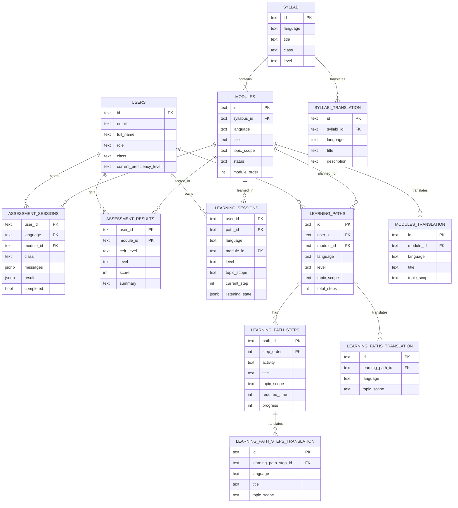

# KAIFA Backend API

Backend service for the KAIFA AI language learning platform. The codebase uses Go, Fiber, and Clean Architecture so the HTTP layer, business rules, and infrastructure can evolve independently.

## Overview

KAIFA backend provides:

- authentication and user creation
- syllabus and module access
- assessment flow for speaking, listening, and scoring
- learning flow with generated paths, chat, listening, and voice sessions
- OpenAPI docs and a lightweight voice test page

The API is a REST service with WebSocket support. Payloads are JSON, while audio is streamed as binary over WebSocket.

## Tech Stack

| Layer | Technology |
|---|---|
| HTTP framework | Fiber v2 |
| WebSocket | `github.com/gofiber/contrib/websocket` |
| AI | OpenAI GPT-4o mini via `go-openai` |
| Speech-to-text | Deepgram |
| Text-to-speech | ElevenLabs |
| Database | PostgreSQL 16 |
| Local dev | Docker Compose |

## Architecture

The project follows a Clean Architecture style:

- `cmd/` contains executable entrypoints
- `internal/adapter/` contains HTTP handlers, middleware, router, and repository adapters
- `internal/usecase/` contains application logic
- `internal/domain/` contains entities and ports
- `internal/infrastructure/` contains concrete integrations such as OpenAI, Deepgram, ElevenLabs, and auth helpers
- `pkg/` contains shared utilities such as config, logger, and response helpers

Dependency direction stays inward:

```text
cmd/api/main.go
  -> internal/adapter/router
  -> internal/adapter/handler
  -> internal/usecase
  -> internal/domain/port
  -> internal/infrastructure
```

Repository adapters support two runtime modes:

- in-memory repositories when `DATABASE_URL` is empty
- PostgreSQL repositories with embedded migrations when `DATABASE_URL` is set

## ERD

Core database relationships:



## Project Structure

```text
kaifa-be/
|-- cmd/
|   |-- api/
|   |-- check-api-keys/
|   `-- migrate/
|-- docs/
|   |-- openapi.yaml
|   `-- swagger.html
|-- internal/
|   |-- adapter/
|   |   |-- handler/
|   |   |-- middleware/
|   |   |-- repository/
|   |   `-- router/
|   |-- domain/
|   |-- infrastructure/
|   `-- usecase/
|-- pkg/
|-- scripts/
|-- tools/
|-- Dockerfile
|-- docker-compose.yml
|-- docker-compose.prod.yml
|-- Makefile
`-- README.md
```

## Runtime Behavior

- `cmd/api` starts the HTTP server
- `cmd/migrate` runs PostgreSQL migrations only
- `cmd/check-api-keys` validates Deepgram and ElevenLabs credentials
- when `DATABASE_URL` is empty, the app falls back to in-memory data
- when `DATABASE_URL` is provided, migrations are applied automatically on startup

## Environment Variables

The canonical template is [.env.example](./.env.example). Main variables:

- `PORT`
- `ALLOWED_ORIGINS`
- `JWT_SECRET`
- `OPENAI_API_KEY`
- `DEEPGRAM_API_KEY`
- `ELEVENLABS_API_KEY`
- `ELEVENLABS_VOICE_ID`
- `DATABASE_URL`
- `DB_NAME`
- `DB_USER`
- `DB_PASSWORD`

The app also reads optional `env` with default `dev`.

## Prerequisites

Before running locally, make sure you have:

- Go 1.26.4 or newer
- Git
- Docker and Docker Compose
- Bash or PowerShell, depending on the helper script you use
- valid API keys for OpenAI, Deepgram, and ElevenLabs
- a `.env` file copied from [.env.example](./.env.example)

Helpful optional tools:

- `psql`, TablePlus, or DBeaver if you want to inspect PostgreSQL locally
- `make` for the convenience commands in the `Makefile`

## API Surface

### Base URL

```text
http://localhost:8080/api
```

### Docs

- Swagger UI: `/swagger`
- OpenAPI YAML: `/swagger/openapi.yaml`
- Voice test page: `/voice-test`
- Health check: `/api/health`

### Authentication

Public:

- `POST /api/auth/login`
- `POST /api/auth/refresh-token`
- `POST /api/users`

Protected with `Authorization: Bearer <access_token>`:

- `GET /api/syllabi`
- all `/api/assessment/*` routes
- all `/api/learning/*` routes

### Auth Endpoints

| Method | Endpoint | Description |
|---|---|---|
| `POST` | `/api/auth/login` | Login and receive access/refresh tokens |
| `POST` | `/api/auth/refresh-token` | Rotate refresh token and receive a new token pair |
| `POST` | `/api/users` | Create a user with a bcrypt-hashed password |

### Syllabi Endpoints

| Method | Endpoint | Description |
|--------|----------|-------------|
| `POST` | `/users` | Create a user with a bcrypt-hashed password |

### Syllabi

| Method | Endpoint                             | Description                                                                                               |
| ------ | ------------------------------------ | --------------------------------------------------------------------------------------------------------- |
| `GET`  | `/api/syllabi`                       | List syllabi. Optional: `?language=english` or `?language=arabic`                                        |
| `GET`  | `/api/syllabi/:id`                   | Syllabus detail                                                                                           |
| `GET`  | `/api/syllabi/:id/modules`           | List modules in a syllabus. Each module includes `completed_assessement` when a user context is present   |
| `GET`  | `/api/syllabi/:id/modules/:moduleId` | Module detail with `completed_assessement`                                                                |

Notes:

- `language` is optional and accepts `english` or `arabic`
- syllabus listing is filtered by the user class from JWT claims
- syllabus level uses CEFR arrays such as `["A1","A2","B1"]`

### Assessment Endpoints

| Method | Endpoint | Description |
|---|---|---|
| `POST` | `/api/assessment/start` | Start assessment for a selected module |
| `POST` | `/api/assessment/chat` | One-turn assessment conversation (text) |
| `POST` | `/api/assessment/speech/tts` | Convert text to speech |
| `POST` | `/api/assessment/speech/stt` | Transcribe audio to text |
| `WS` | `/api/assessment/voice?module_id=` | Voice assessment session |

Notes:

- conversation history is stored server-side per user and module
- `/assessment/chat` accepts `module_id` and `user_text`
- `/assessment/voice` accepts `module_id` as a query parameter
- WebSocket messages may alternate between JSON status messages and binary audio chunks

### Learning Endpoints

| Method | Endpoint | Description |
|---|---|---|
| `POST` | `/api/learning/generate` | Generate a learning path from the selected module and assessment result |
| `POST` | `/api/learning/start` | Start a learning chat session for a path step |
| `POST` | `/api/learning/start-chat` | Alias for `start` |
| `POST` | `/api/learning/chat` | One-turn learning conversation (text) |
| `POST` | `/api/learning/start-questions` | Start guided questions for a material block |
| `POST` | `/api/learning/speech/tts` | Convert text to speech |
| `POST` | `/api/learning/speech/stt` | Transcribe audio to text |
| `WS` | `/api/learning/voice?learning_path_step_id=` | Voice learning session |

Notes:

- learning sessions are tracked server-side per user and path step
- `/learning/start` and `/learning/start-chat` require `learning_path_step_id`
- `/learning/start-questions` requires `learning_path_step_id`, `material`, and `material_type`
- `/learning/generate` expects `module_id`
- `/learning/voice` expects `learning_path_step_id` as a query parameter

## Getting Started

### 1. Copy the environment file

```bash
cp .env.example .env
```

Then fill in the API keys and JWT secret.

### 2. Enable Git hooks

```bash
git config core.hooksPath .githooks
```

This enables:

- `pre-commit` to format staged Go files with `gofmt`
- `pre-push` to run `go test ./...`

You can also use the helper scripts:

- Git Bash or WSL: `sh scripts/setup-hooks.sh`
- PowerShell: `powershell -File scripts/setup-hooks.ps1`

### 3. Run without PostgreSQL

```bash
go run ./cmd/api
```

Or:

```bash
make run
```

If `DATABASE_URL` is empty, the app uses in-memory repositories seeded with default users, syllabi, and modules.

### 4. Run with PostgreSQL in Docker

```bash
bash scripts/dev.sh
```

This will:

- start PostgreSQL in Docker
- run the backend locally with `go run ./cmd/api`
- point the backend to `localhost:5432`
- apply embedded migrations during startup

Useful shortcuts:

- `bash scripts/dev.sh` = start DB + backend
- `bash scripts/dev.sh --db-only` = only start PostgreSQL
- `bash scripts/dev.sh --stop` = stop PostgreSQL

Database connection for local tools:

| Field | Value |
|---|---|
| Host | `localhost` |
| Port | `5432` |
| Database | `kaifa` |
| User | `kaifa` |
| Password | `kaifa` |

Other useful commands:

```bash
docker compose logs -f postgres
docker compose down
docker compose down -v
```

### 5. Run migrations manually

```bash
go run ./cmd/migrate
```

`DATABASE_URL` is required for this command.

### 6. Check external API keys

```bash
go run ./cmd/check-api-keys
```

This checks Deepgram and ElevenLabs credentials from `.env` or the current environment.

## Local Onboarding Checklist

If you are joining the project for the first time, this is the shortest path:

1. Install the prerequisites.
1. Copy `.env.example` to `.env` and fill in the required secrets.
1. Run `git config core.hooksPath .githooks`.
1. Start the app with `go run ./cmd/api` for in-memory mode, or `bash scripts/dev.sh` for PostgreSQL mode.
1. Open `/swagger` and `/api/health` to verify the server is up.
1. Use `go run ./cmd/check-api-keys` if voice or OpenAI features do not work.

## Deploy to VPS

Deployment is triggered by pushing to the `main` branch.

### Flow

```text
push to main
  -> GitHub Actions builds Docker image
  -> image is pushed to GHCR
  -> GitHub Actions SSHes into the VPS
  -> VPS pulls the new image
  -> docker compose restarts the service
```

### What must be ready

- GitHub Actions secrets must be set for the backend repo
- the VPS must already have Docker, Docker Compose, and Nginx installed
- the VPS must be able to pull the private image from GHCR using `GHCR_PAT`
- the backend `.env` on the VPS is generated by the deploy workflow

### GitHub Secrets used by deploy

| Secret | Purpose |
|---|---|
| `VPS_HOST` | SSH host for the VPS |
| `VPS_USER` | SSH username |
| `VPS_SSH_KEY` | Private key used by GitHub Actions |
| `GHCR_PAT` | Token for pulling the private Docker image |
| `OPENAI_API_KEY` | OpenAI access |
| `DEEPGRAM_API_KEY` | Speech-to-text access |
| `ELEVENLABS_API_KEY` | Text-to-speech access |
| `ELEVENLABS_VOICE_ID` | Voice to use for speech output |
| `JWT_SECRET` | Token signing secret |
| `DB_PASSWORD` | PostgreSQL password |
| `ALLOWED_ORIGINS` | CORS allowlist for frontend and local tools |

### Deploy command

You usually do not deploy manually. After committing and pushing to `main`, the workflow in [.github/workflows/deploy.yml](./.github/workflows/deploy.yml) runs automatically.

If you want the one-line summary for teammates:

```text
edit code -> git push origin main -> wait for GitHub Actions -> live on VPS
```

## Build

```bash
make build
./bin/server
```

## Testing

```bash
go test ./...
```

## Deployment Notes

- production compose uses [docker-compose.prod.yml](./docker-compose.prod.yml)
- the app is designed to run behind the provided Nginx config in [nginx/kaifa.conf](./nginx/kaifa.conf)
- migrations live under [internal/adapter/repository/postgres/migrations](./internal/adapter/repository/postgres/migrations)
- the backend serves docs from [docs/swagger.html](./docs/swagger.html) and [docs/openapi.yaml](./docs/openapi.yaml)

## Important Notes

- If `DATABASE_URL` is empty, the app runs with in-memory repositories
- All protected routes require `Authorization: Bearer <access_token>`
- Assessment and learning sessions are stateful on the server, so the same user can continue a flow across requests
- Voice endpoints stream audio as binary WebSocket messages
- `ALLOWED_ORIGINS` should include your frontend URL and any local dev URL you use
- `cmd/check-api-keys` is useful when voice or OpenAI calls fail during setup
